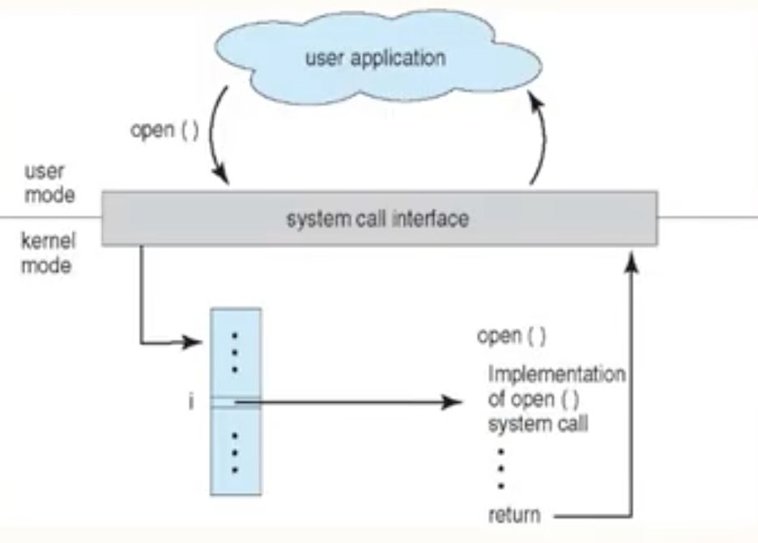
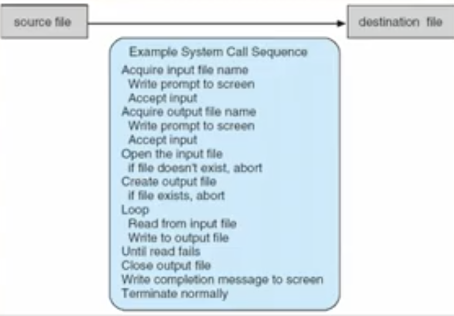
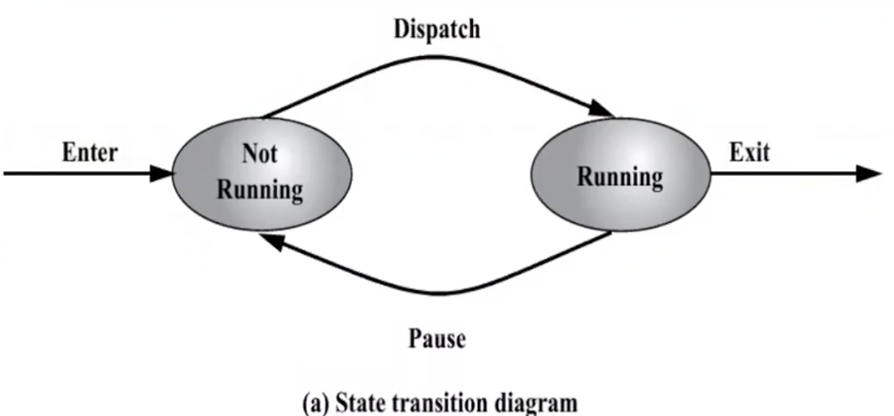
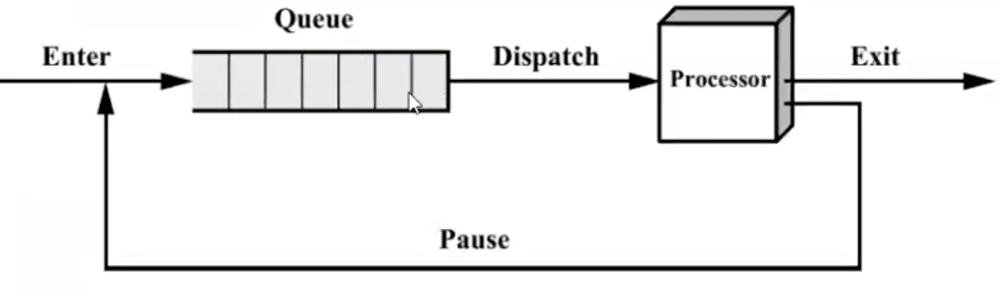

**LECTURE 1, 2: Introduction**

# Operating System

A program that acts as an intermediary between a user of a computer and the computer hardware.

## Goals:

- Execute user programs and make solving user problems easier.
- Make the computer system convinent to use.
- Use the computer hardware in an efficient manner.

## What Operating Systems do

Depends on the POV:

- Users want convinence, ease of use, good performance.
- But shared computer such as mainframes must keep all users happy.
- Users of dedicated systems such as workstations have dedicated resources but frequently use shared resources from servers.
- Handheld computers are resource poor, optimised for usability and battery life.
- Some computers have little or no user interface, such as embedded computers in devices and automobiles.

## Definition of OS

**OS is a resource allocator:**

- Manages all resources.
- Decides between conflicting requests for efficient and fair resource use.

**OS is a control program**

- Controls execution of programs to prevent errors and improper use of computer.

## Operations

- **Dual Mode** operation allows OS to protect irself and other system components.
  - Modes:
    1. **User Mode**
    2. **Kernal Mode**
  - Mode bit provided by hardware
    - Provides ability to distinguish when system is running user code or kernal code.
    - Some instructions are designated as **privileged**, only executable in kernal mode.
    - System call changes mode to kernal, return from call resets it to user.
- Increasingly, CPUs support multi-mode operations.
  - i.e. **virtual machine manager (VMM)** mode for guest **VMs**.

# Computer System Organisation

- A bootstrap program is loaded at power up or reboot.

  - Typically stored in ROM or EPROM, generally known as firmware.
  - Initailizes all aspects of the system.
  - Loads operating system kernal and starts execution.

- Computer-system operation:
  - One or more CPUs, device controllers connect through common bus providing access to shared memory.
  - Concurrent execution of CPUs aand devices competing for memory cycles.

# Computer System Operation

- IO devies and the CPU can execute concurrently.
- Each device controller is in charge of a particular device type.
- Each device controller has a local buffer.
- CPU moves data from/to main memory to/from local buffers.
- IO is from the device to local buffer of controller.
- Device controller informs CPU that it has finished its operation by causing an interrupt.

# Computer System Structure

Computer system can be divided into four componenets:

- Hardware: Provides basic computing resources. Eg: CPU, Memory, I/O Devices
- Operating System: Controls and coordinates the use of hardware among various applications and users.
- Application Programs: Define the ways in which the system resources are used to solve the computing problems of the users.
- Users: People, machines, other computers.

# IO Structure

- After I/O starts. control returns to user program only upon I/O completion.
  - Wait instruction idles the CPU until the next interrupt.
  - Wait loop (contention for memory access).
  - At most one I/O request is outstanding at a time, no simultaneous I/O processing.
- After I/O starts, control returns to user program without waiting for I/O completion.
  - **System Call:** Request to the OS to allow user to wait for I/O completion.
  - **Device-Status Table:** Contains entry for each I/O device indicating it's type, address and state.
  - OS Indexes into I/O device table to determine device status and to modify table entry to include interrupt.

# Storage Notations:

| Full Name | Abbreviation | Bytes    |
| --------- | ------------ | -------- |
| Kilobyte  | KB           | $1024$   |
| Megabyte  | MB           | $1024^2$ |
| Gigabyte  | GB           | $1024^3$ |
| Terabyte  | TB           | $1024^4$ |
| Petabyte  | PB           | $1024^5$ |

# Storage Structure

- **Main Memory:** Only large storage media that the CPU can access directly.
  - Random Access
  - Typically Volatile
- **Secondary Storage:** Extension of main memory that provides large non-volatile storage capacity.
- **Hard Disks:** Rigid metal or glass platters covered with magnetic recording material.
- **Solid-State Disks:** Faster than hard disks, non-volatile.
  - Various technologies.
  - Becoming more popular.

# Storage Hierarchy

- Storage systems organized in hierarchy
  - Speed
  - Cost
  - Volatility
- **Caching:** Copying information into faster storage system; main memory can be viewed as a cache for secondary storage.
- **Device Driver:** for each device controller to manage I/O
  - Provides uniform interface between controller and kernal.

## Storage Device Hierarchy

- Registers
- Cache
- Main Memory
- Solid-state Disk
- Hard Disk
- Optical Disk
- Magnetic Tapes

# Direct Memory Access Structure

- Used for high-speed I/O Devices able to transmit information at close to memory speed.
- Device controller transfers blocks of data from buffer storage directly to main memory without CPU intervention.
- Only one interrupt is generated per block, rather than one interrupt per byte.

# Computer System Architecture

- Most systems use a single general-purpose processor.
  - Most systems have special purpose processor as well.
- Multiprocessor systems are growing in use and importance.
  - Also known as parallel systems or tightly-coupled systems.
  - Advnatages include:
    1. Increased throughput.
    2. Economy of scale.
    3. Increased reliability.
  - Two Types:
    1. Asymmetric Multiprocessing - each processor is assigned a special task.
    2. Symmetric Multiprocessing - each processor performs all tasks.
- **Multiprograming (Batch System)** needed for efficiency
  - Single user cannot keep CPU and I/O devices busy at all times.
  - Multiprogramming organizes jobs (code and data) so CPU always has one to execute.
  - A subset of total jobs in system is kept in memory.
  - One job selected and run via **job scheduling**.
  - When it has to wait (for I/O for example), OS switches to another job.
- **Timesharing (multitasking)** is logical extension in which CPU switches jobs so frequently that users can interact with each job while it is running, creating interactive computing.
  - Response time should be $<1$ second
  - Each user has at least one program executing in memory (**Process**).
  - If several jobs ready to run at the same time (**CPU Scheduling**).
  - If processes don't fit in memory, **swapping** moves them in and out to run.
  - **Virtual Memory** allows execution of process not completely in memory.
- **Interrupt Driven (hardware and software)**
  - Hardware interrupt by one of the devices.
  - Software interrupt (**exception** or **trap**).
    - Software error (Example: _Division by zero_)
    - Request for operating system service.
    - Other process problems include infinite loop, processes modifying each other or the operating system.

# Process

A process is a program in execution. It is a unit of work within the system. Program is a passive entity, while process is an active entity.

- Process needs resources to accomplish its task.
  - CPU, memory, IO, files
  - Initialization data
- Process termination requires reclain of any reusable resources.
- Single threaded process has one **program counter** specifying locaion of next instruction to execute.
  - Process executes instructions sequentially, one at a time, until completion.
- Multi-threaded process has one program counter per thread.
- Typically system has many processes, some user, some operating system running concurrently on one or more CPUs.
  - Concurrency by multiplexing the CPUs among the processes / threads.

# Process Management Activities

The operating system responsible for the following activities in connection with process management:

- Creating and deleting both user and system processes.
- Suspending and resuming processes.
- Providing mechanisms for process synchronization.
- Providing mechanisms for process communication.
- Providing mechanisms for deadlock handling.

<hr/>

**LECTURE 3: Program and Process**

# Program

- A program is a piece of code.
- A program is a passive entity as it resides in the secondary memory, such as the contents of a file stored on a disk.
- When we execute a program that was just compiled, the OS will generate a process to execute the program. Execution of the program starts via GUI mouse clicks, command line entry of its name, etc. One program can have several processes.

# Process

- The term process (job) refers to program code that has been loaded into a computer's memory so that it can be executed by the central processing unit (CPU).
- A process can be described as an instance of a program running on a computer or as an entity that can be assigned to and executed on a processor.
- A program becomes a process when loaded into memory and thus is an **active entity**.

```c
int main() {
    int i, z = 1;
    for(i = 0; i < 100; i++) {
        z = z*i; // Line 1
    }
}
```

According to a program, _Line 1_ occurs 1 time, while according to process, it occurs 100 times.

| Parameter           | Process                                                                                                     | Program                                                                                         |
| ------------------- | ----------------------------------------------------------------------------------------------------------- | ----------------------------------------------------------------------------------------------- |
| Definition          | An executing part of a program is called a process.                                                         | A program is a group of odered operations to achieve a programming goal.                        |
| Nature              | The process is an instance of program being executed.                                                       | The nature of program is passive, so it's unlikely to do anything until it gets executed.       |
| Resource Management | The resource requirement is quite high in case of a process.                                                | The program only needs memory for storage.                                                      |
| Overheads           | Processes have a considerable overhead                                                                      | No significant overhead cost.                                                                   |
| Lifespan            | The process has a shorter and very limited lifespan as it gets terminated after the completion of the task. | A program has a longer lifespan as it is stored in the memory until it is not manually deleted. |
| Creation            | New process require duplication of the parent process.                                                      | No such duplication is needed.                                                                  |
| Required Process    | Process holds resources like CPU, memory, address, disk, I/O, etc.                                          | The program is stored on the disk in some file and does not require any other resources.        |
| Entity Type         | A process is a dynamic or active entity.                                                                    | A program is a passive or static entity.                                                        |
| Contain             | A process contains many resources like a memory address, disk, printer, etc.                                | A program needs memory space on disk to store all instructions.                                 |

<hr/>

**LECTURE 4: System Calls**

# System Calls

Requests made by the user program to the OS in order to get any kind of services.

- Programming Interface to the services provided by the OS.
- Typically written in a high-level language such as C or C++.
- Mostly accessed by the programs via a high-level Application Programming Interface (API) rather than direct system call.
- Three most common APIs are Win32 API for Windows, POSIX API for POSIX-based systems (including virtually all versions of UNIX, Linux and macOS), and Java API for the Java Virtual Machine (JVM).

## Example of a Standard API

Consider the `ReadFile()` function in the Win32 API - a function for reading from a file.

```
BOOL ReadFile c (HANDLE        file,
                 LPVOID        buffer,
                 DWORD         bytesToRead,
                 LPDWORD       bytesRead,
                 LPOVERLAPPED  ovl);
```

Parameters Passed to `ReadFile()`:

- **HANDLE file:** the file to be read.
- **LPVOID buffer:** a buffer where the data will be read into and written from.
- **DWORD bytesToRead:** the number of bytes to be read into the buffer.
- **LPDWORD bytesRead:** the number of bytes read during the last read.
- **LPOVERLAPPED olv:** indicates if overlapped I/O is being used.

# System Call Implementation

- Typically, a number associated with each system call
  - System call interface maintains a table indexed according to these numbers.
- The system call interface invokes intended system call in OS kernal and returns status of the system call and any return values.
- The caller need know nothing about how the system call is implemented.
  - Just needs to obey the API and understand what OS will do as a result call.
  - Most details of OS interface hidden from programmer by API.
    - Managed by runtime support library (set of functions built into libraries included with compiler).

# API - System Call - OS Relationship

Invoking a system call moves the execution mode from user mode to kernal mode.


**Example:** C Program invoking `printf()` library call, which call the `write()` system call.

```c
int main() {
  printf("Greetings"); // Calls the write() system call
}
```

When `write()` system call is made, the program is moved form user mode to kernal mode.

# System Call Parameter Passing

Often, more information is required than simply indentity of desired system call.

Exact type and amount of information vary according to OS and call.

Three general methods used to pass parameters to the OS:

- Simplest: Pass parameters in _registers._
  - In some cases, there may be more parameters than registers.
- Parameters stored in a block, or table, in memory, and address of block passed as a parameter in register.
  - This approach is taken by Linux and Solaris.
- Parameters placed, or pushed onto the stack by the program and popped off the stack by the operating system.

Block and stack methods do not limit the number of length of parameters being passed

# Types of System Calls

System calls are primarily divided into following sections as per working:

- Process Control
- File Management
- Device Management
- Information Maintainance
- Communications

## Process Control

- `end`, `abort`
- `load`, `execute`
- create process, terminate process
- get process attributes, set process attributes
- wait for time
- wait event, signal event
- allocate and free memory

## File Management

- create file, delete file
- open, close file
- read, write, reposition
- get and set file attributes

## Device Management

- request device, release device
- read, write, reposition
- get device attributes, set device attributres
- logically attach or detatch devices

## Information Maintainance

- get time or date, set time or date
- get system data, set system data
- get and set process, file or device attributes

## Communications

- create, delete communication connection
- send, receive messages
- transfer status information
- attach and detach remote devices

# Example of System Calls

System call to copy the contents of one file to another file.


# Examples of Windows and Unix System Calls


<hr/>

**LECTURE 5: Types of Systems**

# Types of Systems

1. **Uniprocessing**
   1. Uniprogramming
   2. Multiprogramming
   3. Multitasking / Time Sharing
2. **Multiprocessing**

Suppose there are 3 processes P1, P2 and P3, all taking 30s to complete their tasks, such that:

| Process | Fetch | Decode | Execute |
| ------- | ----- | ------ | ------- |
| P1      | 10s   | 10s    | 10s     |
| P2      | 10s   | 10s    | 10s     |
| P3      | 10s   | 10s    | 10s     |

In **uniprocessing**, there is only 1 processor, so total execution time:

<svg width="202" height="44" viewBox="0 0 202 44" fill="none" xmlns="http://www.w3.org/2000/svg">
<path fill-rule="evenodd" clip-rule="evenodd" d="M28.1152 20V16.6602H30.125C31.0898 16.6602 31.8301 16.4375 32.3457 15.9922C32.8652 15.543 33.125 14.9043 33.125 14.0762C33.125 13.291 32.8594 12.6602 32.3281 12.1836C31.8008 11.707 31.0703 11.4688 30.1367 11.4688H26.9902V20H28.1152ZM30.1367 15.7402H28.1152V12.3945H30.2012C30.7598 12.4062 31.1992 12.5645 31.5195 12.8691C31.8398 13.1738 32 13.5801 32 14.0879C32 14.623 31.8398 15.0332 31.5195 15.3184C31.1992 15.5996 30.7383 15.7402 30.1367 15.7402Z" fill="#0075FF"/>
<path d="M36.752 20H37.8418V11.4277H37.6719L34.5664 12.5938V13.5781L36.752 12.7754V20Z" fill="#0075FF"/>
<path fill-rule="evenodd" clip-rule="evenodd" d="M92.1152 16.6602V20H90.9902V11.4688H94.1367C95.0703 11.4688 95.8008 11.707 96.3281 12.1836C96.8594 12.6602 97.125 13.291 97.125 14.0762C97.125 14.9043 96.8652 15.543 96.3457 15.9922C95.8301 16.4375 95.0898 16.6602 94.125 16.6602H92.1152ZM92.1152 15.7402H94.1367C94.7383 15.7402 95.1992 15.5996 95.5195 15.3184C95.8398 15.0332 96 14.623 96 14.0879C96 13.5801 95.8398 13.1738 95.5195 12.8691C95.1992 12.5645 94.7598 12.4062 94.2012 12.3945H92.1152V15.7402Z" fill="#0075FF"/>
<path d="M103.869 20H98.2793V19.2207L101.232 15.9395C101.67 15.4434 101.971 15.041 102.135 14.7324C102.303 14.4199 102.387 14.0977 102.387 13.7656C102.387 13.3203 102.252 12.9551 101.982 12.6699C101.713 12.3848 101.354 12.2422 100.904 12.2422C100.365 12.2422 99.9453 12.3965 99.6445 12.7051C99.3477 13.0098 99.1992 13.4355 99.1992 13.9824H98.1152C98.1152 13.1973 98.3672 12.5625 98.8711 12.0781C99.3789 11.5938 100.057 11.3516 100.904 11.3516C101.697 11.3516 102.324 11.5605 102.785 11.9785C103.246 12.3926 103.477 12.9453 103.477 13.6367C103.477 14.4766 102.941 15.4766 101.871 16.6367L99.5859 19.1152H103.869V20Z" fill="#0075FF"/>
<path fill-rule="evenodd" clip-rule="evenodd" d="M156.115 20V16.6602H158.125C159.09 16.6602 159.83 16.4375 160.346 15.9922C160.865 15.543 161.125 14.9043 161.125 14.0762C161.125 13.291 160.859 12.6602 160.328 12.1836C159.801 11.707 159.07 11.4688 158.137 11.4688H154.99V20H156.115ZM158.137 15.7402H156.115V12.3945H158.201C158.76 12.4062 159.199 12.5645 159.52 12.8691C159.84 13.1738 160 13.5801 160 14.0879C160 14.623 159.84 15.0332 159.52 15.3184C159.199 15.5996 158.738 15.7402 158.137 15.7402Z" fill="#0075FF"/>
<path d="M164.67 15.207H163.855V16.0918H164.67C165.244 16.0996 165.684 16.2363 165.988 16.502C166.293 16.7676 166.445 17.1484 166.445 17.6445C166.445 18.1562 166.307 18.5488 166.029 18.8223C165.752 19.0957 165.352 19.2324 164.828 19.2324C164.336 19.2324 163.943 19.0977 163.65 18.8281C163.357 18.5586 163.211 18.1992 163.211 17.75H162.121C162.121 18.4609 162.371 19.0332 162.871 19.4668C163.375 19.9004 164.027 20.1172 164.828 20.1172C165.629 20.1172 166.279 19.8926 166.779 19.4434C167.279 18.9941 167.529 18.3867 167.529 17.6211C167.529 17.125 167.4 16.7051 167.143 16.3613C166.889 16.0176 166.527 15.7715 166.059 15.623C166.473 15.4512 166.799 15.1914 167.037 14.8438C167.279 14.4961 167.4 14.1367 167.4 13.7656C167.4 13.0078 167.172 12.416 166.715 11.9902C166.258 11.5645 165.627 11.3516 164.822 11.3516C164.061 11.3516 163.432 11.5762 162.936 12.0254C162.443 12.4707 162.197 13.0312 162.197 13.707H163.281C163.281 13.2656 163.42 12.9121 163.697 12.6465C163.979 12.377 164.354 12.2422 164.822 12.2422C165.818 12.2422 166.316 12.7422 166.316 13.7422C166.316 14.1875 166.17 14.541 165.877 14.8027C165.584 15.0645 165.182 15.1992 164.67 15.207Z" fill="#0075FF"/>
<path fill-rule="evenodd" clip-rule="evenodd" d="M3 0H195V32H3V0ZM4 1H66V31H4V1ZM68 1H130V31H68V1ZM194 1H132V31H194V1Z" fill="#0075FF"/>
<path fill-rule="evenodd" clip-rule="evenodd" d="M6.18945 39.3613C6.18945 40.6309 5.97266 41.5742 5.53906 42.1914C5.10547 42.8086 4.42773 43.1172 3.50586 43.1172C2.5957 43.1172 1.92188 42.8164 1.48438 42.2148C1.04688 41.6094 0.820312 40.707 0.804688 39.5078V38.0605C0.804688 36.8066 1.02148 35.875 1.45508 35.2656C1.88867 34.6562 2.56836 34.3516 3.49414 34.3516C4.41211 34.3516 5.08789 34.6465 5.52148 35.2363C5.95508 35.8223 6.17773 36.7285 6.18945 37.9551V39.3613ZM5.10547 37.8789C5.10547 36.9609 4.97656 36.293 4.71875 35.875C4.46094 35.4531 4.05273 35.2422 3.49414 35.2422C2.93945 35.2422 2.53516 35.4512 2.28125 35.8691C2.02734 36.2871 1.89648 36.9297 1.88867 37.7969V39.5312C1.88867 40.4531 2.02148 41.1348 2.28711 41.5762C2.55664 42.0137 2.96289 42.2324 3.50586 42.2324C4.04102 42.2324 4.4375 42.0254 4.69531 41.6113C4.95703 41.1973 5.09375 40.5449 5.10547 39.6543V37.8789Z" fill="#0075FF"/>
<path d="M63.3613 38.207H62.5469V39.0918H63.3613C63.9355 39.0996 64.375 39.2363 64.6797 39.502C64.9844 39.7676 65.1367 40.1484 65.1367 40.6445C65.1367 41.1562 64.998 41.5488 64.7207 41.8223C64.4434 42.0957 64.043 42.2324 63.5195 42.2324C63.0273 42.2324 62.6348 42.0977 62.3418 41.8281C62.0488 41.5586 61.9023 41.1992 61.9023 40.75H60.8125C60.8125 41.4609 61.0625 42.0332 61.5625 42.4668C62.0664 42.9004 62.7188 43.1172 63.5195 43.1172C64.3203 43.1172 64.9707 42.8926 65.4707 42.4434C65.9707 41.9941 66.2207 41.3867 66.2207 40.6211C66.2207 40.125 66.0918 39.7051 65.834 39.3613C65.5801 39.0176 65.2188 38.7715 64.75 38.623C65.1641 38.4512 65.4902 38.1914 65.7285 37.8438C65.9707 37.4961 66.0918 37.1367 66.0918 36.7656C66.0918 36.0078 65.8633 35.416 65.4062 34.9902C64.9492 34.5645 64.3184 34.3516 63.5137 34.3516C62.752 34.3516 62.123 34.5762 61.627 35.0254C61.1348 35.4707 60.8887 36.0312 60.8887 36.707H61.9727C61.9727 36.2656 62.1113 35.9121 62.3887 35.6465C62.6699 35.377 63.0449 35.2422 63.5137 35.2422C64.5098 35.2422 65.0078 35.7422 65.0078 36.7422C65.0078 37.1875 64.8613 37.541 64.5684 37.8027C64.2754 38.0645 63.873 38.1992 63.3613 38.207Z" fill="#0075FF"/>
<path fill-rule="evenodd" clip-rule="evenodd" d="M72.4082 42.1914C72.8418 41.5742 73.0586 40.6309 73.0586 39.3613V37.9551C73.0469 36.7285 72.8242 35.8223 72.3906 35.2363C71.957 34.6465 71.2812 34.3516 70.3633 34.3516C69.4375 34.3516 68.7578 34.6562 68.3242 35.2656C67.8906 35.875 67.6738 36.8066 67.6738 38.0605V39.5078C67.6895 40.707 67.916 41.6094 68.3535 42.2148C68.791 42.8164 69.4648 43.1172 70.375 43.1172C71.2969 43.1172 71.9746 42.8086 72.4082 42.1914ZM71.5879 35.875C71.8457 36.293 71.9746 36.9609 71.9746 37.8789V39.6543C71.9629 40.5449 71.8262 41.1973 71.5645 41.6113C71.3066 42.0254 70.9102 42.2324 70.375 42.2324C69.832 42.2324 69.4258 42.0137 69.1562 41.5762C68.8906 41.1348 68.7578 40.4531 68.7578 39.5312V37.7969C68.7656 36.9297 68.8965 36.2871 69.1504 35.8691C69.4043 35.4512 69.8086 35.2422 70.3633 35.2422C70.9219 35.2422 71.3301 35.4531 71.5879 35.875Z" fill="#0075FF"/>
<path fill-rule="evenodd" clip-rule="evenodd" d="M129.225 34.4629V35.3828H129.025C128.182 35.3984 127.51 35.6484 127.01 36.1328C126.51 36.6172 126.221 37.2988 126.143 38.1777C126.592 37.6621 127.205 37.4043 127.982 37.4043C128.725 37.4043 129.316 37.666 129.758 38.1895C130.203 38.7129 130.426 39.3887 130.426 40.2168C130.426 41.0957 130.186 41.7988 129.705 42.3262C129.229 42.8535 128.588 43.1172 127.783 43.1172C126.967 43.1172 126.305 42.8047 125.797 42.1797C125.289 41.5508 125.035 40.7422 125.035 39.7539V39.3379C125.035 37.7676 125.369 36.5684 126.037 35.7402C126.709 34.9082 127.707 34.4824 129.031 34.4629H129.225ZM127.801 38.3066C127.43 38.3066 127.088 38.418 126.775 38.6406C126.463 38.8633 126.246 39.1426 126.125 39.4785V39.877C126.125 40.5801 126.283 41.1465 126.6 41.5762C126.916 42.0059 127.311 42.2207 127.783 42.2207C128.271 42.2207 128.654 42.041 128.932 41.6816C129.213 41.3223 129.354 40.8516 129.354 40.2695C129.354 39.6836 129.211 39.2109 128.926 38.8516C128.645 38.4883 128.27 38.3066 127.801 38.3066Z" fill="#0075FF"/>
<path fill-rule="evenodd" clip-rule="evenodd" d="M137.059 39.3613C137.059 40.6309 136.842 41.5742 136.408 42.1914C135.975 42.8086 135.297 43.1172 134.375 43.1172C133.465 43.1172 132.791 42.8164 132.354 42.2148C131.916 41.6094 131.689 40.707 131.674 39.5078V38.0605C131.674 36.8066 131.891 35.875 132.324 35.2656C132.758 34.6562 133.438 34.3516 134.363 34.3516C135.281 34.3516 135.957 34.6465 136.391 35.2363C136.824 35.8223 137.047 36.7285 137.059 37.9551V39.3613ZM135.975 37.8789C135.975 36.9609 135.846 36.293 135.588 35.875C135.33 35.4531 134.922 35.2422 134.363 35.2422C133.809 35.2422 133.404 35.4512 133.15 35.8691C132.896 36.2871 132.766 36.9297 132.758 37.7969V39.5312C132.758 40.4531 132.891 41.1348 133.156 41.5762C133.426 42.0137 133.832 42.2324 134.375 42.2324C134.91 42.2324 135.307 42.0254 135.564 41.6113C135.826 41.1973 135.963 40.5449 135.975 39.6543V37.8789Z" fill="#0075FF"/>
<path fill-rule="evenodd" clip-rule="evenodd" d="M192.311 39.9004C192.627 39.7363 192.898 39.5195 193.125 39.25C193.082 40.2266 192.82 40.9414 192.34 41.3945C191.859 41.8438 191.172 42.0762 190.277 42.0918H190.049V43.0059H190.26C191.584 42.9863 192.574 42.5957 193.23 41.834C193.887 41.0684 194.215 39.8555 194.215 38.1953V37.8789C194.215 36.7891 193.971 35.9297 193.482 35.3008C192.998 34.668 192.334 34.3516 191.49 34.3516C190.959 34.3516 190.494 34.4727 190.096 34.7148C189.697 34.957 189.389 35.3066 189.17 35.7637C188.955 36.2207 188.848 36.7344 188.848 37.3047C188.848 37.8359 188.947 38.3223 189.146 38.7637C189.346 39.2012 189.627 39.541 189.99 39.7832C190.357 40.0254 190.787 40.1465 191.279 40.1465C191.654 40.1465 191.998 40.0645 192.311 39.9004ZM192.457 38.916C192.152 39.1387 191.818 39.25 191.455 39.25C190.986 39.25 190.611 39.0625 190.33 38.6875C190.053 38.3086 189.914 37.8281 189.914 37.2461C189.914 36.6484 190.059 36.168 190.348 35.8047C190.637 35.4375 191.02 35.2539 191.496 35.2539C191.969 35.2539 192.359 35.4766 192.668 35.9219C192.977 36.3672 193.131 36.9453 193.131 37.6562V38.0898C192.99 38.418 192.766 38.6934 192.457 38.916Z" fill="#0075FF"/>
<path fill-rule="evenodd" clip-rule="evenodd" d="M200.408 42.1914C200.842 41.5742 201.059 40.6309 201.059 39.3613V37.9551C201.047 36.7285 200.824 35.8223 200.391 35.2363C199.957 34.6465 199.281 34.3516 198.363 34.3516C197.438 34.3516 196.758 34.6562 196.324 35.2656C195.891 35.875 195.674 36.8066 195.674 38.0605V39.5078C195.689 40.707 195.916 41.6094 196.354 42.2148C196.791 42.8164 197.465 43.1172 198.375 43.1172C199.297 43.1172 199.975 42.8086 200.408 42.1914ZM199.588 35.875C199.846 36.293 199.975 36.9609 199.975 37.8789V39.6543C199.963 40.5449 199.826 41.1973 199.564 41.6113C199.307 42.0254 198.91 42.2324 198.375 42.2324C197.832 42.2324 197.426 42.0137 197.156 41.5762C196.891 41.1348 196.758 40.4531 196.758 39.5312V37.7969C196.766 36.9297 196.896 36.2871 197.15 35.8691C197.404 35.4512 197.809 35.2422 198.363 35.2422C198.922 35.2422 199.33 35.4531 199.588 35.875Z" fill="#0075FF"/>
</svg>

= 90 seconds

In **Multiprocessing**, suppose there are 3 processors.

<svg width="122" height="123" viewBox="0 0 122 123" fill="none" xmlns="http://www.w3.org/2000/svg">
<path fill-rule="evenodd" clip-rule="evenodd" d="M63.4609 16.6602V20H62.3359V11.4688H65.4824C66.416 11.4688 67.1465 11.707 67.6738 12.1836C68.2051 12.6602 68.4707 13.291 68.4707 14.0762C68.4707 14.9043 68.2109 15.543 67.6914 15.9922C67.1758 16.4375 66.4355 16.6602 65.4707 16.6602H63.4609ZM63.4609 15.7402H65.4824C66.084 15.7402 66.5449 15.5996 66.8652 15.3184C67.1855 15.0332 67.3457 14.623 67.3457 14.0879C67.3457 13.5801 67.1855 13.1738 66.8652 12.8691C66.5449 12.5645 66.1055 12.4062 65.5469 12.3945H63.4609V15.7402Z" fill="#0088FF"/>
<path d="M73.1875 20H72.0977V12.7754L69.9121 13.5781V12.5938L73.0176 11.4277H73.1875V20Z" fill="#0088FF"/>
<path fill-rule="evenodd" clip-rule="evenodd" d="M28 0V32H108V0H28ZM107 1H29V31H107V1Z" fill="#0088FF"/>
<path fill-rule="evenodd" clip-rule="evenodd" d="M63.4609 58.6602V62H62.3359V53.4688H65.4824C66.416 53.4688 67.1465 53.707 67.6738 54.1836C68.2051 54.6602 68.4707 55.291 68.4707 56.0762C68.4707 56.9043 68.2109 57.543 67.6914 57.9922C67.1758 58.4375 66.4355 58.6602 65.4707 58.6602H63.4609ZM63.4609 57.7402H65.4824C66.084 57.7402 66.5449 57.5996 66.8652 57.3184C67.1855 57.0332 67.3457 56.623 67.3457 56.0879C67.3457 55.5801 67.1855 55.1738 66.8652 54.8691C66.5449 54.5645 66.1055 54.4062 65.5469 54.3945H63.4609V57.7402Z" fill="#0088FF"/>
<path d="M73.1875 62H72.0977V54.7754L69.9121 55.5781V54.5938L73.0176 53.4277H73.1875V62Z" fill="#0088FF"/>
<path fill-rule="evenodd" clip-rule="evenodd" d="M28 42H108V74H28V42ZM29 43H107V73H29V43Z" fill="#0088FF"/>
<path fill-rule="evenodd" clip-rule="evenodd" d="M63.4609 100.66V104H62.3359V95.4688H65.4824C66.416 95.4688 67.1465 95.707 67.6738 96.1836C68.2051 96.6602 68.4707 97.291 68.4707 98.0762C68.4707 98.9043 68.2109 99.543 67.6914 99.9922C67.1758 100.438 66.4355 100.66 65.4707 100.66H63.4609ZM63.4609 99.7402H65.4824C66.084 99.7402 66.5449 99.5996 66.8652 99.3184C67.1855 99.0332 67.3457 98.623 67.3457 98.0879C67.3457 97.5801 67.1855 97.1738 66.8652 96.8691C66.5449 96.5645 66.1055 96.4062 65.5469 96.3945H63.4609V99.7402Z" fill="#0088FF"/>
<path d="M73.1875 104H72.0977V96.7754L69.9121 97.5781V96.5938L73.0176 95.4277H73.1875V104Z" fill="#0088FF"/>
<path fill-rule="evenodd" clip-rule="evenodd" d="M28 84H108V116H28V84ZM29 85H107V115H29V85Z" fill="#0088FF"/>
<path fill-rule="evenodd" clip-rule="evenodd" d="M26.5391 38.1914C26.9727 37.5742 27.1895 36.6309 27.1895 35.3613V33.9551C27.1777 32.7285 26.9551 31.8223 26.5215 31.2363C26.0879 30.6465 25.4121 30.3516 24.4941 30.3516C23.5684 30.3516 22.8887 30.6562 22.4551 31.2656C22.0215 31.875 21.8047 32.8066 21.8047 34.0605V35.5078C21.8203 36.707 22.0469 37.6094 22.4844 38.2148C22.9219 38.8164 23.5957 39.1172 24.5059 39.1172C25.4277 39.1172 26.1055 38.8086 26.5391 38.1914ZM25.7188 31.875C25.9766 32.293 26.1055 32.9609 26.1055 33.8789V35.6543C26.0938 36.5449 25.957 37.1973 25.6953 37.6113C25.4375 38.0254 25.041 38.2324 24.5059 38.2324C23.9629 38.2324 23.5566 38.0137 23.2871 37.5762C23.0215 37.1348 22.8887 36.4531 22.8887 35.5312V33.7969C22.8965 32.9297 23.0273 32.2871 23.2812 31.8691C23.5352 31.4512 23.9395 31.2422 24.4941 31.2422C25.0527 31.2422 25.4609 31.4531 25.7188 31.875Z" fill="#0088FF"/>
<path fill-rule="evenodd" clip-rule="evenodd" d="M27.1895 77.3613C27.1895 78.6309 26.9727 79.5742 26.5391 80.1914C26.1055 80.8086 25.4277 81.1172 24.5059 81.1172C23.5957 81.1172 22.9219 80.8164 22.4844 80.2148C22.0469 79.6094 21.8203 78.707 21.8047 77.5078V76.0605C21.8047 74.8066 22.0215 73.875 22.4551 73.2656C22.8887 72.6562 23.5684 72.3516 24.4941 72.3516C25.4121 72.3516 26.0879 72.6465 26.5215 73.2363C26.9551 73.8223 27.1777 74.7285 27.1895 75.9551V77.3613ZM26.1055 75.8789C26.1055 74.9609 25.9766 74.293 25.7188 73.875C25.4609 73.4531 25.0527 73.2422 24.4941 73.2422C23.9395 73.2422 23.5352 73.4512 23.2812 73.8691C23.0273 74.2871 22.8965 74.9297 22.8887 75.7969V77.5312C22.8887 78.4531 23.0215 79.1348 23.2871 79.5762C23.5566 80.0137 23.9629 80.2324 24.5059 80.2324C25.041 80.2324 25.4375 80.0254 25.6953 79.6113C25.957 79.1973 26.0938 78.5449 26.1055 77.6543V75.8789Z" fill="#0088FF"/>
<path fill-rule="evenodd" clip-rule="evenodd" d="M26.5391 121.191C26.9727 120.574 27.1895 119.631 27.1895 118.361V116.955C27.1777 115.729 26.9551 114.822 26.5215 114.236C26.0879 113.646 25.4121 113.352 24.4941 113.352C23.5684 113.352 22.8887 113.656 22.4551 114.266C22.0215 114.875 21.8047 115.807 21.8047 117.061V118.508C21.8203 119.707 22.0469 120.609 22.4844 121.215C22.9219 121.816 23.5957 122.117 24.5059 122.117C25.4277 122.117 26.1055 121.809 26.5391 121.191ZM25.7188 114.875C25.9766 115.293 26.1055 115.961 26.1055 116.879V118.654C26.0938 119.545 25.957 120.197 25.6953 120.611C25.4375 121.025 25.041 121.232 24.5059 121.232C23.9629 121.232 23.5566 121.014 23.2871 120.576C23.0215 120.135 22.8887 119.453 22.8887 118.531V116.797C22.8965 115.93 23.0273 115.287 23.2812 114.869C23.5352 114.451 23.9395 114.242 24.4941 114.242C25.0527 114.242 25.4609 114.453 25.7188 114.875Z" fill="#0088FF"/>
<path d="M110.547 34.207H111.361C111.873 34.1992 112.275 34.0645 112.568 33.8027C112.861 33.541 113.008 33.1875 113.008 32.7422C113.008 31.7422 112.51 31.2422 111.514 31.2422C111.045 31.2422 110.67 31.377 110.389 31.6465C110.111 31.9121 109.973 32.2656 109.973 32.707H108.889C108.889 32.0312 109.135 31.4707 109.627 31.0254C110.123 30.5762 110.752 30.3516 111.514 30.3516C112.318 30.3516 112.949 30.5645 113.406 30.9902C113.863 31.416 114.092 32.0078 114.092 32.7656C114.092 33.1367 113.971 33.4961 113.729 33.8438C113.49 34.1914 113.164 34.4512 112.75 34.623C113.219 34.7715 113.58 35.0176 113.834 35.3613C114.092 35.7051 114.221 36.125 114.221 36.6211C114.221 37.3867 113.971 37.9941 113.471 38.4434C112.971 38.8926 112.32 39.1172 111.52 39.1172C110.719 39.1172 110.066 38.9004 109.562 38.4668C109.062 38.0332 108.812 37.4609 108.812 36.75H109.902C109.902 37.1992 110.049 37.5586 110.342 37.8281C110.635 38.0977 111.027 38.2324 111.52 38.2324C112.043 38.2324 112.443 38.0957 112.721 37.8223C112.998 37.5488 113.137 37.1562 113.137 36.6445C113.137 36.1484 112.984 35.7676 112.68 35.502C112.375 35.2363 111.936 35.0996 111.361 35.0918H110.547V34.207Z" fill="#0088FF"/>
<path fill-rule="evenodd" clip-rule="evenodd" d="M121.059 35.3613C121.059 36.6309 120.842 37.5742 120.408 38.1914C119.975 38.8086 119.297 39.1172 118.375 39.1172C117.465 39.1172 116.791 38.8164 116.354 38.2148C115.916 37.6094 115.689 36.707 115.674 35.5078V34.0605C115.674 32.8066 115.891 31.875 116.324 31.2656C116.758 30.6562 117.438 30.3516 118.363 30.3516C119.281 30.3516 119.957 30.6465 120.391 31.2363C120.824 31.8223 121.047 32.7285 121.059 33.9551V35.3613ZM119.975 33.8789C119.975 32.9609 119.846 32.293 119.588 31.875C119.33 31.4531 118.922 31.2422 118.363 31.2422C117.809 31.2422 117.404 31.4512 117.15 31.8691C116.896 32.2871 116.766 32.9297 116.758 33.7969V35.5312C116.758 36.4531 116.891 37.1348 117.156 37.5762C117.426 38.0137 117.832 38.2324 118.375 38.2324C118.91 38.2324 119.307 38.0254 119.564 37.6113C119.826 37.1973 119.963 36.5449 119.975 35.6543V33.8789Z" fill="#0088FF"/>
<path d="M111.361 76.207H110.547V77.0918H111.361C111.936 77.0996 112.375 77.2363 112.68 77.502C112.984 77.7676 113.137 78.1484 113.137 78.6445C113.137 79.1562 112.998 79.5488 112.721 79.8223C112.443 80.0957 112.043 80.2324 111.52 80.2324C111.027 80.2324 110.635 80.0977 110.342 79.8281C110.049 79.5586 109.902 79.1992 109.902 78.75H108.812C108.812 79.4609 109.062 80.0332 109.562 80.4668C110.066 80.9004 110.719 81.1172 111.52 81.1172C112.32 81.1172 112.971 80.8926 113.471 80.4434C113.971 79.9941 114.221 79.3867 114.221 78.6211C114.221 78.125 114.092 77.7051 113.834 77.3613C113.58 77.0176 113.219 76.7715 112.75 76.623C113.164 76.4512 113.49 76.1914 113.729 75.8438C113.971 75.4961 114.092 75.1367 114.092 74.7656C114.092 74.0078 113.863 73.416 113.406 72.9902C112.949 72.5645 112.318 72.3516 111.514 72.3516C110.752 72.3516 110.123 72.5762 109.627 73.0254C109.135 73.4707 108.889 74.0312 108.889 74.707H109.973C109.973 74.2656 110.111 73.9121 110.389 73.6465C110.67 73.377 111.045 73.2422 111.514 73.2422C112.51 73.2422 113.008 73.7422 113.008 74.7422C113.008 75.1875 112.861 75.541 112.568 75.8027C112.275 76.0645 111.873 76.1992 111.361 76.207Z" fill="#0088FF"/>
<path fill-rule="evenodd" clip-rule="evenodd" d="M120.408 80.1914C120.842 79.5742 121.059 78.6309 121.059 77.3613V75.9551C121.047 74.7285 120.824 73.8223 120.391 73.2363C119.957 72.6465 119.281 72.3516 118.363 72.3516C117.438 72.3516 116.758 72.6562 116.324 73.2656C115.891 73.875 115.674 74.8066 115.674 76.0605V77.5078C115.689 78.707 115.916 79.6094 116.354 80.2148C116.791 80.8164 117.465 81.1172 118.375 81.1172C119.297 81.1172 119.975 80.8086 120.408 80.1914ZM119.588 73.875C119.846 74.293 119.975 74.9609 119.975 75.8789V77.6543C119.963 78.5449 119.826 79.1973 119.564 79.6113C119.307 80.0254 118.91 80.2324 118.375 80.2324C117.832 80.2324 117.426 80.0137 117.156 79.5762C116.891 79.1348 116.758 78.4531 116.758 77.5312V75.7969C116.766 74.9297 116.896 74.2871 117.15 73.8691C117.404 73.4512 117.809 73.2422 118.363 73.2422C118.922 73.2422 119.33 73.4531 119.588 73.875Z" fill="#0088FF"/>
<path d="M110.547 117.207H111.361C111.873 117.199 112.275 117.064 112.568 116.803C112.861 116.541 113.008 116.188 113.008 115.742C113.008 114.742 112.51 114.242 111.514 114.242C111.045 114.242 110.67 114.377 110.389 114.646C110.111 114.912 109.973 115.266 109.973 115.707H108.889C108.889 115.031 109.135 114.471 109.627 114.025C110.123 113.576 110.752 113.352 111.514 113.352C112.318 113.352 112.949 113.564 113.406 113.99C113.863 114.416 114.092 115.008 114.092 115.766C114.092 116.137 113.971 116.496 113.729 116.844C113.49 117.191 113.164 117.451 112.75 117.623C113.219 117.771 113.58 118.018 113.834 118.361C114.092 118.705 114.221 119.125 114.221 119.621C114.221 120.387 113.971 120.994 113.471 121.443C112.971 121.893 112.32 122.117 111.52 122.117C110.719 122.117 110.066 121.9 109.562 121.467C109.062 121.033 108.812 120.461 108.812 119.75H109.902C109.902 120.199 110.049 120.559 110.342 120.828C110.635 121.098 111.027 121.232 111.52 121.232C112.043 121.232 112.443 121.096 112.721 120.822C112.998 120.549 113.137 120.156 113.137 119.645C113.137 119.148 112.984 118.768 112.68 118.502C112.375 118.236 111.936 118.1 111.361 118.092H110.547V117.207Z" fill="#0088FF"/>
<path fill-rule="evenodd" clip-rule="evenodd" d="M121.059 118.361C121.059 119.631 120.842 120.574 120.408 121.191C119.975 121.809 119.297 122.117 118.375 122.117C117.465 122.117 116.791 121.816 116.354 121.215C115.916 120.609 115.689 119.707 115.674 118.508V117.061C115.674 115.807 115.891 114.875 116.324 114.266C116.758 113.656 117.438 113.352 118.363 113.352C119.281 113.352 119.957 113.646 120.391 114.236C120.824 114.822 121.047 115.729 121.059 116.955V118.361ZM119.975 116.879C119.975 115.961 119.846 115.293 119.588 114.875C119.33 114.453 118.922 114.242 118.363 114.242C117.809 114.242 117.404 114.451 117.15 114.869C116.896 115.287 116.766 115.93 116.758 116.797V118.531C116.758 119.453 116.891 120.135 117.156 120.576C117.426 121.014 117.832 121.232 118.375 121.232C118.91 121.232 119.307 121.025 119.564 120.611C119.826 120.197 119.963 119.545 119.975 118.654V116.879Z" fill="#0088FF"/>
<path d="M4.19336 12.3945H6.93555V11.4688H0.337891V12.3945H3.07422V20H4.19336V12.3945Z" fill="#0088FF"/>
<path d="M10.3926 20H11.4824V11.4277H11.3125L8.20703 12.5938V13.5781L10.3926 12.7754V20Z" fill="#0088FF"/>
<path d="M6.93555 54.3945H4.19336V62H3.07422V54.3945H0.337891V53.4688H6.93555V54.3945Z" fill="#0088FF"/>
<path d="M13.5098 62H7.91992V61.2207L10.873 57.9395C11.3105 57.4434 11.6113 57.041 11.7754 56.7324C11.9434 56.4199 12.0273 56.0977 12.0273 55.7656C12.0273 55.3203 11.8926 54.9551 11.623 54.6699C11.3535 54.3848 10.9941 54.2422 10.5449 54.2422C10.0059 54.2422 9.58594 54.3965 9.28516 54.7051C8.98828 55.0098 8.83984 55.4355 8.83984 55.9824H7.75586C7.75586 55.1973 8.00781 54.5625 8.51172 54.0781C9.01953 53.5938 9.69727 53.3516 10.5449 53.3516C11.3379 53.3516 11.9648 53.5605 12.4258 53.9785C12.8867 54.3926 13.1172 54.9453 13.1172 55.6367C13.1172 56.4766 12.582 57.4766 11.5117 58.6367L9.22656 61.1152H13.5098V62Z" fill="#0088FF"/>
<path d="M4.19336 96.3945H6.93555V95.4688H0.337891V96.3945H3.07422V104H4.19336V96.3945Z" fill="#0088FF"/>
<path d="M10.3105 99.207H9.49609V100.092H10.3105C10.8848 100.1 11.3242 100.236 11.6289 100.502C11.9336 100.768 12.0859 101.148 12.0859 101.645C12.0859 102.156 11.9473 102.549 11.6699 102.822C11.3926 103.096 10.9922 103.232 10.4688 103.232C9.97656 103.232 9.58398 103.098 9.29102 102.828C8.99805 102.559 8.85156 102.199 8.85156 101.75H7.76172C7.76172 102.461 8.01172 103.033 8.51172 103.467C9.01562 103.9 9.66797 104.117 10.4688 104.117C11.2695 104.117 11.9199 103.893 12.4199 103.443C12.9199 102.994 13.1699 102.387 13.1699 101.621C13.1699 101.125 13.041 100.705 12.7832 100.361C12.5293 100.018 12.168 99.7715 11.6992 99.623C12.1133 99.4512 12.4395 99.1914 12.6777 98.8438C12.9199 98.4961 13.041 98.1367 13.041 97.7656C13.041 97.0078 12.8125 96.416 12.3555 95.9902C11.8984 95.5645 11.2676 95.3516 10.4629 95.3516C9.70117 95.3516 9.07227 95.5762 8.57617 96.0254C8.08398 96.4707 7.83789 97.0312 7.83789 97.707H8.92188C8.92188 97.2656 9.06055 96.9121 9.33789 96.6465C9.61914 96.377 9.99414 96.2422 10.4629 96.2422C11.459 96.2422 11.957 96.7422 11.957 97.7422C11.957 98.1875 11.8105 98.541 11.5176 98.8027C11.2246 99.0645 10.8223 99.1992 10.3105 99.207Z" fill="#0088FF"/>
</svg>

= 30 Seconds

In **Multiprogramming Uniprocessing** Several jobs are kept in the main memory at the same time, and the CPU is multiplexed among them.

When one job frees CPU, for say, IO Service, another Job is assigned to the CPU.

<svg width="480" height="160" viewBox="0 0 480 160" fill="none" xmlns="http://www.w3.org/2000/svg">
<path d="M35.8008 20.2168V23H34.8633V15.8906H37.4854C38.2633 15.8906 38.8721 16.0892 39.3115 16.4863C39.7542 16.8835 39.9756 17.4092 39.9756 18.0635C39.9756 18.7536 39.7591 19.2858 39.3262 19.6602C38.8965 20.0312 38.2796 20.2168 37.4756 20.2168H35.8008ZM35.8008 19.4502H37.4854C37.9867 19.4502 38.3708 19.333 38.6377 19.0986C38.9046 18.861 39.0381 18.5192 39.0381 18.0732C39.0381 17.6501 38.9046 17.3115 38.6377 17.0576C38.3708 16.8037 38.0046 16.6719 37.5391 16.6621H35.8008V19.4502ZM43.9062 23H42.998V16.9795L41.1768 17.6484V16.8281L43.7646 15.8564H43.9062V23Z" fill="#0088FF"/>
<path d="M99.4971 19.8604H96.5137V23H95.5762V15.8906H99.9805V16.6621H96.5137V19.0938H99.4971V19.8604ZM103.047 23.0977C102.331 23.0977 101.748 22.8633 101.299 22.3945C100.85 21.9225 100.625 21.2926 100.625 20.5049V20.3389C100.625 19.8148 100.724 19.3477 100.923 18.9375C101.125 18.5241 101.405 18.2018 101.763 17.9707C102.124 17.7363 102.515 17.6191 102.935 17.6191C103.621 17.6191 104.155 17.8454 104.536 18.2979C104.917 18.7503 105.107 19.3981 105.107 20.2412V20.6172H101.528C101.541 21.138 101.693 21.5596 101.982 21.8818C102.275 22.2008 102.646 22.3604 103.096 22.3604C103.415 22.3604 103.685 22.2952 103.906 22.165C104.128 22.0348 104.321 21.8623 104.487 21.6475L105.039 22.0771C104.596 22.7575 103.932 23.0977 103.047 23.0977ZM102.935 18.3613C102.57 18.3613 102.264 18.4948 102.017 18.7617C101.769 19.0254 101.616 19.3965 101.558 19.875H104.204V19.8066C104.178 19.3477 104.054 18.9928 103.833 18.7422C103.612 18.4883 103.312 18.3613 102.935 18.3613ZM107.383 16.4375V17.7168H108.369V18.415H107.383V21.6914C107.383 21.903 107.427 22.0625 107.515 22.1699C107.603 22.2741 107.752 22.3262 107.964 22.3262C108.068 22.3262 108.211 22.3066 108.394 22.2676V23C108.156 23.0651 107.925 23.0977 107.7 23.0977C107.297 23.0977 106.992 22.9756 106.787 22.7314C106.582 22.4873 106.479 22.1406 106.479 21.6914V18.415H105.518V17.7168H106.479V16.4375H107.383ZM111.548 22.3604C111.87 22.3604 112.152 22.2627 112.393 22.0674C112.633 21.8721 112.767 21.6279 112.793 21.335H113.647C113.631 21.6377 113.527 21.9258 113.335 22.1992C113.143 22.4727 112.886 22.6908 112.563 22.8535C112.244 23.0163 111.906 23.0977 111.548 23.0977C110.828 23.0977 110.256 22.8584 109.829 22.3799C109.406 21.8981 109.194 21.2406 109.194 20.4072V20.2559C109.194 19.7415 109.289 19.2842 109.478 18.8838C109.666 18.4834 109.937 18.1725 110.288 17.9512C110.643 17.7298 111.061 17.6191 111.543 17.6191C112.135 17.6191 112.627 17.7965 113.018 18.1514C113.411 18.5062 113.621 18.9668 113.647 19.5332H112.793C112.767 19.1914 112.637 18.9115 112.402 18.6934C112.171 18.472 111.885 18.3613 111.543 18.3613C111.084 18.3613 110.728 18.5273 110.474 18.8594C110.223 19.1882 110.098 19.665 110.098 20.29V20.4609C110.098 21.0697 110.223 21.5384 110.474 21.8672C110.724 22.196 111.082 22.3604 111.548 22.3604ZM115.566 18.3564C115.967 17.8649 116.488 17.6191 117.129 17.6191C118.245 17.6191 118.809 18.249 118.818 19.5088V23H117.915V19.5039C117.912 19.123 117.824 18.8415 117.651 18.6592C117.482 18.4769 117.217 18.3857 116.855 18.3857C116.562 18.3857 116.305 18.4639 116.084 18.6201C115.863 18.7764 115.69 18.9814 115.566 19.2354V23H114.663V15.5H115.566V18.3564ZM122.617 20.1143C122.617 19.3786 122.715 18.6722 122.91 17.9951C123.109 17.318 123.403 16.7028 123.794 16.1494C124.185 15.596 124.59 15.2054 125.01 14.9775L125.195 15.5732C124.72 15.9378 124.329 16.4945 124.023 17.2432C123.721 17.9919 123.555 18.8301 123.525 19.7578L123.521 20.1729C123.521 21.4294 123.75 22.5199 124.209 23.4443C124.486 23.9977 124.814 24.4307 125.195 24.7432L125.01 25.2949C124.577 25.054 124.163 24.6504 123.77 24.084C123.001 22.9772 122.617 21.654 122.617 20.1143ZM128.945 23H128.037V16.9795L126.216 17.6484V16.8281L128.804 15.8564H128.945V23ZM136.05 19.9678C136.05 21.0257 135.869 21.8118 135.508 22.3262C135.146 22.8405 134.582 23.0977 133.813 23.0977C133.055 23.0977 132.493 22.847 132.129 22.3457C131.764 21.8411 131.576 21.0892 131.562 20.0898V18.8838C131.562 17.8389 131.743 17.0625 132.104 16.5547C132.466 16.0469 133.032 15.793 133.804 15.793C134.569 15.793 135.132 16.0387 135.493 16.5303C135.854 17.0186 136.04 17.7738 136.05 18.7959V19.9678ZM135.146 18.7324C135.146 17.9674 135.039 17.4108 134.824 17.0625C134.609 16.7109 134.269 16.5352 133.804 16.5352C133.341 16.5352 133.005 16.7093 132.793 17.0576C132.581 17.4059 132.472 17.9414 132.466 18.6641V20.1094C132.466 20.8776 132.576 21.4456 132.798 21.8135C133.022 22.1781 133.361 22.3604 133.813 22.3604C134.259 22.3604 134.59 22.1878 134.805 21.8428C135.023 21.4977 135.137 20.9541 135.146 20.2119V18.7324ZM140.376 21.5986C140.376 21.3545 140.283 21.1657 140.098 21.0322C139.915 20.8955 139.595 20.7783 139.136 20.6807C138.68 20.583 138.317 20.4658 138.047 20.3291C137.78 20.1924 137.581 20.0296 137.451 19.8408C137.324 19.652 137.261 19.4274 137.261 19.167C137.261 18.734 137.443 18.3678 137.808 18.0684C138.175 17.7689 138.644 17.6191 139.214 17.6191C139.813 17.6191 140.298 17.7738 140.669 18.083C141.043 18.3923 141.23 18.7878 141.23 19.2695H140.322C140.322 19.0221 140.216 18.8089 140.005 18.6299C139.797 18.4508 139.533 18.3613 139.214 18.3613C138.885 18.3613 138.628 18.4329 138.442 18.5762C138.257 18.7194 138.164 18.9066 138.164 19.1377C138.164 19.3558 138.25 19.5202 138.423 19.6309C138.595 19.7415 138.906 19.8473 139.355 19.9482C139.808 20.0492 140.174 20.1696 140.454 20.3096C140.734 20.4495 140.941 20.6188 141.074 20.8174C141.211 21.0127 141.279 21.252 141.279 21.5352C141.279 22.0072 141.09 22.3864 140.713 22.6729C140.335 22.9561 139.845 23.0977 139.243 23.0977C138.82 23.0977 138.446 23.0228 138.12 22.873C137.795 22.7233 137.539 22.515 137.354 22.248C137.171 21.9779 137.08 21.6865 137.08 21.374H137.983C138 21.6768 138.12 21.9176 138.345 22.0967C138.573 22.2725 138.872 22.3604 139.243 22.3604C139.585 22.3604 139.858 22.292 140.063 22.1553C140.272 22.0153 140.376 21.8298 140.376 21.5986ZM144.541 20.1631C144.541 20.889 144.445 21.5856 144.253 22.2529C144.064 22.917 143.773 23.5306 143.379 24.0938C142.988 24.6569 142.578 25.0573 142.148 25.2949L141.958 24.7432C142.459 24.359 142.861 23.7633 143.164 22.9561C143.47 22.1455 143.626 21.2471 143.633 20.2607V20.1045C143.633 19.4209 143.561 18.7861 143.418 18.2002C143.275 17.611 143.075 17.0837 142.817 16.6182C142.563 16.1527 142.277 15.7897 141.958 15.5293L142.148 14.9775C142.578 15.2152 142.987 15.6123 143.374 16.1689C143.765 16.7256 144.056 17.3392 144.248 18.0098C144.443 18.6803 144.541 19.3981 144.541 20.1631Z" fill="#0088FF"/>
<rect x="80.5" y="0.5" width="79" height="39" stroke="#0088FF"/>
<path d="M171.069 23V15.8906H173.076C173.695 15.8906 174.242 16.0273 174.717 16.3008C175.192 16.5742 175.558 16.9632 175.815 17.4678C176.076 17.9723 176.208 18.5518 176.211 19.2061V19.6602C176.211 20.3307 176.081 20.9183 175.82 21.4229C175.563 21.9274 175.194 22.3148 174.712 22.585C174.233 22.8551 173.675 22.9935 173.037 23H171.069ZM172.007 16.6621V22.2334H172.993C173.716 22.2334 174.277 22.0088 174.678 21.5596C175.081 21.1104 175.283 20.4707 175.283 19.6406V19.2256C175.283 18.4183 175.093 17.7917 174.712 17.3457C174.334 16.8965 173.797 16.6686 173.101 16.6621H172.007ZM179.683 23.0977C178.966 23.0977 178.384 22.8633 177.935 22.3945C177.485 21.9225 177.261 21.2926 177.261 20.5049V20.3389C177.261 19.8148 177.36 19.3477 177.559 18.9375C177.76 18.5241 178.04 18.2018 178.398 17.9707C178.76 17.7363 179.15 17.6191 179.57 17.6191C180.257 17.6191 180.791 17.8454 181.172 18.2979C181.553 18.7503 181.743 19.3981 181.743 20.2412V20.6172H178.164C178.177 21.138 178.328 21.5596 178.618 21.8818C178.911 22.2008 179.282 22.3604 179.731 22.3604C180.05 22.3604 180.321 22.2952 180.542 22.165C180.763 22.0348 180.957 21.8623 181.123 21.6475L181.675 22.0771C181.232 22.7575 180.568 23.0977 179.683 23.0977ZM179.57 18.3613C179.206 18.3613 178.9 18.4948 178.652 18.7617C178.405 19.0254 178.252 19.3965 178.193 19.875H180.84V19.8066C180.814 19.3477 180.69 18.9928 180.469 18.7422C180.247 18.4883 179.948 18.3613 179.57 18.3613ZM184.912 22.3604C185.234 22.3604 185.516 22.2627 185.757 22.0674C185.998 21.8721 186.131 21.6279 186.157 21.335H187.012C186.995 21.6377 186.891 21.9258 186.699 22.1992C186.507 22.4727 186.25 22.6908 185.928 22.8535C185.609 23.0163 185.27 23.0977 184.912 23.0977C184.193 23.0977 183.62 22.8584 183.193 22.3799C182.77 21.8981 182.559 21.2406 182.559 20.4072V20.2559C182.559 19.7415 182.653 19.2842 182.842 18.8838C183.031 18.4834 183.301 18.1725 183.652 17.9512C184.007 17.7298 184.425 17.6191 184.907 17.6191C185.5 17.6191 185.991 17.7965 186.382 18.1514C186.776 18.5062 186.986 18.9668 187.012 19.5332H186.157C186.131 19.1914 186.001 18.9115 185.767 18.6934C185.535 18.472 185.249 18.3613 184.907 18.3613C184.448 18.3613 184.092 18.5273 183.838 18.8594C183.587 19.1882 183.462 19.665 183.462 20.29V20.4609C183.462 21.0697 183.587 21.5384 183.838 21.8672C184.089 22.196 184.447 22.3604 184.912 22.3604ZM187.788 20.3096C187.788 19.792 187.889 19.3265 188.091 18.9131C188.296 18.4997 188.579 18.1807 188.94 17.9561C189.305 17.7314 189.72 17.6191 190.186 17.6191C190.905 17.6191 191.486 17.8682 191.929 18.3662C192.375 18.8643 192.598 19.5267 192.598 20.3535V20.417C192.598 20.9313 192.498 21.3936 192.3 21.8037C192.104 22.2106 191.823 22.528 191.455 22.7559C191.09 22.9837 190.671 23.0977 190.195 23.0977C189.479 23.0977 188.898 22.8486 188.452 22.3506C188.009 21.8525 187.788 21.1934 187.788 20.373V20.3096ZM188.696 20.417C188.696 21.0029 188.831 21.4733 189.102 21.8281C189.375 22.1829 189.74 22.3604 190.195 22.3604C190.654 22.3604 191.019 22.1813 191.289 21.8232C191.559 21.4619 191.694 20.9574 191.694 20.3096C191.694 19.7301 191.556 19.2614 191.279 18.9033C191.006 18.542 190.641 18.3613 190.186 18.3613C189.74 18.3613 189.38 18.5387 189.106 18.8936C188.833 19.2484 188.696 19.7562 188.696 20.417ZM193.511 20.3145C193.511 19.5039 193.703 18.8529 194.087 18.3613C194.471 17.8665 194.974 17.6191 195.596 17.6191C196.214 17.6191 196.704 17.8307 197.065 18.2539V15.5H197.969V23H197.139L197.095 22.4336C196.733 22.8763 196.23 23.0977 195.586 23.0977C194.974 23.0977 194.474 22.847 194.087 22.3457C193.703 21.8444 193.511 21.1901 193.511 20.3828V20.3145ZM194.414 20.417C194.414 21.016 194.538 21.4847 194.785 21.8232C195.033 22.1618 195.374 22.3311 195.811 22.3311C196.383 22.3311 196.802 22.0739 197.065 21.5596V19.1328C196.795 18.6348 196.38 18.3857 195.82 18.3857C195.378 18.3857 195.033 18.5566 194.785 18.8984C194.538 19.2402 194.414 19.7464 194.414 20.417ZM201.567 23.0977C200.851 23.0977 200.269 22.8633 199.819 22.3945C199.37 21.9225 199.146 21.2926 199.146 20.5049V20.3389C199.146 19.8148 199.245 19.3477 199.443 18.9375C199.645 18.5241 199.925 18.2018 200.283 17.9707C200.645 17.7363 201.035 17.6191 201.455 17.6191C202.142 17.6191 202.676 17.8454 203.057 18.2979C203.438 18.7503 203.628 19.3981 203.628 20.2412V20.6172H200.049C200.062 21.138 200.213 21.5596 200.503 21.8818C200.796 22.2008 201.167 22.3604 201.616 22.3604C201.935 22.3604 202.205 22.2952 202.427 22.165C202.648 22.0348 202.842 21.8623 203.008 21.6475L203.56 22.0771C203.117 22.7575 202.453 23.0977 201.567 23.0977ZM201.455 18.3613C201.09 18.3613 200.785 18.4948 200.537 18.7617C200.29 19.0254 200.137 19.3965 200.078 19.875H202.725V19.8066C202.699 19.3477 202.575 18.9928 202.354 18.7422C202.132 18.4883 201.833 18.3613 201.455 18.3613ZM207.124 20.1143C207.124 19.3786 207.222 18.6722 207.417 17.9951C207.616 17.318 207.91 16.7028 208.301 16.1494C208.691 15.596 209.097 15.2054 209.517 14.9775L209.702 15.5732C209.227 15.9378 208.836 16.4945 208.53 17.2432C208.228 17.9919 208.062 18.8301 208.032 19.7578L208.027 20.1729C208.027 21.4294 208.257 22.5199 208.716 23.4443C208.993 23.9977 209.321 24.4307 209.702 24.7432L209.517 25.2949C209.084 25.054 208.67 24.6504 208.276 24.084C207.508 22.9772 207.124 21.654 207.124 20.1143ZM213.452 23H212.544V16.9795L210.723 17.6484V16.8281L213.311 15.8564H213.452V23ZM220.557 19.9678C220.557 21.0257 220.376 21.8118 220.015 22.3262C219.653 22.8405 219.089 23.0977 218.32 23.0977C217.562 23.0977 217 22.847 216.636 22.3457C216.271 21.8411 216.082 21.0892 216.069 20.0898V18.8838C216.069 17.8389 216.25 17.0625 216.611 16.5547C216.973 16.0469 217.539 15.793 218.311 15.793C219.076 15.793 219.639 16.0387 220 16.5303C220.361 17.0186 220.547 17.7738 220.557 18.7959V19.9678ZM219.653 18.7324C219.653 17.9674 219.546 17.4108 219.331 17.0625C219.116 16.7109 218.776 16.5352 218.311 16.5352C217.848 16.5352 217.511 16.7093 217.3 17.0576C217.088 17.4059 216.979 17.9414 216.973 18.6641V20.1094C216.973 20.8776 217.083 21.4456 217.305 21.8135C217.529 22.1781 217.868 22.3604 218.32 22.3604C218.766 22.3604 219.097 22.1878 219.312 21.8428C219.53 21.4977 219.644 20.9541 219.653 20.2119V18.7324ZM224.883 21.5986C224.883 21.3545 224.79 21.1657 224.604 21.0322C224.422 20.8955 224.102 20.7783 223.643 20.6807C223.187 20.583 222.824 20.4658 222.554 20.3291C222.287 20.1924 222.088 20.0296 221.958 19.8408C221.831 19.652 221.768 19.4274 221.768 19.167C221.768 18.734 221.95 18.3678 222.314 18.0684C222.682 17.7689 223.151 17.6191 223.721 17.6191C224.32 17.6191 224.805 17.7738 225.176 18.083C225.55 18.3923 225.737 18.7878 225.737 19.2695H224.829C224.829 19.0221 224.723 18.8089 224.512 18.6299C224.303 18.4508 224.04 18.3613 223.721 18.3613C223.392 18.3613 223.135 18.4329 222.949 18.5762C222.764 18.7194 222.671 18.9066 222.671 19.1377C222.671 19.3558 222.757 19.5202 222.93 19.6309C223.102 19.7415 223.413 19.8473 223.862 19.9482C224.315 20.0492 224.681 20.1696 224.961 20.3096C225.241 20.4495 225.448 20.6188 225.581 20.8174C225.718 21.0127 225.786 21.252 225.786 21.5352C225.786 22.0072 225.597 22.3864 225.22 22.6729C224.842 22.9561 224.352 23.0977 223.75 23.0977C223.327 23.0977 222.952 23.0228 222.627 22.873C222.301 22.7233 222.046 22.515 221.86 22.248C221.678 21.9779 221.587 21.6865 221.587 21.374H222.49C222.507 21.6768 222.627 21.9176 222.852 22.0967C223.079 22.2725 223.379 22.3604 223.75 22.3604C224.092 22.3604 224.365 22.292 224.57 22.1553C224.779 22.0153 224.883 21.8298 224.883 21.5986ZM229.048 20.1631C229.048 20.889 228.952 21.5856 228.76 22.2529C228.571 22.917 228.28 23.5306 227.886 24.0938C227.495 24.6569 227.085 25.0573 226.655 25.2949L226.465 24.7432C226.966 24.359 227.368 23.7633 227.671 22.9561C227.977 22.1455 228.133 21.2471 228.14 20.2607V20.1045C228.14 19.4209 228.068 18.7861 227.925 18.2002C227.782 17.611 227.581 17.0837 227.324 16.6182C227.07 16.1527 226.784 15.7897 226.465 15.5293L226.655 14.9775C227.085 15.2152 227.493 15.6123 227.881 16.1689C228.271 16.7256 228.563 17.3392 228.755 18.0098C228.95 18.6803 229.048 19.3981 229.048 20.1631Z" fill="#0088FF"/>
<rect x="160.5" y="0.5" width="79" height="39" stroke="#0088FF"/>
<path d="M254.375 19.7139H251.294V22.2334H254.873V23H250.356V15.8906H254.824V16.6621H251.294V18.9473H254.375V19.7139ZM257.671 19.6455L258.843 17.7168H259.897L258.169 20.3291L259.951 23H258.906L257.686 21.0225L256.465 23H255.415L257.197 20.3291L255.469 17.7168H256.514L257.671 19.6455ZM262.954 23.0977C262.238 23.0977 261.655 22.8633 261.206 22.3945C260.757 21.9225 260.532 21.2926 260.532 20.5049V20.3389C260.532 19.8148 260.632 19.3477 260.83 18.9375C261.032 18.5241 261.312 18.2018 261.67 17.9707C262.031 17.7363 262.422 17.6191 262.842 17.6191C263.529 17.6191 264.062 17.8454 264.443 18.2979C264.824 18.7503 265.015 19.3981 265.015 20.2412V20.6172H261.436C261.449 21.138 261.6 21.5596 261.89 21.8818C262.183 22.2008 262.554 22.3604 263.003 22.3604C263.322 22.3604 263.592 22.2952 263.813 22.165C264.035 22.0348 264.229 21.8623 264.395 21.6475L264.946 22.0771C264.504 22.7575 263.84 23.0977 262.954 23.0977ZM262.842 18.3613C262.477 18.3613 262.171 18.4948 261.924 18.7617C261.676 19.0254 261.523 19.3965 261.465 19.875H264.111V19.8066C264.085 19.3477 263.962 18.9928 263.74 18.7422C263.519 18.4883 263.219 18.3613 262.842 18.3613ZM268.184 22.3604C268.506 22.3604 268.787 22.2627 269.028 22.0674C269.269 21.8721 269.403 21.6279 269.429 21.335H270.283C270.267 21.6377 270.163 21.9258 269.971 22.1992C269.779 22.4727 269.521 22.6908 269.199 22.8535C268.88 23.0163 268.542 23.0977 268.184 23.0977C267.464 23.0977 266.891 22.8584 266.465 22.3799C266.042 21.8981 265.83 21.2406 265.83 20.4072V20.2559C265.83 19.7415 265.924 19.2842 266.113 18.8838C266.302 18.4834 266.572 18.1725 266.924 17.9512C267.279 17.7298 267.697 17.6191 268.179 17.6191C268.771 17.6191 269.263 17.7965 269.653 18.1514C270.047 18.5062 270.257 18.9668 270.283 19.5332H269.429C269.403 19.1914 269.272 18.9115 269.038 18.6934C268.807 18.472 268.521 18.3613 268.179 18.3613C267.72 18.3613 267.363 18.5273 267.109 18.8594C266.859 19.1882 266.733 19.665 266.733 20.29V20.4609C266.733 21.0697 266.859 21.5384 267.109 21.8672C267.36 22.196 267.718 22.3604 268.184 22.3604ZM274.561 22.4775C274.209 22.891 273.693 23.0977 273.013 23.0977C272.45 23.0977 272.02 22.9349 271.724 22.6094C271.431 22.2806 271.283 21.7956 271.279 21.1543V17.7168H272.183V21.1299C272.183 21.9307 272.508 22.3311 273.159 22.3311C273.849 22.3311 274.308 22.0739 274.536 21.5596V17.7168H275.439V23H274.58L274.561 22.4775ZM278.042 16.4375V17.7168H279.028V18.415H278.042V21.6914C278.042 21.903 278.086 22.0625 278.174 22.1699C278.262 22.2741 278.411 22.3262 278.623 22.3262C278.727 22.3262 278.87 22.3066 279.053 22.2676V23C278.815 23.0651 278.584 23.0977 278.359 23.0977C277.956 23.0977 277.651 22.9756 277.446 22.7314C277.241 22.4873 277.139 22.1406 277.139 21.6914V18.415H276.177V17.7168H277.139V16.4375H278.042ZM282.28 23.0977C281.564 23.0977 280.981 22.8633 280.532 22.3945C280.083 21.9225 279.858 21.2926 279.858 20.5049V20.3389C279.858 19.8148 279.958 19.3477 280.156 18.9375C280.358 18.5241 280.638 18.2018 280.996 17.9707C281.357 17.7363 281.748 17.6191 282.168 17.6191C282.855 17.6191 283.389 17.8454 283.77 18.2979C284.15 18.7503 284.341 19.3981 284.341 20.2412V20.6172H280.762C280.775 21.138 280.926 21.5596 281.216 21.8818C281.509 22.2008 281.88 22.3604 282.329 22.3604C282.648 22.3604 282.918 22.2952 283.14 22.165C283.361 22.0348 283.555 21.8623 283.721 21.6475L284.272 22.0771C283.83 22.7575 283.166 23.0977 282.28 23.0977ZM282.168 18.3613C281.803 18.3613 281.497 18.4948 281.25 18.7617C281.003 19.0254 280.85 19.3965 280.791 19.875H283.438V19.8066C283.411 19.3477 283.288 18.9928 283.066 18.7422C282.845 18.4883 282.546 18.3613 282.168 18.3613ZM287.837 20.1143C287.837 19.3786 287.935 18.6722 288.13 17.9951C288.328 17.318 288.623 16.7028 289.014 16.1494C289.404 15.596 289.81 15.2054 290.229 14.9775L290.415 15.5732C289.94 15.9378 289.549 16.4945 289.243 17.2432C288.94 17.9919 288.774 18.8301 288.745 19.7578L288.74 20.1729C288.74 21.4294 288.97 22.5199 289.429 23.4443C289.705 23.9977 290.034 24.4307 290.415 24.7432L290.229 25.2949C289.797 25.054 289.383 24.6504 288.989 24.084C288.221 22.9772 287.837 21.654 287.837 20.1143ZM294.165 23H293.257V16.9795L291.436 17.6484V16.8281L294.023 15.8564H294.165V23ZM301.27 19.9678C301.27 21.0257 301.089 21.8118 300.728 22.3262C300.366 22.8405 299.801 23.0977 299.033 23.0977C298.275 23.0977 297.713 22.847 297.349 22.3457C296.984 21.8411 296.795 21.0892 296.782 20.0898V18.8838C296.782 17.8389 296.963 17.0625 297.324 16.5547C297.686 16.0469 298.252 15.793 299.023 15.793C299.788 15.793 300.352 16.0387 300.713 16.5303C301.074 17.0186 301.26 17.7738 301.27 18.7959V19.9678ZM300.366 18.7324C300.366 17.9674 300.259 17.4108 300.044 17.0625C299.829 16.7109 299.489 16.5352 299.023 16.5352C298.561 16.5352 298.224 16.7093 298.013 17.0576C297.801 17.4059 297.692 17.9414 297.686 18.6641V20.1094C297.686 20.8776 297.796 21.4456 298.018 21.8135C298.242 22.1781 298.581 22.3604 299.033 22.3604C299.479 22.3604 299.81 22.1878 300.024 21.8428C300.243 21.4977 300.356 20.9541 300.366 20.2119V18.7324ZM305.596 21.5986C305.596 21.3545 305.503 21.1657 305.317 21.0322C305.135 20.8955 304.814 20.7783 304.355 20.6807C303.9 20.583 303.537 20.4658 303.267 20.3291C303 20.1924 302.801 20.0296 302.671 19.8408C302.544 19.652 302.48 19.4274 302.48 19.167C302.48 18.734 302.663 18.3678 303.027 18.0684C303.395 17.7689 303.864 17.6191 304.434 17.6191C305.033 17.6191 305.518 17.7738 305.889 18.083C306.263 18.3923 306.45 18.7878 306.45 19.2695H305.542C305.542 19.0221 305.436 18.8089 305.225 18.6299C305.016 18.4508 304.753 18.3613 304.434 18.3613C304.105 18.3613 303.848 18.4329 303.662 18.5762C303.477 18.7194 303.384 18.9066 303.384 19.1377C303.384 19.3558 303.47 19.5202 303.643 19.6309C303.815 19.7415 304.126 19.8473 304.575 19.9482C305.028 20.0492 305.394 20.1696 305.674 20.3096C305.954 20.4495 306.16 20.6188 306.294 20.8174C306.431 21.0127 306.499 21.252 306.499 21.5352C306.499 22.0072 306.31 22.3864 305.933 22.6729C305.555 22.9561 305.065 23.0977 304.463 23.0977C304.04 23.0977 303.665 23.0228 303.34 22.873C303.014 22.7233 302.759 22.515 302.573 22.248C302.391 21.9779 302.3 21.6865 302.3 21.374H303.203C303.219 21.6768 303.34 21.9176 303.564 22.0967C303.792 22.2725 304.092 22.3604 304.463 22.3604C304.805 22.3604 305.078 22.292 305.283 22.1553C305.492 22.0153 305.596 21.8298 305.596 21.5986ZM309.761 20.1631C309.761 20.889 309.665 21.5856 309.473 22.2529C309.284 22.917 308.993 23.5306 308.599 24.0938C308.208 24.6569 307.798 25.0573 307.368 25.2949L307.178 24.7432C307.679 24.359 308.081 23.7633 308.384 22.9561C308.69 22.1455 308.846 21.2471 308.853 20.2607V20.1045C308.853 19.4209 308.781 18.7861 308.638 18.2002C308.494 17.611 308.294 17.0837 308.037 16.6182C307.783 16.1527 307.497 15.7897 307.178 15.5293L307.368 14.9775C307.798 15.2152 308.206 15.6123 308.594 16.1689C308.984 16.7256 309.276 17.3392 309.468 18.0098C309.663 18.6803 309.761 19.3981 309.761 20.1631Z" fill="#0088FF"/>
<rect x="240.5" y="0.5" width="79" height="39" stroke="#0088FF"/>
<path d="M35.8008 60.2168V63H34.8633V55.8906H37.4854C38.2633 55.8906 38.8721 56.0892 39.3115 56.4863C39.7542 56.8835 39.9756 57.4092 39.9756 58.0635C39.9756 58.7536 39.7591 59.2858 39.3262 59.6602C38.8965 60.0312 38.2796 60.2168 37.4756 60.2168H35.8008ZM35.8008 59.4502H37.4854C37.9867 59.4502 38.3708 59.333 38.6377 59.0986C38.9046 58.861 39.0381 58.5192 39.0381 58.0732C39.0381 57.6501 38.9046 57.3115 38.6377 57.0576C38.3708 56.8037 38.0046 56.6719 37.5391 56.6621H35.8008V59.4502ZM45.5957 63H40.9375V62.3506L43.3984 59.6162C43.763 59.2028 44.0137 58.8675 44.1504 58.6104C44.2904 58.3499 44.3604 58.0814 44.3604 57.8047C44.3604 57.4336 44.248 57.1292 44.0234 56.8916C43.7988 56.654 43.4993 56.5352 43.125 56.5352C42.6758 56.5352 42.3258 56.6637 42.0752 56.9209C41.8278 57.1748 41.7041 57.5296 41.7041 57.9854H40.8008C40.8008 57.3311 41.0107 56.8021 41.4307 56.3984C41.8538 55.9948 42.4186 55.793 43.125 55.793C43.7858 55.793 44.3083 55.9671 44.6924 56.3154C45.0765 56.6605 45.2686 57.1211 45.2686 57.6973C45.2686 58.3971 44.8226 59.2305 43.9307 60.1973L42.0264 62.2627H45.5957V63Z" fill="#0088FF"/>
<path d="M179.497 59.8604H176.514V63H175.576V55.8906H179.98V56.6621H176.514V59.0938H179.497V59.8604ZM183.047 63.0977C182.331 63.0977 181.748 62.8633 181.299 62.3945C180.85 61.9225 180.625 61.2926 180.625 60.5049V60.3389C180.625 59.8148 180.724 59.3477 180.923 58.9375C181.125 58.5241 181.405 58.2018 181.763 57.9707C182.124 57.7363 182.515 57.6191 182.935 57.6191C183.621 57.6191 184.155 57.8454 184.536 58.2979C184.917 58.7503 185.107 59.3981 185.107 60.2412V60.6172H181.528C181.541 61.138 181.693 61.5596 181.982 61.8818C182.275 62.2008 182.646 62.3604 183.096 62.3604C183.415 62.3604 183.685 62.2952 183.906 62.165C184.128 62.0348 184.321 61.8623 184.487 61.6475L185.039 62.0771C184.596 62.7575 183.932 63.0977 183.047 63.0977ZM182.935 58.3613C182.57 58.3613 182.264 58.4948 182.017 58.7617C181.769 59.0254 181.616 59.3965 181.558 59.875H184.204V59.8066C184.178 59.3477 184.054 58.9928 183.833 58.7422C183.612 58.4883 183.312 58.3613 182.935 58.3613ZM187.383 56.4375V57.7168H188.369V58.415H187.383V61.6914C187.383 61.903 187.427 62.0625 187.515 62.1699C187.603 62.2741 187.752 62.3262 187.964 62.3262C188.068 62.3262 188.211 62.3066 188.394 62.2676V63C188.156 63.0651 187.925 63.0977 187.7 63.0977C187.297 63.0977 186.992 62.9756 186.787 62.7314C186.582 62.4873 186.479 62.1406 186.479 61.6914V58.415H185.518V57.7168H186.479V56.4375H187.383ZM191.548 62.3604C191.87 62.3604 192.152 62.2627 192.393 62.0674C192.633 61.8721 192.767 61.6279 192.793 61.335H193.647C193.631 61.6377 193.527 61.9258 193.335 62.1992C193.143 62.4727 192.886 62.6908 192.563 62.8535C192.244 63.0163 191.906 63.0977 191.548 63.0977C190.828 63.0977 190.256 62.8584 189.829 62.3799C189.406 61.8981 189.194 61.2406 189.194 60.4072V60.2559C189.194 59.7415 189.289 59.2842 189.478 58.8838C189.666 58.4834 189.937 58.1725 190.288 57.9512C190.643 57.7298 191.061 57.6191 191.543 57.6191C192.135 57.6191 192.627 57.7965 193.018 58.1514C193.411 58.5062 193.621 58.9668 193.647 59.5332H192.793C192.767 59.1914 192.637 58.9115 192.402 58.6934C192.171 58.472 191.885 58.3613 191.543 58.3613C191.084 58.3613 190.728 58.5273 190.474 58.8594C190.223 59.1882 190.098 59.665 190.098 60.29V60.4609C190.098 61.0697 190.223 61.5384 190.474 61.8672C190.724 62.196 191.082 62.3604 191.548 62.3604ZM195.566 58.3564C195.967 57.8649 196.488 57.6191 197.129 57.6191C198.245 57.6191 198.809 58.249 198.818 59.5088V63H197.915V59.5039C197.912 59.123 197.824 58.8415 197.651 58.6592C197.482 58.4769 197.217 58.3857 196.855 58.3857C196.562 58.3857 196.305 58.4639 196.084 58.6201C195.863 58.7764 195.69 58.9814 195.566 59.2354V63H194.663V55.5H195.566V58.3564ZM202.617 60.1143C202.617 59.3786 202.715 58.6722 202.91 57.9951C203.109 57.318 203.403 56.7028 203.794 56.1494C204.185 55.596 204.59 55.2054 205.01 54.9775L205.195 55.5732C204.72 55.9378 204.329 56.4945 204.023 57.2432C203.721 57.9919 203.555 58.8301 203.525 59.7578L203.521 60.1729C203.521 61.4294 203.75 62.5199 204.209 63.4443C204.486 63.9977 204.814 64.4307 205.195 64.7432L205.01 65.2949C204.577 65.054 204.163 64.6504 203.77 64.084C203.001 62.9772 202.617 61.654 202.617 60.1143ZM208.945 63H208.037V56.9795L206.216 57.6484V56.8281L208.804 55.8564H208.945V63ZM216.05 59.9678C216.05 61.0257 215.869 61.8118 215.508 62.3262C215.146 62.8405 214.582 63.0977 213.813 63.0977C213.055 63.0977 212.493 62.847 212.129 62.3457C211.764 61.8411 211.576 61.0892 211.562 60.0898V58.8838C211.562 57.8389 211.743 57.0625 212.104 56.5547C212.466 56.0469 213.032 55.793 213.804 55.793C214.569 55.793 215.132 56.0387 215.493 56.5303C215.854 57.0186 216.04 57.7738 216.05 58.7959V59.9678ZM215.146 58.7324C215.146 57.9674 215.039 57.4108 214.824 57.0625C214.609 56.7109 214.269 56.5352 213.804 56.5352C213.341 56.5352 213.005 56.7093 212.793 57.0576C212.581 57.4059 212.472 57.9414 212.466 58.6641V60.1094C212.466 60.8776 212.576 61.4456 212.798 61.8135C213.022 62.1781 213.361 62.3604 213.813 62.3604C214.259 62.3604 214.59 62.1878 214.805 61.8428C215.023 61.4977 215.137 60.9541 215.146 60.2119V58.7324ZM220.376 61.5986C220.376 61.3545 220.283 61.1657 220.098 61.0322C219.915 60.8955 219.595 60.7783 219.136 60.6807C218.68 60.583 218.317 60.4658 218.047 60.3291C217.78 60.1924 217.581 60.0296 217.451 59.8408C217.324 59.652 217.261 59.4274 217.261 59.167C217.261 58.734 217.443 58.3678 217.808 58.0684C218.175 57.7689 218.644 57.6191 219.214 57.6191C219.813 57.6191 220.298 57.7738 220.669 58.083C221.043 58.3923 221.23 58.7878 221.23 59.2695H220.322C220.322 59.0221 220.216 58.8089 220.005 58.6299C219.797 58.4508 219.533 58.3613 219.214 58.3613C218.885 58.3613 218.628 58.4329 218.442 58.5762C218.257 58.7194 218.164 58.9066 218.164 59.1377C218.164 59.3558 218.25 59.5202 218.423 59.6309C218.595 59.7415 218.906 59.8473 219.355 59.9482C219.808 60.0492 220.174 60.1696 220.454 60.3096C220.734 60.4495 220.941 60.6188 221.074 60.8174C221.211 61.0127 221.279 61.252 221.279 61.5352C221.279 62.0072 221.09 62.3864 220.713 62.6729C220.335 62.9561 219.845 63.0977 219.243 63.0977C218.82 63.0977 218.446 63.0228 218.12 62.873C217.795 62.7233 217.539 62.515 217.354 62.248C217.171 61.9779 217.08 61.6865 217.08 61.374H217.983C218 61.6768 218.12 61.9176 218.345 62.0967C218.573 62.2725 218.872 62.3604 219.243 62.3604C219.585 62.3604 219.858 62.292 220.063 62.1553C220.272 62.0153 220.376 61.8298 220.376 61.5986ZM224.541 60.1631C224.541 60.889 224.445 61.5856 224.253 62.2529C224.064 62.917 223.773 63.5306 223.379 64.0938C222.988 64.6569 222.578 65.0573 222.148 65.2949L221.958 64.7432C222.459 64.359 222.861 63.7633 223.164 62.9561C223.47 62.1455 223.626 61.2471 223.633 60.2607V60.1045C223.633 59.4209 223.561 58.7861 223.418 58.2002C223.275 57.611 223.075 57.0837 222.817 56.6182C222.563 56.1527 222.277 55.7897 221.958 55.5293L222.148 54.9775C222.578 55.2152 222.987 55.6123 223.374 56.1689C223.765 56.7256 224.056 57.3392 224.248 58.0098C224.443 58.6803 224.541 59.3981 224.541 60.1631Z" fill="#0088FF"/>
<rect x="160.5" y="40.5" width="79" height="39" stroke="#0088FF"/>
<path d="M251.069 63V55.8906H253.076C253.695 55.8906 254.242 56.0273 254.717 56.3008C255.192 56.5742 255.558 56.9632 255.815 57.4678C256.076 57.9723 256.208 58.5518 256.211 59.2061V59.6602C256.211 60.3307 256.081 60.9183 255.82 61.4229C255.563 61.9274 255.194 62.3148 254.712 62.585C254.233 62.8551 253.675 62.9935 253.037 63H251.069ZM252.007 56.6621V62.2334H252.993C253.716 62.2334 254.277 62.0088 254.678 61.5596C255.081 61.1104 255.283 60.4707 255.283 59.6406V59.2256C255.283 58.4183 255.093 57.7917 254.712 57.3457C254.334 56.8965 253.797 56.6686 253.101 56.6621H252.007ZM259.683 63.0977C258.966 63.0977 258.384 62.8633 257.935 62.3945C257.485 61.9225 257.261 61.2926 257.261 60.5049V60.3389C257.261 59.8148 257.36 59.3477 257.559 58.9375C257.76 58.5241 258.04 58.2018 258.398 57.9707C258.76 57.7363 259.15 57.6191 259.57 57.6191C260.257 57.6191 260.791 57.8454 261.172 58.2979C261.553 58.7503 261.743 59.3981 261.743 60.2412V60.6172H258.164C258.177 61.138 258.328 61.5596 258.618 61.8818C258.911 62.2008 259.282 62.3604 259.731 62.3604C260.05 62.3604 260.321 62.2952 260.542 62.165C260.763 62.0348 260.957 61.8623 261.123 61.6475L261.675 62.0771C261.232 62.7575 260.568 63.0977 259.683 63.0977ZM259.57 58.3613C259.206 58.3613 258.9 58.4948 258.652 58.7617C258.405 59.0254 258.252 59.3965 258.193 59.875H260.84V59.8066C260.814 59.3477 260.69 58.9928 260.469 58.7422C260.247 58.4883 259.948 58.3613 259.57 58.3613ZM264.912 62.3604C265.234 62.3604 265.516 62.2627 265.757 62.0674C265.998 61.8721 266.131 61.6279 266.157 61.335H267.012C266.995 61.6377 266.891 61.9258 266.699 62.1992C266.507 62.4727 266.25 62.6908 265.928 62.8535C265.609 63.0163 265.27 63.0977 264.912 63.0977C264.193 63.0977 263.62 62.8584 263.193 62.3799C262.77 61.8981 262.559 61.2406 262.559 60.4072V60.2559C262.559 59.7415 262.653 59.2842 262.842 58.8838C263.031 58.4834 263.301 58.1725 263.652 57.9512C264.007 57.7298 264.425 57.6191 264.907 57.6191C265.5 57.6191 265.991 57.7965 266.382 58.1514C266.776 58.5062 266.986 58.9668 267.012 59.5332H266.157C266.131 59.1914 266.001 58.9115 265.767 58.6934C265.535 58.472 265.249 58.3613 264.907 58.3613C264.448 58.3613 264.092 58.5273 263.838 58.8594C263.587 59.1882 263.462 59.665 263.462 60.29V60.4609C263.462 61.0697 263.587 61.5384 263.838 61.8672C264.089 62.196 264.447 62.3604 264.912 62.3604ZM267.788 60.3096C267.788 59.792 267.889 59.3265 268.091 58.9131C268.296 58.4997 268.579 58.1807 268.94 57.9561C269.305 57.7314 269.72 57.6191 270.186 57.6191C270.905 57.6191 271.486 57.8682 271.929 58.3662C272.375 58.8643 272.598 59.5267 272.598 60.3535V60.417C272.598 60.9313 272.498 61.3936 272.3 61.8037C272.104 62.2106 271.823 62.528 271.455 62.7559C271.09 62.9837 270.671 63.0977 270.195 63.0977C269.479 63.0977 268.898 62.8486 268.452 62.3506C268.009 61.8525 267.788 61.1934 267.788 60.373V60.3096ZM268.696 60.417C268.696 61.0029 268.831 61.4733 269.102 61.8281C269.375 62.1829 269.74 62.3604 270.195 62.3604C270.654 62.3604 271.019 62.1813 271.289 61.8232C271.559 61.4619 271.694 60.9574 271.694 60.3096C271.694 59.7301 271.556 59.2614 271.279 58.9033C271.006 58.542 270.641 58.3613 270.186 58.3613C269.74 58.3613 269.38 58.5387 269.106 58.8936C268.833 59.2484 268.696 59.7562 268.696 60.417ZM273.511 60.3145C273.511 59.5039 273.703 58.8529 274.087 58.3613C274.471 57.8665 274.974 57.6191 275.596 57.6191C276.214 57.6191 276.704 57.8307 277.065 58.2539V55.5H277.969V63H277.139L277.095 62.4336C276.733 62.8763 276.23 63.0977 275.586 63.0977C274.974 63.0977 274.474 62.847 274.087 62.3457C273.703 61.8444 273.511 61.1901 273.511 60.3828V60.3145ZM274.414 60.417C274.414 61.016 274.538 61.4847 274.785 61.8232C275.033 62.1618 275.374 62.3311 275.811 62.3311C276.383 62.3311 276.802 62.0739 277.065 61.5596V59.1328C276.795 58.6348 276.38 58.3857 275.82 58.3857C275.378 58.3857 275.033 58.5566 274.785 58.8984C274.538 59.2402 274.414 59.7464 274.414 60.417ZM281.567 63.0977C280.851 63.0977 280.269 62.8633 279.819 62.3945C279.37 61.9225 279.146 61.2926 279.146 60.5049V60.3389C279.146 59.8148 279.245 59.3477 279.443 58.9375C279.645 58.5241 279.925 58.2018 280.283 57.9707C280.645 57.7363 281.035 57.6191 281.455 57.6191C282.142 57.6191 282.676 57.8454 283.057 58.2979C283.438 58.7503 283.628 59.3981 283.628 60.2412V60.6172H280.049C280.062 61.138 280.213 61.5596 280.503 61.8818C280.796 62.2008 281.167 62.3604 281.616 62.3604C281.935 62.3604 282.205 62.2952 282.427 62.165C282.648 62.0348 282.842 61.8623 283.008 61.6475L283.56 62.0771C283.117 62.7575 282.453 63.0977 281.567 63.0977ZM281.455 58.3613C281.09 58.3613 280.785 58.4948 280.537 58.7617C280.29 59.0254 280.137 59.3965 280.078 59.875H282.725V59.8066C282.699 59.3477 282.575 58.9928 282.354 58.7422C282.132 58.4883 281.833 58.3613 281.455 58.3613ZM287.124 60.1143C287.124 59.3786 287.222 58.6722 287.417 57.9951C287.616 57.318 287.91 56.7028 288.301 56.1494C288.691 55.596 289.097 55.2054 289.517 54.9775L289.702 55.5732C289.227 55.9378 288.836 56.4945 288.53 57.2432C288.228 57.9919 288.062 58.8301 288.032 59.7578L288.027 60.1729C288.027 61.4294 288.257 62.5199 288.716 63.4443C288.993 63.9977 289.321 64.4307 289.702 64.7432L289.517 65.2949C289.084 65.054 288.67 64.6504 288.276 64.084C287.508 62.9772 287.124 61.654 287.124 60.1143ZM293.452 63H292.544V56.9795L290.723 57.6484V56.8281L293.311 55.8564H293.452V63ZM300.557 59.9678C300.557 61.0257 300.376 61.8118 300.015 62.3262C299.653 62.8405 299.089 63.0977 298.32 63.0977C297.562 63.0977 297 62.847 296.636 62.3457C296.271 61.8411 296.082 61.0892 296.069 60.0898V58.8838C296.069 57.8389 296.25 57.0625 296.611 56.5547C296.973 56.0469 297.539 55.793 298.311 55.793C299.076 55.793 299.639 56.0387 300 56.5303C300.361 57.0186 300.547 57.7738 300.557 58.7959V59.9678ZM299.653 58.7324C299.653 57.9674 299.546 57.4108 299.331 57.0625C299.116 56.7109 298.776 56.5352 298.311 56.5352C297.848 56.5352 297.511 56.7093 297.3 57.0576C297.088 57.4059 296.979 57.9414 296.973 58.6641V60.1094C296.973 60.8776 297.083 61.4456 297.305 61.8135C297.529 62.1781 297.868 62.3604 298.32 62.3604C298.766 62.3604 299.097 62.1878 299.312 61.8428C299.53 61.4977 299.644 60.9541 299.653 60.2119V58.7324ZM304.883 61.5986C304.883 61.3545 304.79 61.1657 304.604 61.0322C304.422 60.8955 304.102 60.7783 303.643 60.6807C303.187 60.583 302.824 60.4658 302.554 60.3291C302.287 60.1924 302.088 60.0296 301.958 59.8408C301.831 59.652 301.768 59.4274 301.768 59.167C301.768 58.734 301.95 58.3678 302.314 58.0684C302.682 57.7689 303.151 57.6191 303.721 57.6191C304.32 57.6191 304.805 57.7738 305.176 58.083C305.55 58.3923 305.737 58.7878 305.737 59.2695H304.829C304.829 59.0221 304.723 58.8089 304.512 58.6299C304.303 58.4508 304.04 58.3613 303.721 58.3613C303.392 58.3613 303.135 58.4329 302.949 58.5762C302.764 58.7194 302.671 58.9066 302.671 59.1377C302.671 59.3558 302.757 59.5202 302.93 59.6309C303.102 59.7415 303.413 59.8473 303.862 59.9482C304.315 60.0492 304.681 60.1696 304.961 60.3096C305.241 60.4495 305.448 60.6188 305.581 60.8174C305.718 61.0127 305.786 61.252 305.786 61.5352C305.786 62.0072 305.597 62.3864 305.22 62.6729C304.842 62.9561 304.352 63.0977 303.75 63.0977C303.327 63.0977 302.952 63.0228 302.627 62.873C302.301 62.7233 302.046 62.515 301.86 62.248C301.678 61.9779 301.587 61.6865 301.587 61.374H302.49C302.507 61.6768 302.627 61.9176 302.852 62.0967C303.079 62.2725 303.379 62.3604 303.75 62.3604C304.092 62.3604 304.365 62.292 304.57 62.1553C304.779 62.0153 304.883 61.8298 304.883 61.5986ZM309.048 60.1631C309.048 60.889 308.952 61.5856 308.76 62.2529C308.571 62.917 308.28 63.5306 307.886 64.0938C307.495 64.6569 307.085 65.0573 306.655 65.2949L306.465 64.7432C306.966 64.359 307.368 63.7633 307.671 62.9561C307.977 62.1455 308.133 61.2471 308.14 60.2607V60.1045C308.14 59.4209 308.068 58.7861 307.925 58.2002C307.782 57.611 307.581 57.0837 307.324 56.6182C307.07 56.1527 306.784 55.7897 306.465 55.5293L306.655 54.9775C307.085 55.2152 307.493 55.6123 307.881 56.1689C308.271 56.7256 308.563 57.3392 308.755 58.0098C308.95 58.6803 309.048 59.3981 309.048 60.1631Z" fill="#0088FF"/>
<rect x="240.5" y="40.5" width="79" height="39" stroke="#0088FF"/>
<path d="M334.375 59.7139H331.294V62.2334H334.873V63H330.356V55.8906H334.824V56.6621H331.294V58.9473H334.375V59.7139ZM337.671 59.6455L338.843 57.7168H339.897L338.169 60.3291L339.951 63H338.906L337.686 61.0225L336.465 63H335.415L337.197 60.3291L335.469 57.7168H336.514L337.671 59.6455ZM342.954 63.0977C342.238 63.0977 341.655 62.8633 341.206 62.3945C340.757 61.9225 340.532 61.2926 340.532 60.5049V60.3389C340.532 59.8148 340.632 59.3477 340.83 58.9375C341.032 58.5241 341.312 58.2018 341.67 57.9707C342.031 57.7363 342.422 57.6191 342.842 57.6191C343.529 57.6191 344.062 57.8454 344.443 58.2979C344.824 58.7503 345.015 59.3981 345.015 60.2412V60.6172H341.436C341.449 61.138 341.6 61.5596 341.89 61.8818C342.183 62.2008 342.554 62.3604 343.003 62.3604C343.322 62.3604 343.592 62.2952 343.813 62.165C344.035 62.0348 344.229 61.8623 344.395 61.6475L344.946 62.0771C344.504 62.7575 343.84 63.0977 342.954 63.0977ZM342.842 58.3613C342.477 58.3613 342.171 58.4948 341.924 58.7617C341.676 59.0254 341.523 59.3965 341.465 59.875H344.111V59.8066C344.085 59.3477 343.962 58.9928 343.74 58.7422C343.519 58.4883 343.219 58.3613 342.842 58.3613ZM348.184 62.3604C348.506 62.3604 348.787 62.2627 349.028 62.0674C349.269 61.8721 349.403 61.6279 349.429 61.335H350.283C350.267 61.6377 350.163 61.9258 349.971 62.1992C349.779 62.4727 349.521 62.6908 349.199 62.8535C348.88 63.0163 348.542 63.0977 348.184 63.0977C347.464 63.0977 346.891 62.8584 346.465 62.3799C346.042 61.8981 345.83 61.2406 345.83 60.4072V60.2559C345.83 59.7415 345.924 59.2842 346.113 58.8838C346.302 58.4834 346.572 58.1725 346.924 57.9512C347.279 57.7298 347.697 57.6191 348.179 57.6191C348.771 57.6191 349.263 57.7965 349.653 58.1514C350.047 58.5062 350.257 58.9668 350.283 59.5332H349.429C349.403 59.1914 349.272 58.9115 349.038 58.6934C348.807 58.472 348.521 58.3613 348.179 58.3613C347.72 58.3613 347.363 58.5273 347.109 58.8594C346.859 59.1882 346.733 59.665 346.733 60.29V60.4609C346.733 61.0697 346.859 61.5384 347.109 61.8672C347.36 62.196 347.718 62.3604 348.184 62.3604ZM354.561 62.4775C354.209 62.891 353.693 63.0977 353.013 63.0977C352.45 63.0977 352.02 62.9349 351.724 62.6094C351.431 62.2806 351.283 61.7956 351.279 61.1543V57.7168H352.183V61.1299C352.183 61.9307 352.508 62.3311 353.159 62.3311C353.849 62.3311 354.308 62.0739 354.536 61.5596V57.7168H355.439V63H354.58L354.561 62.4775ZM358.042 56.4375V57.7168H359.028V58.415H358.042V61.6914C358.042 61.903 358.086 62.0625 358.174 62.1699C358.262 62.2741 358.411 62.3262 358.623 62.3262C358.727 62.3262 358.87 62.3066 359.053 62.2676V63C358.815 63.0651 358.584 63.0977 358.359 63.0977C357.956 63.0977 357.651 62.9756 357.446 62.7314C357.241 62.4873 357.139 62.1406 357.139 61.6914V58.415H356.177V57.7168H357.139V56.4375H358.042ZM362.28 63.0977C361.564 63.0977 360.981 62.8633 360.532 62.3945C360.083 61.9225 359.858 61.2926 359.858 60.5049V60.3389C359.858 59.8148 359.958 59.3477 360.156 58.9375C360.358 58.5241 360.638 58.2018 360.996 57.9707C361.357 57.7363 361.748 57.6191 362.168 57.6191C362.855 57.6191 363.389 57.8454 363.77 58.2979C364.15 58.7503 364.341 59.3981 364.341 60.2412V60.6172H360.762C360.775 61.138 360.926 61.5596 361.216 61.8818C361.509 62.2008 361.88 62.3604 362.329 62.3604C362.648 62.3604 362.918 62.2952 363.14 62.165C363.361 62.0348 363.555 61.8623 363.721 61.6475L364.272 62.0771C363.83 62.7575 363.166 63.0977 362.28 63.0977ZM362.168 58.3613C361.803 58.3613 361.497 58.4948 361.25 58.7617C361.003 59.0254 360.85 59.3965 360.791 59.875H363.438V59.8066C363.411 59.3477 363.288 58.9928 363.066 58.7422C362.845 58.4883 362.546 58.3613 362.168 58.3613ZM367.837 60.1143C367.837 59.3786 367.935 58.6722 368.13 57.9951C368.328 57.318 368.623 56.7028 369.014 56.1494C369.404 55.596 369.81 55.2054 370.229 54.9775L370.415 55.5732C369.94 55.9378 369.549 56.4945 369.243 57.2432C368.94 57.9919 368.774 58.8301 368.745 59.7578L368.74 60.1729C368.74 61.4294 368.97 62.5199 369.429 63.4443C369.705 63.9977 370.034 64.4307 370.415 64.7432L370.229 65.2949C369.797 65.054 369.383 64.6504 368.989 64.084C368.221 62.9772 367.837 61.654 367.837 60.1143ZM374.165 63H373.257V56.9795L371.436 57.6484V56.8281L374.023 55.8564H374.165V63ZM381.27 59.9678C381.27 61.0257 381.089 61.8118 380.728 62.3262C380.366 62.8405 379.801 63.0977 379.033 63.0977C378.275 63.0977 377.713 62.847 377.349 62.3457C376.984 61.8411 376.795 61.0892 376.782 60.0898V58.8838C376.782 57.8389 376.963 57.0625 377.324 56.5547C377.686 56.0469 378.252 55.793 379.023 55.793C379.788 55.793 380.352 56.0387 380.713 56.5303C381.074 57.0186 381.26 57.7738 381.27 58.7959V59.9678ZM380.366 58.7324C380.366 57.9674 380.259 57.4108 380.044 57.0625C379.829 56.7109 379.489 56.5352 379.023 56.5352C378.561 56.5352 378.224 56.7093 378.013 57.0576C377.801 57.4059 377.692 57.9414 377.686 58.6641V60.1094C377.686 60.8776 377.796 61.4456 378.018 61.8135C378.242 62.1781 378.581 62.3604 379.033 62.3604C379.479 62.3604 379.81 62.1878 380.024 61.8428C380.243 61.4977 380.356 60.9541 380.366 60.2119V58.7324ZM385.596 61.5986C385.596 61.3545 385.503 61.1657 385.317 61.0322C385.135 60.8955 384.814 60.7783 384.355 60.6807C383.9 60.583 383.537 60.4658 383.267 60.3291C383 60.1924 382.801 60.0296 382.671 59.8408C382.544 59.652 382.48 59.4274 382.48 59.167C382.48 58.734 382.663 58.3678 383.027 58.0684C383.395 57.7689 383.864 57.6191 384.434 57.6191C385.033 57.6191 385.518 57.7738 385.889 58.083C386.263 58.3923 386.45 58.7878 386.45 59.2695H385.542C385.542 59.0221 385.436 58.8089 385.225 58.6299C385.016 58.4508 384.753 58.3613 384.434 58.3613C384.105 58.3613 383.848 58.4329 383.662 58.5762C383.477 58.7194 383.384 58.9066 383.384 59.1377C383.384 59.3558 383.47 59.5202 383.643 59.6309C383.815 59.7415 384.126 59.8473 384.575 59.9482C385.028 60.0492 385.394 60.1696 385.674 60.3096C385.954 60.4495 386.16 60.6188 386.294 60.8174C386.431 61.0127 386.499 61.252 386.499 61.5352C386.499 62.0072 386.31 62.3864 385.933 62.6729C385.555 62.9561 385.065 63.0977 384.463 63.0977C384.04 63.0977 383.665 63.0228 383.34 62.873C383.014 62.7233 382.759 62.515 382.573 62.248C382.391 61.9779 382.3 61.6865 382.3 61.374H383.203C383.219 61.6768 383.34 61.9176 383.564 62.0967C383.792 62.2725 384.092 62.3604 384.463 62.3604C384.805 62.3604 385.078 62.292 385.283 62.1553C385.492 62.0153 385.596 61.8298 385.596 61.5986ZM389.761 60.1631C389.761 60.889 389.665 61.5856 389.473 62.2529C389.284 62.917 388.993 63.5306 388.599 64.0938C388.208 64.6569 387.798 65.0573 387.368 65.2949L387.178 64.7432C387.679 64.359 388.081 63.7633 388.384 62.9561C388.69 62.1455 388.846 61.2471 388.853 60.2607V60.1045C388.853 59.4209 388.781 58.7861 388.638 58.2002C388.494 57.611 388.294 57.0837 388.037 56.6182C387.783 56.1527 387.497 55.7897 387.178 55.5293L387.368 54.9775C387.798 55.2152 388.206 55.6123 388.594 56.1689C388.984 56.7256 389.276 57.3392 389.468 58.0098C389.663 58.6803 389.761 59.3981 389.761 60.1631Z" fill="#0088FF"/>
<rect x="320.5" y="40.5" width="79" height="39" stroke="#0088FF"/>
<path d="M35.8008 100.217V103H34.8633V95.8906H37.4854C38.2633 95.8906 38.8721 96.0892 39.3115 96.4863C39.7542 96.8835 39.9756 97.4092 39.9756 98.0635C39.9756 98.7536 39.7591 99.2858 39.3262 99.6602C38.8965 100.031 38.2796 100.217 37.4756 100.217H35.8008ZM35.8008 99.4502H37.4854C37.9867 99.4502 38.3708 99.333 38.6377 99.0986C38.9046 98.861 39.0381 98.5192 39.0381 98.0732C39.0381 97.6501 38.9046 97.3115 38.6377 97.0576C38.3708 96.8037 38.0046 96.6719 37.5391 96.6621H35.8008V99.4502ZM42.251 99.0059H42.9297C43.3561 98.9993 43.6914 98.887 43.9355 98.6689C44.1797 98.4508 44.3018 98.1562 44.3018 97.7852C44.3018 96.9518 43.8867 96.5352 43.0566 96.5352C42.666 96.5352 42.3535 96.6475 42.1191 96.8721C41.888 97.0934 41.7725 97.388 41.7725 97.7559H40.8691C40.8691 97.1927 41.0742 96.7256 41.4844 96.3545C41.8978 95.9801 42.4219 95.793 43.0566 95.793C43.7272 95.793 44.2529 95.9704 44.6338 96.3252C45.0146 96.68 45.2051 97.1732 45.2051 97.8047C45.2051 98.1139 45.1042 98.4134 44.9023 98.7031C44.7038 98.9928 44.432 99.2093 44.0869 99.3525C44.4775 99.4762 44.7786 99.6813 44.9902 99.9678C45.2051 100.254 45.3125 100.604 45.3125 101.018C45.3125 101.656 45.1042 102.162 44.6875 102.536C44.2708 102.91 43.7288 103.098 43.0615 103.098C42.3942 103.098 41.8506 102.917 41.4307 102.556C41.014 102.194 40.8057 101.717 40.8057 101.125H41.7139C41.7139 101.499 41.8359 101.799 42.0801 102.023C42.3242 102.248 42.6514 102.36 43.0615 102.36C43.4977 102.36 43.8314 102.246 44.0625 102.019C44.2936 101.791 44.4092 101.464 44.4092 101.037C44.4092 100.624 44.2822 100.306 44.0283 100.085C43.7744 99.8636 43.4082 99.7497 42.9297 99.7432H42.251V99.0059Z" fill="#0088FF"/>
<path d="M259.497 99.8604H256.514V103H255.576V95.8906H259.98V96.6621H256.514V99.0938H259.497V99.8604ZM263.047 103.098C262.331 103.098 261.748 102.863 261.299 102.395C260.85 101.923 260.625 101.293 260.625 100.505V100.339C260.625 99.8148 260.724 99.3477 260.923 98.9375C261.125 98.5241 261.405 98.2018 261.763 97.9707C262.124 97.7363 262.515 97.6191 262.935 97.6191C263.621 97.6191 264.155 97.8454 264.536 98.2979C264.917 98.7503 265.107 99.3981 265.107 100.241V100.617H261.528C261.541 101.138 261.693 101.56 261.982 101.882C262.275 102.201 262.646 102.36 263.096 102.36C263.415 102.36 263.685 102.295 263.906 102.165C264.128 102.035 264.321 101.862 264.487 101.647L265.039 102.077C264.596 102.757 263.932 103.098 263.047 103.098ZM262.935 98.3613C262.57 98.3613 262.264 98.4948 262.017 98.7617C261.769 99.0254 261.616 99.3965 261.558 99.875H264.204V99.8066C264.178 99.3477 264.054 98.9928 263.833 98.7422C263.612 98.4883 263.312 98.3613 262.935 98.3613ZM267.383 96.4375V97.7168H268.369V98.415H267.383V101.691C267.383 101.903 267.427 102.062 267.515 102.17C267.603 102.274 267.752 102.326 267.964 102.326C268.068 102.326 268.211 102.307 268.394 102.268V103C268.156 103.065 267.925 103.098 267.7 103.098C267.297 103.098 266.992 102.976 266.787 102.731C266.582 102.487 266.479 102.141 266.479 101.691V98.415H265.518V97.7168H266.479V96.4375H267.383ZM271.548 102.36C271.87 102.36 272.152 102.263 272.393 102.067C272.633 101.872 272.767 101.628 272.793 101.335H273.647C273.631 101.638 273.527 101.926 273.335 102.199C273.143 102.473 272.886 102.691 272.563 102.854C272.244 103.016 271.906 103.098 271.548 103.098C270.828 103.098 270.256 102.858 269.829 102.38C269.406 101.898 269.194 101.241 269.194 100.407V100.256C269.194 99.7415 269.289 99.2842 269.478 98.8838C269.666 98.4834 269.937 98.1725 270.288 97.9512C270.643 97.7298 271.061 97.6191 271.543 97.6191C272.135 97.6191 272.627 97.7965 273.018 98.1514C273.411 98.5062 273.621 98.9668 273.647 99.5332H272.793C272.767 99.1914 272.637 98.9115 272.402 98.6934C272.171 98.472 271.885 98.3613 271.543 98.3613C271.084 98.3613 270.728 98.5273 270.474 98.8594C270.223 99.1882 270.098 99.665 270.098 100.29V100.461C270.098 101.07 270.223 101.538 270.474 101.867C270.724 102.196 271.082 102.36 271.548 102.36ZM275.566 98.3564C275.967 97.8649 276.488 97.6191 277.129 97.6191C278.245 97.6191 278.809 98.249 278.818 99.5088V103H277.915V99.5039C277.912 99.123 277.824 98.8415 277.651 98.6592C277.482 98.4769 277.217 98.3857 276.855 98.3857C276.562 98.3857 276.305 98.4639 276.084 98.6201C275.863 98.7764 275.69 98.9814 275.566 99.2354V103H274.663V95.5H275.566V98.3564ZM282.617 100.114C282.617 99.3786 282.715 98.6722 282.91 97.9951C283.109 97.318 283.403 96.7028 283.794 96.1494C284.185 95.596 284.59 95.2054 285.01 94.9775L285.195 95.5732C284.72 95.9378 284.329 96.4945 284.023 97.2432C283.721 97.9919 283.555 98.8301 283.525 99.7578L283.521 100.173C283.521 101.429 283.75 102.52 284.209 103.444C284.486 103.998 284.814 104.431 285.195 104.743L285.01 105.295C284.577 105.054 284.163 104.65 283.77 104.084C283.001 102.977 282.617 101.654 282.617 100.114ZM288.945 103H288.037V96.9795L286.216 97.6484V96.8281L288.804 95.8564H288.945V103ZM296.05 99.9678C296.05 101.026 295.869 101.812 295.508 102.326C295.146 102.84 294.582 103.098 293.813 103.098C293.055 103.098 292.493 102.847 292.129 102.346C291.764 101.841 291.576 101.089 291.562 100.09V98.8838C291.562 97.8389 291.743 97.0625 292.104 96.5547C292.466 96.0469 293.032 95.793 293.804 95.793C294.569 95.793 295.132 96.0387 295.493 96.5303C295.854 97.0186 296.04 97.7738 296.05 98.7959V99.9678ZM295.146 98.7324C295.146 97.9674 295.039 97.4108 294.824 97.0625C294.609 96.7109 294.269 96.5352 293.804 96.5352C293.341 96.5352 293.005 96.7093 292.793 97.0576C292.581 97.4059 292.472 97.9414 292.466 98.6641V100.109C292.466 100.878 292.576 101.446 292.798 101.813C293.022 102.178 293.361 102.36 293.813 102.36C294.259 102.36 294.59 102.188 294.805 101.843C295.023 101.498 295.137 100.954 295.146 100.212V98.7324ZM300.376 101.599C300.376 101.354 300.283 101.166 300.098 101.032C299.915 100.896 299.595 100.778 299.136 100.681C298.68 100.583 298.317 100.466 298.047 100.329C297.78 100.192 297.581 100.03 297.451 99.8408C297.324 99.652 297.261 99.4274 297.261 99.167C297.261 98.734 297.443 98.3678 297.808 98.0684C298.175 97.7689 298.644 97.6191 299.214 97.6191C299.813 97.6191 300.298 97.7738 300.669 98.083C301.043 98.3923 301.23 98.7878 301.23 99.2695H300.322C300.322 99.0221 300.216 98.8089 300.005 98.6299C299.797 98.4508 299.533 98.3613 299.214 98.3613C298.885 98.3613 298.628 98.4329 298.442 98.5762C298.257 98.7194 298.164 98.9066 298.164 99.1377C298.164 99.3558 298.25 99.5202 298.423 99.6309C298.595 99.7415 298.906 99.8473 299.355 99.9482C299.808 100.049 300.174 100.17 300.454 100.31C300.734 100.45 300.941 100.619 301.074 100.817C301.211 101.013 301.279 101.252 301.279 101.535C301.279 102.007 301.09 102.386 300.713 102.673C300.335 102.956 299.845 103.098 299.243 103.098C298.82 103.098 298.446 103.023 298.12 102.873C297.795 102.723 297.539 102.515 297.354 102.248C297.171 101.978 297.08 101.687 297.08 101.374H297.983C298 101.677 298.12 101.918 298.345 102.097C298.573 102.272 298.872 102.36 299.243 102.36C299.585 102.36 299.858 102.292 300.063 102.155C300.272 102.015 300.376 101.83 300.376 101.599ZM304.541 100.163C304.541 100.889 304.445 101.586 304.253 102.253C304.064 102.917 303.773 103.531 303.379 104.094C302.988 104.657 302.578 105.057 302.148 105.295L301.958 104.743C302.459 104.359 302.861 103.763 303.164 102.956C303.47 102.146 303.626 101.247 303.633 100.261V100.104C303.633 99.4209 303.561 98.7861 303.418 98.2002C303.275 97.611 303.075 97.0837 302.817 96.6182C302.563 96.1527 302.277 95.7897 301.958 95.5293L302.148 94.9775C302.578 95.2152 302.987 95.6123 303.374 96.1689C303.765 96.7256 304.056 97.3392 304.248 98.0098C304.443 98.6803 304.541 99.3981 304.541 100.163Z" fill="#0088FF"/>
<rect x="240.5" y="80.5" width="79" height="39" stroke="#0088FF"/>
<path d="M331.069 103V95.8906H333.076C333.695 95.8906 334.242 96.0273 334.717 96.3008C335.192 96.5742 335.558 96.9632 335.815 97.4678C336.076 97.9723 336.208 98.5518 336.211 99.2061V99.6602C336.211 100.331 336.081 100.918 335.82 101.423C335.563 101.927 335.194 102.315 334.712 102.585C334.233 102.855 333.675 102.993 333.037 103H331.069ZM332.007 96.6621V102.233H332.993C333.716 102.233 334.277 102.009 334.678 101.56C335.081 101.11 335.283 100.471 335.283 99.6406V99.2256C335.283 98.4183 335.093 97.7917 334.712 97.3457C334.334 96.8965 333.797 96.6686 333.101 96.6621H332.007ZM339.683 103.098C338.966 103.098 338.384 102.863 337.935 102.395C337.485 101.923 337.261 101.293 337.261 100.505V100.339C337.261 99.8148 337.36 99.3477 337.559 98.9375C337.76 98.5241 338.04 98.2018 338.398 97.9707C338.76 97.7363 339.15 97.6191 339.57 97.6191C340.257 97.6191 340.791 97.8454 341.172 98.2979C341.553 98.7503 341.743 99.3981 341.743 100.241V100.617H338.164C338.177 101.138 338.328 101.56 338.618 101.882C338.911 102.201 339.282 102.36 339.731 102.36C340.05 102.36 340.321 102.295 340.542 102.165C340.763 102.035 340.957 101.862 341.123 101.647L341.675 102.077C341.232 102.757 340.568 103.098 339.683 103.098ZM339.57 98.3613C339.206 98.3613 338.9 98.4948 338.652 98.7617C338.405 99.0254 338.252 99.3965 338.193 99.875H340.84V99.8066C340.814 99.3477 340.69 98.9928 340.469 98.7422C340.247 98.4883 339.948 98.3613 339.57 98.3613ZM344.912 102.36C345.234 102.36 345.516 102.263 345.757 102.067C345.998 101.872 346.131 101.628 346.157 101.335H347.012C346.995 101.638 346.891 101.926 346.699 102.199C346.507 102.473 346.25 102.691 345.928 102.854C345.609 103.016 345.27 103.098 344.912 103.098C344.193 103.098 343.62 102.858 343.193 102.38C342.77 101.898 342.559 101.241 342.559 100.407V100.256C342.559 99.7415 342.653 99.2842 342.842 98.8838C343.031 98.4834 343.301 98.1725 343.652 97.9512C344.007 97.7298 344.425 97.6191 344.907 97.6191C345.5 97.6191 345.991 97.7965 346.382 98.1514C346.776 98.5062 346.986 98.9668 347.012 99.5332H346.157C346.131 99.1914 346.001 98.9115 345.767 98.6934C345.535 98.472 345.249 98.3613 344.907 98.3613C344.448 98.3613 344.092 98.5273 343.838 98.8594C343.587 99.1882 343.462 99.665 343.462 100.29V100.461C343.462 101.07 343.587 101.538 343.838 101.867C344.089 102.196 344.447 102.36 344.912 102.36ZM347.788 100.31C347.788 99.792 347.889 99.3265 348.091 98.9131C348.296 98.4997 348.579 98.1807 348.94 97.9561C349.305 97.7314 349.72 97.6191 350.186 97.6191C350.905 97.6191 351.486 97.8682 351.929 98.3662C352.375 98.8643 352.598 99.5267 352.598 100.354V100.417C352.598 100.931 352.498 101.394 352.3 101.804C352.104 102.211 351.823 102.528 351.455 102.756C351.09 102.984 350.671 103.098 350.195 103.098C349.479 103.098 348.898 102.849 348.452 102.351C348.009 101.853 347.788 101.193 347.788 100.373V100.31ZM348.696 100.417C348.696 101.003 348.831 101.473 349.102 101.828C349.375 102.183 349.74 102.36 350.195 102.36C350.654 102.36 351.019 102.181 351.289 101.823C351.559 101.462 351.694 100.957 351.694 100.31C351.694 99.7301 351.556 99.2614 351.279 98.9033C351.006 98.542 350.641 98.3613 350.186 98.3613C349.74 98.3613 349.38 98.5387 349.106 98.8936C348.833 99.2484 348.696 99.7562 348.696 100.417ZM353.511 100.314C353.511 99.5039 353.703 98.8529 354.087 98.3613C354.471 97.8665 354.974 97.6191 355.596 97.6191C356.214 97.6191 356.704 97.8307 357.065 98.2539V95.5H357.969V103H357.139L357.095 102.434C356.733 102.876 356.23 103.098 355.586 103.098C354.974 103.098 354.474 102.847 354.087 102.346C353.703 101.844 353.511 101.19 353.511 100.383V100.314ZM354.414 100.417C354.414 101.016 354.538 101.485 354.785 101.823C355.033 102.162 355.374 102.331 355.811 102.331C356.383 102.331 356.802 102.074 357.065 101.56V99.1328C356.795 98.6348 356.38 98.3857 355.82 98.3857C355.378 98.3857 355.033 98.5566 354.785 98.8984C354.538 99.2402 354.414 99.7464 354.414 100.417ZM361.567 103.098C360.851 103.098 360.269 102.863 359.819 102.395C359.37 101.923 359.146 101.293 359.146 100.505V100.339C359.146 99.8148 359.245 99.3477 359.443 98.9375C359.645 98.5241 359.925 98.2018 360.283 97.9707C360.645 97.7363 361.035 97.6191 361.455 97.6191C362.142 97.6191 362.676 97.8454 363.057 98.2979C363.438 98.7503 363.628 99.3981 363.628 100.241V100.617H360.049C360.062 101.138 360.213 101.56 360.503 101.882C360.796 102.201 361.167 102.36 361.616 102.36C361.935 102.36 362.205 102.295 362.427 102.165C362.648 102.035 362.842 101.862 363.008 101.647L363.56 102.077C363.117 102.757 362.453 103.098 361.567 103.098ZM361.455 98.3613C361.09 98.3613 360.785 98.4948 360.537 98.7617C360.29 99.0254 360.137 99.3965 360.078 99.875H362.725V99.8066C362.699 99.3477 362.575 98.9928 362.354 98.7422C362.132 98.4883 361.833 98.3613 361.455 98.3613ZM367.124 100.114C367.124 99.3786 367.222 98.6722 367.417 97.9951C367.616 97.318 367.91 96.7028 368.301 96.1494C368.691 95.596 369.097 95.2054 369.517 94.9775L369.702 95.5732C369.227 95.9378 368.836 96.4945 368.53 97.2432C368.228 97.9919 368.062 98.8301 368.032 99.7578L368.027 100.173C368.027 101.429 368.257 102.52 368.716 103.444C368.993 103.998 369.321 104.431 369.702 104.743L369.517 105.295C369.084 105.054 368.67 104.65 368.276 104.084C367.508 102.977 367.124 101.654 367.124 100.114ZM373.452 103H372.544V96.9795L370.723 97.6484V96.8281L373.311 95.8564H373.452V103ZM380.557 99.9678C380.557 101.026 380.376 101.812 380.015 102.326C379.653 102.84 379.089 103.098 378.32 103.098C377.562 103.098 377 102.847 376.636 102.346C376.271 101.841 376.082 101.089 376.069 100.09V98.8838C376.069 97.8389 376.25 97.0625 376.611 96.5547C376.973 96.0469 377.539 95.793 378.311 95.793C379.076 95.793 379.639 96.0387 380 96.5303C380.361 97.0186 380.547 97.7738 380.557 98.7959V99.9678ZM379.653 98.7324C379.653 97.9674 379.546 97.4108 379.331 97.0625C379.116 96.7109 378.776 96.5352 378.311 96.5352C377.848 96.5352 377.511 96.7093 377.3 97.0576C377.088 97.4059 376.979 97.9414 376.973 98.6641V100.109C376.973 100.878 377.083 101.446 377.305 101.813C377.529 102.178 377.868 102.36 378.32 102.36C378.766 102.36 379.097 102.188 379.312 101.843C379.53 101.498 379.644 100.954 379.653 100.212V98.7324ZM384.883 101.599C384.883 101.354 384.79 101.166 384.604 101.032C384.422 100.896 384.102 100.778 383.643 100.681C383.187 100.583 382.824 100.466 382.554 100.329C382.287 100.192 382.088 100.03 381.958 99.8408C381.831 99.652 381.768 99.4274 381.768 99.167C381.768 98.734 381.95 98.3678 382.314 98.0684C382.682 97.7689 383.151 97.6191 383.721 97.6191C384.32 97.6191 384.805 97.7738 385.176 98.083C385.55 98.3923 385.737 98.7878 385.737 99.2695H384.829C384.829 99.0221 384.723 98.8089 384.512 98.6299C384.303 98.4508 384.04 98.3613 383.721 98.3613C383.392 98.3613 383.135 98.4329 382.949 98.5762C382.764 98.7194 382.671 98.9066 382.671 99.1377C382.671 99.3558 382.757 99.5202 382.93 99.6309C383.102 99.7415 383.413 99.8473 383.862 99.9482C384.315 100.049 384.681 100.17 384.961 100.31C385.241 100.45 385.448 100.619 385.581 100.817C385.718 101.013 385.786 101.252 385.786 101.535C385.786 102.007 385.597 102.386 385.22 102.673C384.842 102.956 384.352 103.098 383.75 103.098C383.327 103.098 382.952 103.023 382.627 102.873C382.301 102.723 382.046 102.515 381.86 102.248C381.678 101.978 381.587 101.687 381.587 101.374H382.49C382.507 101.677 382.627 101.918 382.852 102.097C383.079 102.272 383.379 102.36 383.75 102.36C384.092 102.36 384.365 102.292 384.57 102.155C384.779 102.015 384.883 101.83 384.883 101.599ZM389.048 100.163C389.048 100.889 388.952 101.586 388.76 102.253C388.571 102.917 388.28 103.531 387.886 104.094C387.495 104.657 387.085 105.057 386.655 105.295L386.465 104.743C386.966 104.359 387.368 103.763 387.671 102.956C387.977 102.146 388.133 101.247 388.14 100.261V100.104C388.14 99.4209 388.068 98.7861 387.925 98.2002C387.782 97.611 387.581 97.0837 387.324 96.6182C387.07 96.1527 386.784 95.7897 386.465 95.5293L386.655 94.9775C387.085 95.2152 387.493 95.6123 387.881 96.1689C388.271 96.7256 388.563 97.3392 388.755 98.0098C388.95 98.6803 389.048 99.3981 389.048 100.163Z" fill="#0088FF"/>
<rect x="320.5" y="80.5" width="79" height="39" stroke="#0088FF"/>
<path d="M414.375 99.7139H411.294V102.233H414.873V103H410.356V95.8906H414.824V96.6621H411.294V98.9473H414.375V99.7139ZM417.671 99.6455L418.843 97.7168H419.897L418.169 100.329L419.951 103H418.906L417.686 101.022L416.465 103H415.415L417.197 100.329L415.469 97.7168H416.514L417.671 99.6455ZM422.954 103.098C422.238 103.098 421.655 102.863 421.206 102.395C420.757 101.923 420.532 101.293 420.532 100.505V100.339C420.532 99.8148 420.632 99.3477 420.83 98.9375C421.032 98.5241 421.312 98.2018 421.67 97.9707C422.031 97.7363 422.422 97.6191 422.842 97.6191C423.529 97.6191 424.062 97.8454 424.443 98.2979C424.824 98.7503 425.015 99.3981 425.015 100.241V100.617H421.436C421.449 101.138 421.6 101.56 421.89 101.882C422.183 102.201 422.554 102.36 423.003 102.36C423.322 102.36 423.592 102.295 423.813 102.165C424.035 102.035 424.229 101.862 424.395 101.647L424.946 102.077C424.504 102.757 423.84 103.098 422.954 103.098ZM422.842 98.3613C422.477 98.3613 422.171 98.4948 421.924 98.7617C421.676 99.0254 421.523 99.3965 421.465 99.875H424.111V99.8066C424.085 99.3477 423.962 98.9928 423.74 98.7422C423.519 98.4883 423.219 98.3613 422.842 98.3613ZM428.184 102.36C428.506 102.36 428.787 102.263 429.028 102.067C429.269 101.872 429.403 101.628 429.429 101.335H430.283C430.267 101.638 430.163 101.926 429.971 102.199C429.779 102.473 429.521 102.691 429.199 102.854C428.88 103.016 428.542 103.098 428.184 103.098C427.464 103.098 426.891 102.858 426.465 102.38C426.042 101.898 425.83 101.241 425.83 100.407V100.256C425.83 99.7415 425.924 99.2842 426.113 98.8838C426.302 98.4834 426.572 98.1725 426.924 97.9512C427.279 97.7298 427.697 97.6191 428.179 97.6191C428.771 97.6191 429.263 97.7965 429.653 98.1514C430.047 98.5062 430.257 98.9668 430.283 99.5332H429.429C429.403 99.1914 429.272 98.9115 429.038 98.6934C428.807 98.472 428.521 98.3613 428.179 98.3613C427.72 98.3613 427.363 98.5273 427.109 98.8594C426.859 99.1882 426.733 99.665 426.733 100.29V100.461C426.733 101.07 426.859 101.538 427.109 101.867C427.36 102.196 427.718 102.36 428.184 102.36ZM434.561 102.478C434.209 102.891 433.693 103.098 433.013 103.098C432.45 103.098 432.02 102.935 431.724 102.609C431.431 102.281 431.283 101.796 431.279 101.154V97.7168H432.183V101.13C432.183 101.931 432.508 102.331 433.159 102.331C433.849 102.331 434.308 102.074 434.536 101.56V97.7168H435.439V103H434.58L434.561 102.478ZM438.042 96.4375V97.7168H439.028V98.415H438.042V101.691C438.042 101.903 438.086 102.062 438.174 102.17C438.262 102.274 438.411 102.326 438.623 102.326C438.727 102.326 438.87 102.307 439.053 102.268V103C438.815 103.065 438.584 103.098 438.359 103.098C437.956 103.098 437.651 102.976 437.446 102.731C437.241 102.487 437.139 102.141 437.139 101.691V98.415H436.177V97.7168H437.139V96.4375H438.042ZM442.28 103.098C441.564 103.098 440.981 102.863 440.532 102.395C440.083 101.923 439.858 101.293 439.858 100.505V100.339C439.858 99.8148 439.958 99.3477 440.156 98.9375C440.358 98.5241 440.638 98.2018 440.996 97.9707C441.357 97.7363 441.748 97.6191 442.168 97.6191C442.855 97.6191 443.389 97.8454 443.77 98.2979C444.15 98.7503 444.341 99.3981 444.341 100.241V100.617H440.762C440.775 101.138 440.926 101.56 441.216 101.882C441.509 102.201 441.88 102.36 442.329 102.36C442.648 102.36 442.918 102.295 443.14 102.165C443.361 102.035 443.555 101.862 443.721 101.647L444.272 102.077C443.83 102.757 443.166 103.098 442.28 103.098ZM442.168 98.3613C441.803 98.3613 441.497 98.4948 441.25 98.7617C441.003 99.0254 440.85 99.3965 440.791 99.875H443.438V99.8066C443.411 99.3477 443.288 98.9928 443.066 98.7422C442.845 98.4883 442.546 98.3613 442.168 98.3613ZM447.837 100.114C447.837 99.3786 447.935 98.6722 448.13 97.9951C448.328 97.318 448.623 96.7028 449.014 96.1494C449.404 95.596 449.81 95.2054 450.229 94.9775L450.415 95.5732C449.94 95.9378 449.549 96.4945 449.243 97.2432C448.94 97.9919 448.774 98.8301 448.745 99.7578L448.74 100.173C448.74 101.429 448.97 102.52 449.429 103.444C449.705 103.998 450.034 104.431 450.415 104.743L450.229 105.295C449.797 105.054 449.383 104.65 448.989 104.084C448.221 102.977 447.837 101.654 447.837 100.114ZM454.165 103H453.257V96.9795L451.436 97.6484V96.8281L454.023 95.8564H454.165V103ZM461.27 99.9678C461.27 101.026 461.089 101.812 460.728 102.326C460.366 102.84 459.801 103.098 459.033 103.098C458.275 103.098 457.713 102.847 457.349 102.346C456.984 101.841 456.795 101.089 456.782 100.09V98.8838C456.782 97.8389 456.963 97.0625 457.324 96.5547C457.686 96.0469 458.252 95.793 459.023 95.793C459.788 95.793 460.352 96.0387 460.713 96.5303C461.074 97.0186 461.26 97.7738 461.27 98.7959V99.9678ZM460.366 98.7324C460.366 97.9674 460.259 97.4108 460.044 97.0625C459.829 96.7109 459.489 96.5352 459.023 96.5352C458.561 96.5352 458.224 96.7093 458.013 97.0576C457.801 97.4059 457.692 97.9414 457.686 98.6641V100.109C457.686 100.878 457.796 101.446 458.018 101.813C458.242 102.178 458.581 102.36 459.033 102.36C459.479 102.36 459.81 102.188 460.024 101.843C460.243 101.498 460.356 100.954 460.366 100.212V98.7324ZM465.596 101.599C465.596 101.354 465.503 101.166 465.317 101.032C465.135 100.896 464.814 100.778 464.355 100.681C463.9 100.583 463.537 100.466 463.267 100.329C463 100.192 462.801 100.03 462.671 99.8408C462.544 99.652 462.48 99.4274 462.48 99.167C462.48 98.734 462.663 98.3678 463.027 98.0684C463.395 97.7689 463.864 97.6191 464.434 97.6191C465.033 97.6191 465.518 97.7738 465.889 98.083C466.263 98.3923 466.45 98.7878 466.45 99.2695H465.542C465.542 99.0221 465.436 98.8089 465.225 98.6299C465.016 98.4508 464.753 98.3613 464.434 98.3613C464.105 98.3613 463.848 98.4329 463.662 98.5762C463.477 98.7194 463.384 98.9066 463.384 99.1377C463.384 99.3558 463.47 99.5202 463.643 99.6309C463.815 99.7415 464.126 99.8473 464.575 99.9482C465.028 100.049 465.394 100.17 465.674 100.31C465.954 100.45 466.16 100.619 466.294 100.817C466.431 101.013 466.499 101.252 466.499 101.535C466.499 102.007 466.31 102.386 465.933 102.673C465.555 102.956 465.065 103.098 464.463 103.098C464.04 103.098 463.665 103.023 463.34 102.873C463.014 102.723 462.759 102.515 462.573 102.248C462.391 101.978 462.3 101.687 462.3 101.374H463.203C463.219 101.677 463.34 101.918 463.564 102.097C463.792 102.272 464.092 102.36 464.463 102.36C464.805 102.36 465.078 102.292 465.283 102.155C465.492 102.015 465.596 101.83 465.596 101.599ZM469.761 100.163C469.761 100.889 469.665 101.586 469.473 102.253C469.284 102.917 468.993 103.531 468.599 104.094C468.208 104.657 467.798 105.057 467.368 105.295L467.178 104.743C467.679 104.359 468.081 103.763 468.384 102.956C468.69 102.146 468.846 101.247 468.853 100.261V100.104C468.853 99.4209 468.781 98.7861 468.638 98.2002C468.494 97.611 468.294 97.0837 468.037 96.6182C467.783 96.1527 467.497 95.7897 467.178 95.5293L467.368 94.9775C467.798 95.2152 468.206 95.6123 468.594 96.1689C468.984 96.7256 469.276 97.3392 469.468 98.0098C469.663 98.6803 469.761 99.3981 469.761 100.163Z" fill="#0088FF"/>
<rect x="400.5" y="80.5" width="79" height="39" stroke="#0088FF"/>
<path d="M64.1631 139.968C64.1631 141.026 63.9824 141.812 63.6211 142.326C63.2598 142.84 62.695 143.098 61.9268 143.098C61.1683 143.098 60.6068 142.847 60.2422 142.346C59.8776 141.841 59.6888 141.089 59.6758 140.09V138.884C59.6758 137.839 59.8564 137.062 60.2178 136.555C60.5791 136.047 61.1455 135.793 61.917 135.793C62.682 135.793 63.2451 136.039 63.6064 136.53C63.9678 137.019 64.1533 137.774 64.1631 138.796V139.968ZM63.2598 138.732C63.2598 137.967 63.1523 137.411 62.9375 137.062C62.7227 136.711 62.3825 136.535 61.917 136.535C61.4548 136.535 61.1178 136.709 60.9062 137.058C60.6947 137.406 60.5856 137.941 60.5791 138.664V140.109C60.5791 140.878 60.6898 141.446 60.9111 141.813C61.1357 142.178 61.4743 142.36 61.9268 142.36C62.3727 142.36 62.7031 142.188 62.918 141.843C63.1361 141.498 63.25 140.954 63.2598 140.212V138.732ZM68.4893 141.599C68.4893 141.354 68.3965 141.166 68.2109 141.032C68.0286 140.896 67.708 140.778 67.249 140.681C66.7933 140.583 66.4303 140.466 66.1602 140.329C65.8932 140.192 65.6947 140.03 65.5645 139.841C65.4375 139.652 65.374 139.427 65.374 139.167C65.374 138.734 65.5563 138.368 65.9209 138.068C66.2887 137.769 66.7575 137.619 67.3271 137.619C67.9261 137.619 68.4111 137.774 68.7822 138.083C69.1566 138.392 69.3438 138.788 69.3438 139.27H68.4355C68.4355 139.022 68.3298 138.809 68.1182 138.63C67.9098 138.451 67.6462 138.361 67.3271 138.361C66.9984 138.361 66.7412 138.433 66.5557 138.576C66.3701 138.719 66.2773 138.907 66.2773 139.138C66.2773 139.356 66.3636 139.52 66.5361 139.631C66.7087 139.742 67.0195 139.847 67.4688 139.948C67.9212 140.049 68.2874 140.17 68.5674 140.31C68.8473 140.45 69.054 140.619 69.1875 140.817C69.3242 141.013 69.3926 141.252 69.3926 141.535C69.3926 142.007 69.2038 142.386 68.8262 142.673C68.4486 142.956 67.9587 143.098 67.3564 143.098C66.9333 143.098 66.5589 143.023 66.2334 142.873C65.9079 142.723 65.6523 142.515 65.4668 142.248C65.2845 141.978 65.1934 141.687 65.1934 141.374H66.0967C66.113 141.677 66.2334 141.918 66.458 142.097C66.6859 142.272 66.9854 142.36 67.3564 142.36C67.6982 142.36 67.9717 142.292 68.1768 142.155C68.3851 142.015 68.4893 141.83 68.4893 141.599Z" fill="#0088FF"/>
<path d="M136.866 143H135.958V136.979L134.137 137.648V136.828L136.725 135.856H136.866V143ZM143.971 139.968C143.971 141.026 143.79 141.812 143.429 142.326C143.067 142.84 142.503 143.098 141.734 143.098C140.976 143.098 140.414 142.847 140.05 142.346C139.685 141.841 139.496 141.089 139.483 140.09V138.884C139.483 137.839 139.664 137.062 140.025 136.555C140.387 136.047 140.953 135.793 141.725 135.793C142.49 135.793 143.053 136.039 143.414 136.53C143.775 137.019 143.961 137.774 143.971 138.796V139.968ZM143.067 138.732C143.067 137.967 142.96 137.411 142.745 137.062C142.53 136.711 142.19 136.535 141.725 136.535C141.262 136.535 140.925 136.709 140.714 137.058C140.502 137.406 140.393 137.941 140.387 138.664V140.109C140.387 140.878 140.497 141.446 140.719 141.813C140.943 142.178 141.282 142.36 141.734 142.36C142.18 142.36 142.511 142.188 142.726 141.843C142.944 141.498 143.058 140.954 143.067 140.212V138.732ZM148.297 141.599C148.297 141.354 148.204 141.166 148.019 141.032C147.836 140.896 147.516 140.778 147.057 140.681C146.601 140.583 146.238 140.466 145.968 140.329C145.701 140.192 145.502 140.03 145.372 139.841C145.245 139.652 145.182 139.427 145.182 139.167C145.182 138.734 145.364 138.368 145.729 138.068C146.096 137.769 146.565 137.619 147.135 137.619C147.734 137.619 148.219 137.774 148.59 138.083C148.964 138.392 149.151 138.788 149.151 139.27H148.243C148.243 139.022 148.137 138.809 147.926 138.63C147.717 138.451 147.454 138.361 147.135 138.361C146.806 138.361 146.549 138.433 146.363 138.576C146.178 138.719 146.085 138.907 146.085 139.138C146.085 139.356 146.171 139.52 146.344 139.631C146.516 139.742 146.827 139.847 147.276 139.948C147.729 140.049 148.095 140.17 148.375 140.31C148.655 140.45 148.862 140.619 148.995 140.817C149.132 141.013 149.2 141.252 149.2 141.535C149.2 142.007 149.011 142.386 148.634 142.673C148.256 142.956 147.766 143.098 147.164 143.098C146.741 143.098 146.367 143.023 146.041 142.873C145.715 142.723 145.46 142.515 145.274 142.248C145.092 141.978 145.001 141.687 145.001 141.374H145.904C145.921 141.677 146.041 141.918 146.266 142.097C146.493 142.272 146.793 142.36 147.164 142.36C147.506 142.36 147.779 142.292 147.984 142.155C148.193 142.015 148.297 141.83 148.297 141.599Z" fill="#0088FF"/>
<path d="M218.556 143H213.897V142.351L216.358 139.616C216.723 139.203 216.974 138.868 217.11 138.61C217.25 138.35 217.32 138.081 217.32 137.805C217.32 137.434 217.208 137.129 216.983 136.892C216.759 136.654 216.459 136.535 216.085 136.535C215.636 136.535 215.286 136.664 215.035 136.921C214.788 137.175 214.664 137.53 214.664 137.985H213.761C213.761 137.331 213.971 136.802 214.391 136.398C214.814 135.995 215.379 135.793 216.085 135.793C216.746 135.793 217.268 135.967 217.652 136.315C218.036 136.66 218.229 137.121 218.229 137.697C218.229 138.397 217.783 139.23 216.891 140.197L214.986 142.263H218.556V143ZM223.971 139.968C223.971 141.026 223.79 141.812 223.429 142.326C223.067 142.84 222.503 143.098 221.734 143.098C220.976 143.098 220.414 142.847 220.05 142.346C219.685 141.841 219.496 141.089 219.483 140.09V138.884C219.483 137.839 219.664 137.062 220.025 136.555C220.387 136.047 220.953 135.793 221.725 135.793C222.49 135.793 223.053 136.039 223.414 136.53C223.775 137.019 223.961 137.774 223.971 138.796V139.968ZM223.067 138.732C223.067 137.967 222.96 137.411 222.745 137.062C222.53 136.711 222.19 136.535 221.725 136.535C221.262 136.535 220.925 136.709 220.714 137.058C220.502 137.406 220.393 137.941 220.387 138.664V140.109C220.387 140.878 220.497 141.446 220.719 141.813C220.943 142.178 221.282 142.36 221.734 142.36C222.18 142.36 222.511 142.188 222.726 141.843C222.944 141.498 223.058 140.954 223.067 140.212V138.732ZM228.297 141.599C228.297 141.354 228.204 141.166 228.019 141.032C227.836 140.896 227.516 140.778 227.057 140.681C226.601 140.583 226.238 140.466 225.968 140.329C225.701 140.192 225.502 140.03 225.372 139.841C225.245 139.652 225.182 139.427 225.182 139.167C225.182 138.734 225.364 138.368 225.729 138.068C226.096 137.769 226.565 137.619 227.135 137.619C227.734 137.619 228.219 137.774 228.59 138.083C228.964 138.392 229.151 138.788 229.151 139.27H228.243C228.243 139.022 228.137 138.809 227.926 138.63C227.717 138.451 227.454 138.361 227.135 138.361C226.806 138.361 226.549 138.433 226.363 138.576C226.178 138.719 226.085 138.907 226.085 139.138C226.085 139.356 226.171 139.52 226.344 139.631C226.516 139.742 226.827 139.847 227.276 139.948C227.729 140.049 228.095 140.17 228.375 140.31C228.655 140.45 228.862 140.619 228.995 140.817C229.132 141.013 229.2 141.252 229.2 141.535C229.2 142.007 229.011 142.386 228.634 142.673C228.256 142.956 227.766 143.098 227.164 143.098C226.741 143.098 226.367 143.023 226.041 142.873C225.715 142.723 225.46 142.515 225.274 142.248C225.092 141.978 225.001 141.687 225.001 141.374H225.904C225.921 141.677 226.041 141.918 226.266 142.097C226.493 142.272 226.793 142.36 227.164 142.36C227.506 142.36 227.779 142.292 227.984 142.155C228.193 142.015 228.297 141.83 228.297 141.599Z" fill="#0088FF"/>
<path d="M295.211 139.006H295.89C296.316 138.999 296.651 138.887 296.896 138.669C297.14 138.451 297.262 138.156 297.262 137.785C297.262 136.952 296.847 136.535 296.017 136.535C295.626 136.535 295.313 136.647 295.079 136.872C294.848 137.093 294.732 137.388 294.732 137.756H293.829C293.829 137.193 294.034 136.726 294.444 136.354C294.858 135.98 295.382 135.793 296.017 135.793C296.687 135.793 297.213 135.97 297.594 136.325C297.975 136.68 298.165 137.173 298.165 137.805C298.165 138.114 298.064 138.413 297.862 138.703C297.664 138.993 297.392 139.209 297.047 139.353C297.438 139.476 297.739 139.681 297.95 139.968C298.165 140.254 298.272 140.604 298.272 141.018C298.272 141.656 298.064 142.162 297.647 142.536C297.231 142.91 296.689 143.098 296.021 143.098C295.354 143.098 294.811 142.917 294.391 142.556C293.974 142.194 293.766 141.717 293.766 141.125H294.674C294.674 141.499 294.796 141.799 295.04 142.023C295.284 142.248 295.611 142.36 296.021 142.36C296.458 142.36 296.791 142.246 297.022 142.019C297.254 141.791 297.369 141.464 297.369 141.037C297.369 140.624 297.242 140.306 296.988 140.085C296.734 139.864 296.368 139.75 295.89 139.743H295.211V139.006ZM303.971 139.968C303.971 141.026 303.79 141.812 303.429 142.326C303.067 142.84 302.503 143.098 301.734 143.098C300.976 143.098 300.414 142.847 300.05 142.346C299.685 141.841 299.496 141.089 299.483 140.09V138.884C299.483 137.839 299.664 137.062 300.025 136.555C300.387 136.047 300.953 135.793 301.725 135.793C302.49 135.793 303.053 136.039 303.414 136.53C303.775 137.019 303.961 137.774 303.971 138.796V139.968ZM303.067 138.732C303.067 137.967 302.96 137.411 302.745 137.062C302.53 136.711 302.19 136.535 301.725 136.535C301.262 136.535 300.925 136.709 300.714 137.058C300.502 137.406 300.393 137.941 300.387 138.664V140.109C300.387 140.878 300.497 141.446 300.719 141.813C300.943 142.178 301.282 142.36 301.734 142.36C302.18 142.36 302.511 142.188 302.726 141.843C302.944 141.498 303.058 140.954 303.067 140.212V138.732ZM308.297 141.599C308.297 141.354 308.204 141.166 308.019 141.032C307.836 140.896 307.516 140.778 307.057 140.681C306.601 140.583 306.238 140.466 305.968 140.329C305.701 140.192 305.502 140.03 305.372 139.841C305.245 139.652 305.182 139.427 305.182 139.167C305.182 138.734 305.364 138.368 305.729 138.068C306.096 137.769 306.565 137.619 307.135 137.619C307.734 137.619 308.219 137.774 308.59 138.083C308.964 138.392 309.151 138.788 309.151 139.27H308.243C308.243 139.022 308.137 138.809 307.926 138.63C307.717 138.451 307.454 138.361 307.135 138.361C306.806 138.361 306.549 138.433 306.363 138.576C306.178 138.719 306.085 138.907 306.085 139.138C306.085 139.356 306.171 139.52 306.344 139.631C306.516 139.742 306.827 139.847 307.276 139.948C307.729 140.049 308.095 140.17 308.375 140.31C308.655 140.45 308.862 140.619 308.995 140.817C309.132 141.013 309.2 141.252 309.2 141.535C309.2 142.007 309.011 142.386 308.634 142.673C308.256 142.956 307.766 143.098 307.164 143.098C306.741 143.098 306.367 143.023 306.041 142.873C305.715 142.723 305.46 142.515 305.274 142.248C305.092 141.978 305.001 141.687 305.001 141.374H305.904C305.921 141.677 306.041 141.918 306.266 142.097C306.493 142.272 306.793 142.36 307.164 142.36C307.506 142.36 307.779 142.292 307.984 142.155C308.193 142.015 308.297 141.83 308.297 141.599Z" fill="#0088FF"/>
<path d="M377.711 140.612H378.697V141.35H377.711V143H376.803V141.35H373.565V140.817L376.749 135.891H377.711V140.612ZM374.591 140.612H376.803V137.126L376.695 137.321L374.591 140.612ZM383.971 139.968C383.971 141.026 383.79 141.812 383.429 142.326C383.067 142.84 382.503 143.098 381.734 143.098C380.976 143.098 380.414 142.847 380.05 142.346C379.685 141.841 379.496 141.089 379.483 140.09V138.884C379.483 137.839 379.664 137.062 380.025 136.555C380.387 136.047 380.953 135.793 381.725 135.793C382.49 135.793 383.053 136.039 383.414 136.53C383.775 137.019 383.961 137.774 383.971 138.796V139.968ZM383.067 138.732C383.067 137.967 382.96 137.411 382.745 137.062C382.53 136.711 382.19 136.535 381.725 136.535C381.262 136.535 380.925 136.709 380.714 137.058C380.502 137.406 380.393 137.941 380.387 138.664V140.109C380.387 140.878 380.497 141.446 380.719 141.813C380.943 142.178 381.282 142.36 381.734 142.36C382.18 142.36 382.511 142.188 382.726 141.843C382.944 141.498 383.058 140.954 383.067 140.212V138.732ZM388.297 141.599C388.297 141.354 388.204 141.166 388.019 141.032C387.836 140.896 387.516 140.778 387.057 140.681C386.601 140.583 386.238 140.466 385.968 140.329C385.701 140.192 385.502 140.03 385.372 139.841C385.245 139.652 385.182 139.427 385.182 139.167C385.182 138.734 385.364 138.368 385.729 138.068C386.096 137.769 386.565 137.619 387.135 137.619C387.734 137.619 388.219 137.774 388.59 138.083C388.964 138.392 389.151 138.788 389.151 139.27H388.243C388.243 139.022 388.137 138.809 387.926 138.63C387.717 138.451 387.454 138.361 387.135 138.361C386.806 138.361 386.549 138.433 386.363 138.576C386.178 138.719 386.085 138.907 386.085 139.138C386.085 139.356 386.171 139.52 386.344 139.631C386.516 139.742 386.827 139.847 387.276 139.948C387.729 140.049 388.095 140.17 388.375 140.31C388.655 140.45 388.862 140.619 388.995 140.817C389.132 141.013 389.2 141.252 389.2 141.535C389.2 142.007 389.011 142.386 388.634 142.673C388.256 142.956 387.766 143.098 387.164 143.098C386.741 143.098 386.367 143.023 386.041 142.873C385.715 142.723 385.46 142.515 385.274 142.248C385.092 141.978 385.001 141.687 385.001 141.374H385.904C385.921 141.677 386.041 141.918 386.266 142.097C386.493 142.272 386.793 142.36 387.164 142.36C387.506 142.36 387.779 142.292 387.984 142.155C388.193 142.015 388.297 141.83 388.297 141.599Z" fill="#0088FF"/>
<path d="M454.312 139.436L454.674 135.891H458.316V136.726H455.44L455.226 138.664C455.574 138.459 455.969 138.356 456.412 138.356C457.06 138.356 457.574 138.571 457.955 139.001C458.336 139.427 458.526 140.005 458.526 140.734C458.526 141.467 458.328 142.045 457.931 142.468C457.537 142.888 456.985 143.098 456.275 143.098C455.647 143.098 455.134 142.924 454.737 142.575C454.34 142.227 454.114 141.745 454.059 141.13H454.913C454.968 141.537 455.113 141.844 455.348 142.053C455.582 142.258 455.891 142.36 456.275 142.36C456.695 142.36 457.024 142.217 457.262 141.931C457.503 141.644 457.623 141.249 457.623 140.744C457.623 140.269 457.493 139.888 457.232 139.602C456.975 139.312 456.632 139.167 456.202 139.167C455.808 139.167 455.499 139.253 455.274 139.426L455.035 139.621L454.312 139.436ZM463.971 139.968C463.971 141.026 463.79 141.812 463.429 142.326C463.067 142.84 462.503 143.098 461.734 143.098C460.976 143.098 460.414 142.847 460.05 142.346C459.685 141.841 459.496 141.089 459.483 140.09V138.884C459.483 137.839 459.664 137.062 460.025 136.555C460.387 136.047 460.953 135.793 461.725 135.793C462.49 135.793 463.053 136.039 463.414 136.53C463.775 137.019 463.961 137.774 463.971 138.796V139.968ZM463.067 138.732C463.067 137.967 462.96 137.411 462.745 137.062C462.53 136.711 462.19 136.535 461.725 136.535C461.262 136.535 460.925 136.709 460.714 137.058C460.502 137.406 460.393 137.941 460.387 138.664V140.109C460.387 140.878 460.497 141.446 460.719 141.813C460.943 142.178 461.282 142.36 461.734 142.36C462.18 142.36 462.511 142.188 462.726 141.843C462.944 141.498 463.058 140.954 463.067 140.212V138.732ZM468.297 141.599C468.297 141.354 468.204 141.166 468.019 141.032C467.836 140.896 467.516 140.778 467.057 140.681C466.601 140.583 466.238 140.466 465.968 140.329C465.701 140.192 465.502 140.03 465.372 139.841C465.245 139.652 465.182 139.427 465.182 139.167C465.182 138.734 465.364 138.368 465.729 138.068C466.096 137.769 466.565 137.619 467.135 137.619C467.734 137.619 468.219 137.774 468.59 138.083C468.964 138.392 469.151 138.788 469.151 139.27H468.243C468.243 139.022 468.137 138.809 467.926 138.63C467.717 138.451 467.454 138.361 467.135 138.361C466.806 138.361 466.549 138.433 466.363 138.576C466.178 138.719 466.085 138.907 466.085 139.138C466.085 139.356 466.171 139.52 466.344 139.631C466.516 139.742 466.827 139.847 467.276 139.948C467.729 140.049 468.095 140.17 468.375 140.31C468.655 140.45 468.862 140.619 468.995 140.817C469.132 141.013 469.2 141.252 469.2 141.535C469.2 142.007 469.011 142.386 468.634 142.673C468.256 142.956 467.766 143.098 467.164 143.098C466.741 143.098 466.367 143.023 466.041 142.873C465.715 142.723 465.46 142.515 465.274 142.248C465.092 141.978 465.001 141.687 465.001 141.374H465.904C465.921 141.677 466.041 141.918 466.266 142.097C466.493 142.272 466.793 142.36 467.164 142.36C467.506 142.36 467.779 142.292 467.984 142.155C468.193 142.015 468.297 141.83 468.297 141.599Z" fill="#0088FF"/>
</svg>

= 50 Seconds

In **Multitasking / Time Sharing / Multiprogrammed Batch Systems**, multiple jobs are kept in memory, and a time bound is set. Each process is executed with that time bound, and when one process runs out of time, execution is shifted to the next process, and previous process is executed on the next cycle.

# Real Time Operating System (RTOS)

Systems which are strictly time bound are called real time OS.

## Types of RTOS:

1. **Hard RTOS:** Systems where minute delay is not acceptable. Example: Satellite Systems.
2. **Soft RTOS:** Systems where minute delay is acceptable. Example: Banking Systems.

<hr/>

**LECTURE 6: PCB**

# Process in Memory

Programs when executed is loaded in memory and takes up following spaces:

**Stack:** All function calls and returns are pushed and popped into the stack.
**Heap:** All dynamically allocated variables are stored here.
**Data Section:** All statically allocated variables are stored here.
**Code Section:** All the code instructions are loaded here.

# Process Control Block

Process Control Block provides more information associated with each process, such as:

1. **Process State:** Info such as Process ID
2. **Program Counter:** Next instruction that should get executed.
3. **CPU Registers:** Registers allocated to a Process.
4. **CPU Scheduling Information:** Which kind of scheduling has been utilised to execute the process.
5. **Memory Management:** Where are files stored, where to fetch it.
6. **Accounting Information:** How much CPU time and IO time is taken, etc.
7. **I/O Status Information:** What I/O devices are being used by the process.

All of this information is stored in PCB and loaded into the memory.


PCB is a data structure that is used to store program information and represent process in memory.

<hr/>

**LECTURE 7: Process State 1**

# Process State

- Each process moves through a number of phases from entry into the system until it completes or exits.
- From a process POV, it is either running or not.
- The reasons for not running has to be maintained by the systems for appropriate progress of the process to be gained.
- In a multiprogramming enviornment, each process state is maintained in a process table.

# 2 State Model



- The 2 state process easily represents the running / not running states from the POV of the process.
- The list of processes waiting to be executed are queued.

There may be multiple reasons for a process not running, such as:


## Queueing Diagram:



## Disadvantages

- Does not represent the reason for waiting (not running) state.

<hr/>

**LECTURE 8: 5 State Model**

# 5 State Model

As process executes, it changes state:

- **new:** The process is being created.
- **running:** Instructions are being executed.
- **waiting:** The process is waiting for some event to occur.
- **ready:** The process is waiting to be assigned to a process.
- **terminated:** The process has finished execution.

## Transision Diagram

<svg width="420" height="180" viewBox="0 0 420 180" fill="none" xmlns="http://www.w3.org/2000/svg">
<circle cx="30" cy="90" r="29.5" stroke="#0088FF"/>
<path d="M21.3418 87.6602L21.377 88.457C21.8613 87.8477 22.4941 87.543 23.2754 87.543C24.6152 87.543 25.291 88.2988 25.3027 89.8105V94H24.2188V89.8047C24.2148 89.3477 24.1094 89.0098 23.9023 88.791C23.6992 88.5723 23.3809 88.4629 22.9473 88.4629C22.5957 88.4629 22.2871 88.5566 22.0215 88.7441C21.7559 88.9316 21.5488 89.1777 21.4004 89.4824V94H20.3164V87.6602H21.3418ZM29.5684 94.1172C28.709 94.1172 28.0098 93.8359 27.4707 93.2734C26.9316 92.707 26.6621 91.9512 26.6621 91.0059V90.8066C26.6621 90.1777 26.7812 89.6172 27.0195 89.125C27.2617 88.6289 27.5977 88.2422 28.0273 87.9648C28.4609 87.6836 28.9297 87.543 29.4336 87.543C30.2578 87.543 30.8984 87.8145 31.3555 88.3574C31.8125 88.9004 32.041 89.6777 32.041 90.6895V91.1406H27.7461C27.7617 91.7656 27.9434 92.2715 28.291 92.6582C28.6426 93.041 29.0879 93.2324 29.627 93.2324C30.0098 93.2324 30.334 93.1543 30.5996 92.998C30.8652 92.8418 31.0977 92.6348 31.2969 92.377L31.959 92.8926C31.4277 93.709 30.6309 94.1172 29.5684 94.1172ZM29.4336 88.4336C28.9961 88.4336 28.6289 88.5938 28.332 88.9141C28.0352 89.2305 27.8516 89.6758 27.7812 90.25H30.957V90.168C30.9258 89.6172 30.7773 89.1914 30.5117 88.8906C30.2461 88.5859 29.8867 88.4336 29.4336 88.4336ZM38.9141 92.5059L40.1328 87.6602H41.2168L39.3711 94H38.4922L36.9512 89.1953L35.4512 94H34.5723L32.7324 87.6602H33.8105L35.0586 92.4062L36.5352 87.6602H37.4082L38.9141 92.5059Z" fill="#0088FF"/>
<circle cx="150" cy="90" r="29.5" stroke="#0088FF"/>
<path d="M139.236 88.6328C139.072 88.6055 138.895 88.5918 138.703 88.5918C137.992 88.5918 137.51 88.8945 137.256 89.5V94H136.172V87.6602H137.227L137.244 88.3926C137.6 87.8262 138.104 87.543 138.756 87.543C138.967 87.543 139.127 87.5703 139.236 87.625V88.6328ZM142.752 94.1172C141.893 94.1172 141.193 93.8359 140.654 93.2734C140.115 92.707 139.846 91.9512 139.846 91.0059V90.8066C139.846 90.1777 139.965 89.6172 140.203 89.125C140.445 88.6289 140.781 88.2422 141.211 87.9648C141.645 87.6836 142.113 87.543 142.617 87.543C143.441 87.543 144.082 87.8145 144.539 88.3574C144.996 88.9004 145.225 89.6777 145.225 90.6895V91.1406H140.93C140.945 91.7656 141.127 92.2715 141.475 92.6582C141.826 93.041 142.271 93.2324 142.811 93.2324C143.193 93.2324 143.518 93.1543 143.783 92.998C144.049 92.8418 144.281 92.6348 144.48 92.377L145.143 92.8926C144.611 93.709 143.814 94.1172 142.752 94.1172ZM142.617 88.4336C142.18 88.4336 141.812 88.5938 141.516 88.9141C141.219 89.2305 141.035 89.6758 140.965 90.25H144.141V90.168C144.109 89.6172 143.961 89.1914 143.695 88.8906C143.43 88.5859 143.07 88.4336 142.617 88.4336ZM150.398 94C150.336 93.875 150.285 93.6523 150.246 93.332C149.742 93.8555 149.141 94.1172 148.441 94.1172C147.816 94.1172 147.303 93.9414 146.9 93.5898C146.502 93.2344 146.303 92.7852 146.303 92.2422C146.303 91.582 146.553 91.0703 147.053 90.707C147.557 90.3398 148.264 90.1562 149.174 90.1562H150.229V89.6582C150.229 89.2793 150.115 88.9785 149.889 88.7559C149.662 88.5293 149.328 88.416 148.887 88.416C148.5 88.416 148.176 88.5137 147.914 88.709C147.652 88.9043 147.521 89.1406 147.521 89.418H146.432C146.432 89.1016 146.543 88.7969 146.766 88.5039C146.992 88.207 147.297 87.9727 147.68 87.8008C148.066 87.6289 148.49 87.543 148.951 87.543C149.682 87.543 150.254 87.7266 150.668 88.0938C151.082 88.457 151.297 88.959 151.312 89.5996V92.5176C151.312 93.0996 151.387 93.5625 151.535 93.9062V94H150.398ZM148.6 93.1738C148.939 93.1738 149.262 93.0859 149.566 92.9102C149.871 92.7344 150.092 92.5059 150.229 92.2246V90.9238H149.379C148.051 90.9238 147.387 91.3125 147.387 92.0898C147.387 92.4297 147.5 92.6953 147.727 92.8867C147.953 93.0781 148.244 93.1738 148.6 93.1738ZM152.748 90.7773C152.748 89.8047 152.979 89.0234 153.439 88.4336C153.9 87.8398 154.504 87.543 155.25 87.543C155.992 87.543 156.58 87.7969 157.014 88.3047V85H158.098V94H157.102L157.049 93.3203C156.615 93.8516 156.012 94.1172 155.238 94.1172C154.504 94.1172 153.904 93.8164 153.439 93.2148C152.979 92.6133 152.748 91.8281 152.748 90.8594V90.7773ZM153.832 90.9004C153.832 91.6191 153.98 92.1816 154.277 92.5879C154.574 92.9941 154.984 93.1973 155.508 93.1973C156.195 93.1973 156.697 92.8887 157.014 92.2715V89.3594C156.689 88.7617 156.191 88.4629 155.52 88.4629C154.988 88.4629 154.574 88.668 154.277 89.0781C153.98 89.4883 153.832 90.0957 153.832 90.9004ZM161.859 92.4121L163.336 87.6602H164.496L161.947 94.9785C161.553 96.0332 160.926 96.5605 160.066 96.5605L159.861 96.543L159.457 96.4668V95.5879L159.75 95.6113C160.117 95.6113 160.402 95.5371 160.605 95.3887C160.812 95.2402 160.982 94.9688 161.115 94.5742L161.355 93.9297L159.094 87.6602H160.277L161.859 92.4121Z" fill="#0088FF"/>
<circle cx="390" cy="90" r="29.5" stroke="#0088FF"/>
<path d="M366.674 86.125V87.6602H367.857V88.498H366.674V92.4297C366.674 92.6836 366.727 92.875 366.832 93.0039C366.938 93.1289 367.117 93.1914 367.371 93.1914C367.496 93.1914 367.668 93.168 367.887 93.1211V94C367.602 94.0781 367.324 94.1172 367.055 94.1172C366.57 94.1172 366.205 93.9707 365.959 93.6777C365.713 93.3848 365.59 92.9688 365.59 92.4297V88.498H364.436V87.6602H365.59V86.125H366.674ZM371.76 94.1172C370.9 94.1172 370.201 93.8359 369.662 93.2734C369.123 92.707 368.854 91.9512 368.854 91.0059V90.8066C368.854 90.1777 368.973 89.6172 369.211 89.125C369.453 88.6289 369.789 88.2422 370.219 87.9648C370.652 87.6836 371.121 87.543 371.625 87.543C372.449 87.543 373.09 87.8145 373.547 88.3574C374.004 88.9004 374.232 89.6777 374.232 90.6895V91.1406H369.938C369.953 91.7656 370.135 92.2715 370.482 92.6582C370.834 93.041 371.279 93.2324 371.818 93.2324C372.201 93.2324 372.525 93.1543 372.791 92.998C373.057 92.8418 373.289 92.6348 373.488 92.377L374.15 92.8926C373.619 93.709 372.822 94.1172 371.76 94.1172ZM371.625 88.4336C371.188 88.4336 370.82 88.5938 370.523 88.9141C370.227 89.2305 370.043 89.6758 369.973 90.25H373.148V90.168C373.117 89.6172 372.969 89.1914 372.703 88.8906C372.438 88.5859 372.078 88.4336 371.625 88.4336ZM378.557 88.6328C378.393 88.6055 378.215 88.5918 378.023 88.5918C377.312 88.5918 376.83 88.8945 376.576 89.5V94H375.492V87.6602H376.547L376.564 88.3926C376.92 87.8262 377.424 87.543 378.076 87.543C378.287 87.543 378.447 87.5703 378.557 87.625V88.6328ZM380.578 87.6602L380.607 88.3633C381.072 87.8164 381.699 87.543 382.488 87.543C383.375 87.543 383.979 87.8828 384.299 88.5625C384.51 88.2578 384.783 88.0117 385.119 87.8242C385.459 87.6367 385.859 87.543 386.32 87.543C387.711 87.543 388.418 88.2793 388.441 89.752V94H387.357V89.8164C387.357 89.3633 387.254 89.0254 387.047 88.8027C386.84 88.5762 386.492 88.4629 386.004 88.4629C385.602 88.4629 385.268 88.584 385.002 88.8262C384.736 89.0645 384.582 89.3867 384.539 89.793V94H383.449V89.8457C383.449 88.9238 382.998 88.4629 382.096 88.4629C381.385 88.4629 380.898 88.7656 380.637 89.3711V94H379.553V87.6602H380.578ZM391.26 94H390.176V87.6602H391.26V94ZM390.088 85.9785C390.088 85.8027 390.141 85.6543 390.246 85.5332C390.355 85.4121 390.516 85.3516 390.727 85.3516C390.938 85.3516 391.098 85.4121 391.207 85.5332C391.316 85.6543 391.371 85.8027 391.371 85.9785C391.371 86.1543 391.316 86.3008 391.207 86.418C391.098 86.5352 390.938 86.5938 390.727 86.5938C390.516 86.5938 390.355 86.5352 390.246 86.418C390.141 86.3008 390.088 86.1543 390.088 85.9785ZM394.025 87.6602L394.061 88.457C394.545 87.8477 395.178 87.543 395.959 87.543C397.299 87.543 397.975 88.2988 397.986 89.8105V94H396.902V89.8047C396.898 89.3477 396.793 89.0098 396.586 88.791C396.383 88.5723 396.064 88.4629 395.631 88.4629C395.279 88.4629 394.971 88.5566 394.705 88.7441C394.439 88.9316 394.232 89.1777 394.084 89.4824V94H393V87.6602H394.025ZM403.535 94C403.473 93.875 403.422 93.6523 403.383 93.332C402.879 93.8555 402.277 94.1172 401.578 94.1172C400.953 94.1172 400.439 93.9414 400.037 93.5898C399.639 93.2344 399.439 92.7852 399.439 92.2422C399.439 91.582 399.689 91.0703 400.189 90.707C400.693 90.3398 401.4 90.1562 402.311 90.1562H403.365V89.6582C403.365 89.2793 403.252 88.9785 403.025 88.7559C402.799 88.5293 402.465 88.416 402.023 88.416C401.637 88.416 401.312 88.5137 401.051 88.709C400.789 88.9043 400.658 89.1406 400.658 89.418H399.568C399.568 89.1016 399.68 88.7969 399.902 88.5039C400.129 88.207 400.434 87.9727 400.816 87.8008C401.203 87.6289 401.627 87.543 402.088 87.543C402.818 87.543 403.391 87.7266 403.805 88.0938C404.219 88.457 404.434 88.959 404.449 89.5996V92.5176C404.449 93.0996 404.523 93.5625 404.672 93.9062V94H403.535ZM401.736 93.1738C402.076 93.1738 402.398 93.0859 402.703 92.9102C403.008 92.7344 403.229 92.5059 403.365 92.2246V90.9238H402.516C401.188 90.9238 400.523 91.3125 400.523 92.0898C400.523 92.4297 400.637 92.6953 400.863 92.8867C401.09 93.0781 401.381 93.1738 401.736 93.1738ZM407.619 86.125V87.6602H408.803V88.498H407.619V92.4297C407.619 92.6836 407.672 92.875 407.777 93.0039C407.883 93.1289 408.062 93.1914 408.316 93.1914C408.441 93.1914 408.613 93.168 408.832 93.1211V94C408.547 94.0781 408.27 94.1172 408 94.1172C407.516 94.1172 407.15 93.9707 406.904 93.6777C406.658 93.3848 406.535 92.9688 406.535 92.4297V88.498H405.381V87.6602H406.535V86.125H407.619ZM412.705 94.1172C411.846 94.1172 411.146 93.8359 410.607 93.2734C410.068 92.707 409.799 91.9512 409.799 91.0059V90.8066C409.799 90.1777 409.918 89.6172 410.156 89.125C410.398 88.6289 410.734 88.2422 411.164 87.9648C411.598 87.6836 412.066 87.543 412.57 87.543C413.395 87.543 414.035 87.8145 414.492 88.3574C414.949 88.9004 415.178 89.6777 415.178 90.6895V91.1406H410.883C410.898 91.7656 411.08 92.2715 411.428 92.6582C411.779 93.041 412.225 93.2324 412.764 93.2324C413.146 93.2324 413.471 93.1543 413.736 92.998C414.002 92.8418 414.234 92.6348 414.434 92.377L415.096 92.8926C414.564 93.709 413.768 94.1172 412.705 94.1172ZM412.57 88.4336C412.133 88.4336 411.766 88.5938 411.469 88.9141C411.172 89.2305 410.988 89.6758 410.918 90.25H414.094V90.168C414.062 89.6172 413.914 89.1914 413.648 88.8906C413.383 88.5859 413.023 88.4336 412.57 88.4336Z" fill="#0088FF"/>
<circle cx="270" cy="30" r="29.5" stroke="#0088FF"/>
<path d="M259.236 28.6328C259.072 28.6055 258.895 28.5918 258.703 28.5918C257.992 28.5918 257.51 28.8945 257.256 29.5V34H256.172V27.6602H257.227L257.244 28.3926C257.6 27.8262 258.104 27.543 258.756 27.543C258.967 27.543 259.127 27.5703 259.236 27.625V28.6328ZM262.752 34.1172C261.893 34.1172 261.193 33.8359 260.654 33.2734C260.115 32.707 259.846 31.9512 259.846 31.0059V30.8066C259.846 30.1777 259.965 29.6172 260.203 29.125C260.445 28.6289 260.781 28.2422 261.211 27.9648C261.645 27.6836 262.113 27.543 262.617 27.543C263.441 27.543 264.082 27.8145 264.539 28.3574C264.996 28.9004 265.225 29.6777 265.225 30.6895V31.1406H260.93C260.945 31.7656 261.127 32.2715 261.475 32.6582C261.826 33.041 262.271 33.2324 262.811 33.2324C263.193 33.2324 263.518 33.1543 263.783 32.998C264.049 32.8418 264.281 32.6348 264.48 32.377L265.143 32.8926C264.611 33.709 263.814 34.1172 262.752 34.1172ZM262.617 28.4336C262.18 28.4336 261.812 28.5938 261.516 28.9141C261.219 29.2305 261.035 29.6758 260.965 30.25H264.141V30.168C264.109 29.6172 263.961 29.1914 263.695 28.8906C263.43 28.5859 263.07 28.4336 262.617 28.4336ZM270.398 34C270.336 33.875 270.285 33.6523 270.246 33.332C269.742 33.8555 269.141 34.1172 268.441 34.1172C267.816 34.1172 267.303 33.9414 266.9 33.5898C266.502 33.2344 266.303 32.7852 266.303 32.2422C266.303 31.582 266.553 31.0703 267.053 30.707C267.557 30.3398 268.264 30.1562 269.174 30.1562H270.229V29.6582C270.229 29.2793 270.115 28.9785 269.889 28.7559C269.662 28.5293 269.328 28.416 268.887 28.416C268.5 28.416 268.176 28.5137 267.914 28.709C267.652 28.9043 267.521 29.1406 267.521 29.418H266.432C266.432 29.1016 266.543 28.7969 266.766 28.5039C266.992 28.207 267.297 27.9727 267.68 27.8008C268.066 27.6289 268.49 27.543 268.951 27.543C269.682 27.543 270.254 27.7266 270.668 28.0938C271.082 28.457 271.297 28.959 271.312 29.5996V32.5176C271.312 33.0996 271.387 33.5625 271.535 33.9062V34H270.398ZM268.6 33.1738C268.939 33.1738 269.262 33.0859 269.566 32.9102C269.871 32.7344 270.092 32.5059 270.229 32.2246V30.9238H269.379C268.051 30.9238 267.387 31.3125 267.387 32.0898C267.387 32.4297 267.5 32.6953 267.727 32.8867C267.953 33.0781 268.244 33.1738 268.6 33.1738ZM272.748 30.7773C272.748 29.8047 272.979 29.0234 273.439 28.4336C273.9 27.8398 274.504 27.543 275.25 27.543C275.992 27.543 276.58 27.7969 277.014 28.3047V25H278.098V34H277.102L277.049 33.3203C276.615 33.8516 276.012 34.1172 275.238 34.1172C274.504 34.1172 273.904 33.8164 273.439 33.2148C272.979 32.6133 272.748 31.8281 272.748 30.8594V30.7773ZM273.832 30.9004C273.832 31.6191 273.98 32.1816 274.277 32.5879C274.574 32.9941 274.984 33.1973 275.508 33.1973C276.195 33.1973 276.697 32.8887 277.014 32.2715V29.3594C276.689 28.7617 276.191 28.4629 275.52 28.4629C274.988 28.4629 274.574 28.668 274.277 29.0781C273.98 29.4883 273.832 30.0957 273.832 30.9004ZM281.859 32.4121L283.336 27.6602H284.496L281.947 34.9785C281.553 36.0332 280.926 36.5605 280.066 36.5605L279.861 36.543L279.457 36.4668V35.5879L279.75 35.6113C280.117 35.6113 280.402 35.5371 280.605 35.3887C280.812 35.2402 280.982 34.9688 281.115 34.5742L281.355 33.9297L279.094 27.6602H280.277L281.859 32.4121Z" fill="#0088FF"/>
<circle cx="270" cy="150" r="29.5" stroke="#0088FF"/>
<path d="M265.736 152.506L266.955 147.66H268.039L266.193 154H265.314L263.773 149.195L262.273 154H261.395L259.555 147.66H260.633L261.881 152.406L263.357 147.66H264.23L265.736 152.506ZM273.061 154C272.998 153.875 272.947 153.652 272.908 153.332C272.404 153.855 271.803 154.117 271.104 154.117C270.479 154.117 269.965 153.941 269.562 153.59C269.164 153.234 268.965 152.785 268.965 152.242C268.965 151.582 269.215 151.07 269.715 150.707C270.219 150.34 270.926 150.156 271.836 150.156H272.891V149.658C272.891 149.279 272.777 148.979 272.551 148.756C272.324 148.529 271.99 148.416 271.549 148.416C271.162 148.416 270.838 148.514 270.576 148.709C270.314 148.904 270.184 149.141 270.184 149.418H269.094C269.094 149.102 269.205 148.797 269.428 148.504C269.654 148.207 269.959 147.973 270.342 147.801C270.729 147.629 271.152 147.543 271.613 147.543C272.344 147.543 272.916 147.727 273.33 148.094C273.744 148.457 273.959 148.959 273.975 149.6V152.518C273.975 153.1 274.049 153.562 274.197 153.906V154H273.061ZM271.262 153.174C271.602 153.174 271.924 153.086 272.229 152.91C272.533 152.734 272.754 152.506 272.891 152.225V150.924H272.041C270.713 150.924 270.049 151.312 270.049 152.09C270.049 152.43 270.162 152.695 270.389 152.887C270.615 153.078 270.906 153.174 271.262 153.174ZM276.852 154H275.768V147.66H276.852V154ZM275.68 145.979C275.68 145.803 275.732 145.654 275.838 145.533C275.947 145.412 276.107 145.352 276.318 145.352C276.529 145.352 276.689 145.412 276.799 145.533C276.908 145.654 276.963 145.803 276.963 145.979C276.963 146.154 276.908 146.301 276.799 146.418C276.689 146.535 276.529 146.594 276.318 146.594C276.107 146.594 275.947 146.535 275.838 146.418C275.732 146.301 275.68 146.154 275.68 145.979ZM280.062 146.125V147.66H281.246V148.498H280.062V152.43C280.062 152.684 280.115 152.875 280.221 153.004C280.326 153.129 280.506 153.191 280.76 153.191C280.885 153.191 281.057 153.168 281.275 153.121V154C280.99 154.078 280.713 154.117 280.443 154.117C279.959 154.117 279.594 153.971 279.348 153.678C279.102 153.385 278.979 152.969 278.979 152.43V148.498H277.824V147.66H278.979V146.125H280.062Z" fill="#0088FF"/>
<path d="M120.354 90.3536C120.549 90.1583 120.549 89.8417 120.354 89.6464L117.172 86.4645C116.976 86.2692 116.66 86.2692 116.464 86.4645C116.269 86.6597 116.269 86.9763 116.464 87.1716L119.293 90L116.464 92.8284C116.269 93.0237 116.269 93.3403 116.464 93.5355C116.66 93.7308 116.976 93.7308 117.172 93.5355L120.354 90.3536ZM60 90.5H120V89.5H60V90.5Z" fill="#0088FF"/>
<path d="M240.5 30C240.5 29.7239 240.276 29.5 240 29.5L235.5 29.5C235.224 29.5 235 29.7239 235 30C235 30.2761 235.224 30.5 235.5 30.5L239.5 30.5V34.5C239.5 34.7761 239.724 35 240 35C240.276 35 240.5 34.7761 240.5 34.5V30ZM180.354 90.3536L240.354 30.3536L239.646 29.6464L179.646 89.6464L180.354 90.3536Z" fill="#0088FF"/>
<path d="M360 90.5C360.276 90.5 360.5 90.2761 360.5 90V85.5C360.5 85.2239 360.276 85 360 85C359.724 85 359.5 85.2239 359.5 85.5V89.5L355.5 89.5C355.224 89.5 355 89.7239 355 90C355 90.2761 355.224 90.5 355.5 90.5L360 90.5ZM299.646 30.3536L359.646 90.3536L360.354 89.6464L300.354 29.6464L299.646 30.3536Z" fill="#0088FF"/>
<path d="M180 89.5C179.724 89.5 179.5 89.7239 179.5 90V94.5C179.5 94.7761 179.724 95 180 95C180.276 95 180.5 94.7761 180.5 94.5V90.5L184.5 90.5C184.776 90.5 185 90.2761 185 90C185 89.7239 184.776 89.5 184.5 89.5L180 89.5ZM240.354 149.646L180.354 89.6464L179.646 90.3536L239.646 150.354L240.354 149.646Z" fill="#0088FF"/>
</svg>

<hr/>

**LECTURE 9: 6 State Model**

# 6 State Diagram

- **new:** The process is being created.
- **running:** Instructions are being executed.
- **waiting:** The process is waiting for some event to occur.
- **ready:** The process is waiting to be assigned to a process.
- **terminated:** The process has finished execution.
- **suspended:** The process is suspended from waiting state due to memory.

## Transition Diagram

<svg width="420" height="240" viewBox="0 0 420 240" fill="none" xmlns="http://www.w3.org/2000/svg">
<circle cx="30" cy="90" r="29.5" stroke="#0088FF"/>
<path d="M21.3418 87.6602L21.377 88.457C21.8613 87.8477 22.4941 87.543 23.2754 87.543C24.6152 87.543 25.291 88.2988 25.3027 89.8105V94H24.2188V89.8047C24.2148 89.3477 24.1094 89.0098 23.9023 88.791C23.6992 88.5723 23.3809 88.4629 22.9473 88.4629C22.5957 88.4629 22.2871 88.5566 22.0215 88.7441C21.7559 88.9316 21.5488 89.1777 21.4004 89.4824V94H20.3164V87.6602H21.3418ZM29.5684 94.1172C28.709 94.1172 28.0098 93.8359 27.4707 93.2734C26.9316 92.707 26.6621 91.9512 26.6621 91.0059V90.8066C26.6621 90.1777 26.7812 89.6172 27.0195 89.125C27.2617 88.6289 27.5977 88.2422 28.0273 87.9648C28.4609 87.6836 28.9297 87.543 29.4336 87.543C30.2578 87.543 30.8984 87.8145 31.3555 88.3574C31.8125 88.9004 32.041 89.6777 32.041 90.6895V91.1406H27.7461C27.7617 91.7656 27.9434 92.2715 28.291 92.6582C28.6426 93.041 29.0879 93.2324 29.627 93.2324C30.0098 93.2324 30.334 93.1543 30.5996 92.998C30.8652 92.8418 31.0977 92.6348 31.2969 92.377L31.959 92.8926C31.4277 93.709 30.6309 94.1172 29.5684 94.1172ZM29.4336 88.4336C28.9961 88.4336 28.6289 88.5938 28.332 88.9141C28.0352 89.2305 27.8516 89.6758 27.7812 90.25H30.957V90.168C30.9258 89.6172 30.7773 89.1914 30.5117 88.8906C30.2461 88.5859 29.8867 88.4336 29.4336 88.4336ZM38.9141 92.5059L40.1328 87.6602H41.2168L39.3711 94H38.4922L36.9512 89.1953L35.4512 94H34.5723L32.7324 87.6602H33.8105L35.0586 92.4062L36.5352 87.6602H37.4082L38.9141 92.5059Z" fill="#0088FF"/>
<circle cx="150" cy="90" r="29.5" stroke="#0088FF"/>
<path d="M139.236 88.6328C139.072 88.6055 138.895 88.5918 138.703 88.5918C137.992 88.5918 137.51 88.8945 137.256 89.5V94H136.172V87.6602H137.227L137.244 88.3926C137.6 87.8262 138.104 87.543 138.756 87.543C138.967 87.543 139.127 87.5703 139.236 87.625V88.6328ZM142.752 94.1172C141.893 94.1172 141.193 93.8359 140.654 93.2734C140.115 92.707 139.846 91.9512 139.846 91.0059V90.8066C139.846 90.1777 139.965 89.6172 140.203 89.125C140.445 88.6289 140.781 88.2422 141.211 87.9648C141.645 87.6836 142.113 87.543 142.617 87.543C143.441 87.543 144.082 87.8145 144.539 88.3574C144.996 88.9004 145.225 89.6777 145.225 90.6895V91.1406H140.93C140.945 91.7656 141.127 92.2715 141.475 92.6582C141.826 93.041 142.271 93.2324 142.811 93.2324C143.193 93.2324 143.518 93.1543 143.783 92.998C144.049 92.8418 144.281 92.6348 144.48 92.377L145.143 92.8926C144.611 93.709 143.814 94.1172 142.752 94.1172ZM142.617 88.4336C142.18 88.4336 141.812 88.5938 141.516 88.9141C141.219 89.2305 141.035 89.6758 140.965 90.25H144.141V90.168C144.109 89.6172 143.961 89.1914 143.695 88.8906C143.43 88.5859 143.07 88.4336 142.617 88.4336ZM150.398 94C150.336 93.875 150.285 93.6523 150.246 93.332C149.742 93.8555 149.141 94.1172 148.441 94.1172C147.816 94.1172 147.303 93.9414 146.9 93.5898C146.502 93.2344 146.303 92.7852 146.303 92.2422C146.303 91.582 146.553 91.0703 147.053 90.707C147.557 90.3398 148.264 90.1562 149.174 90.1562H150.229V89.6582C150.229 89.2793 150.115 88.9785 149.889 88.7559C149.662 88.5293 149.328 88.416 148.887 88.416C148.5 88.416 148.176 88.5137 147.914 88.709C147.652 88.9043 147.521 89.1406 147.521 89.418H146.432C146.432 89.1016 146.543 88.7969 146.766 88.5039C146.992 88.207 147.297 87.9727 147.68 87.8008C148.066 87.6289 148.49 87.543 148.951 87.543C149.682 87.543 150.254 87.7266 150.668 88.0938C151.082 88.457 151.297 88.959 151.312 89.5996V92.5176C151.312 93.0996 151.387 93.5625 151.535 93.9062V94H150.398ZM148.6 93.1738C148.939 93.1738 149.262 93.0859 149.566 92.9102C149.871 92.7344 150.092 92.5059 150.229 92.2246V90.9238H149.379C148.051 90.9238 147.387 91.3125 147.387 92.0898C147.387 92.4297 147.5 92.6953 147.727 92.8867C147.953 93.0781 148.244 93.1738 148.6 93.1738ZM152.748 90.7773C152.748 89.8047 152.979 89.0234 153.439 88.4336C153.9 87.8398 154.504 87.543 155.25 87.543C155.992 87.543 156.58 87.7969 157.014 88.3047V85H158.098V94H157.102L157.049 93.3203C156.615 93.8516 156.012 94.1172 155.238 94.1172C154.504 94.1172 153.904 93.8164 153.439 93.2148C152.979 92.6133 152.748 91.8281 152.748 90.8594V90.7773ZM153.832 90.9004C153.832 91.6191 153.98 92.1816 154.277 92.5879C154.574 92.9941 154.984 93.1973 155.508 93.1973C156.195 93.1973 156.697 92.8887 157.014 92.2715V89.3594C156.689 88.7617 156.191 88.4629 155.52 88.4629C154.988 88.4629 154.574 88.668 154.277 89.0781C153.98 89.4883 153.832 90.0957 153.832 90.9004ZM161.859 92.4121L163.336 87.6602H164.496L161.947 94.9785C161.553 96.0332 160.926 96.5605 160.066 96.5605L159.861 96.543L159.457 96.4668V95.5879L159.75 95.6113C160.117 95.6113 160.402 95.5371 160.605 95.3887C160.812 95.2402 160.982 94.9688 161.115 94.5742L161.355 93.9297L159.094 87.6602H160.277L161.859 92.4121Z" fill="#0088FF"/>
<circle cx="390" cy="90" r="29.5" stroke="#0088FF"/>
<path d="M366.674 86.125V87.6602H367.857V88.498H366.674V92.4297C366.674 92.6836 366.727 92.875 366.832 93.0039C366.938 93.1289 367.117 93.1914 367.371 93.1914C367.496 93.1914 367.668 93.168 367.887 93.1211V94C367.602 94.0781 367.324 94.1172 367.055 94.1172C366.57 94.1172 366.205 93.9707 365.959 93.6777C365.713 93.3848 365.59 92.9688 365.59 92.4297V88.498H364.436V87.6602H365.59V86.125H366.674ZM371.76 94.1172C370.9 94.1172 370.201 93.8359 369.662 93.2734C369.123 92.707 368.854 91.9512 368.854 91.0059V90.8066C368.854 90.1777 368.973 89.6172 369.211 89.125C369.453 88.6289 369.789 88.2422 370.219 87.9648C370.652 87.6836 371.121 87.543 371.625 87.543C372.449 87.543 373.09 87.8145 373.547 88.3574C374.004 88.9004 374.232 89.6777 374.232 90.6895V91.1406H369.938C369.953 91.7656 370.135 92.2715 370.482 92.6582C370.834 93.041 371.279 93.2324 371.818 93.2324C372.201 93.2324 372.525 93.1543 372.791 92.998C373.057 92.8418 373.289 92.6348 373.488 92.377L374.15 92.8926C373.619 93.709 372.822 94.1172 371.76 94.1172ZM371.625 88.4336C371.188 88.4336 370.82 88.5938 370.523 88.9141C370.227 89.2305 370.043 89.6758 369.973 90.25H373.148V90.168C373.117 89.6172 372.969 89.1914 372.703 88.8906C372.438 88.5859 372.078 88.4336 371.625 88.4336ZM378.557 88.6328C378.393 88.6055 378.215 88.5918 378.023 88.5918C377.312 88.5918 376.83 88.8945 376.576 89.5V94H375.492V87.6602H376.547L376.564 88.3926C376.92 87.8262 377.424 87.543 378.076 87.543C378.287 87.543 378.447 87.5703 378.557 87.625V88.6328ZM380.578 87.6602L380.607 88.3633C381.072 87.8164 381.699 87.543 382.488 87.543C383.375 87.543 383.979 87.8828 384.299 88.5625C384.51 88.2578 384.783 88.0117 385.119 87.8242C385.459 87.6367 385.859 87.543 386.32 87.543C387.711 87.543 388.418 88.2793 388.441 89.752V94H387.357V89.8164C387.357 89.3633 387.254 89.0254 387.047 88.8027C386.84 88.5762 386.492 88.4629 386.004 88.4629C385.602 88.4629 385.268 88.584 385.002 88.8262C384.736 89.0645 384.582 89.3867 384.539 89.793V94H383.449V89.8457C383.449 88.9238 382.998 88.4629 382.096 88.4629C381.385 88.4629 380.898 88.7656 380.637 89.3711V94H379.553V87.6602H380.578ZM391.26 94H390.176V87.6602H391.26V94ZM390.088 85.9785C390.088 85.8027 390.141 85.6543 390.246 85.5332C390.355 85.4121 390.516 85.3516 390.727 85.3516C390.938 85.3516 391.098 85.4121 391.207 85.5332C391.316 85.6543 391.371 85.8027 391.371 85.9785C391.371 86.1543 391.316 86.3008 391.207 86.418C391.098 86.5352 390.938 86.5938 390.727 86.5938C390.516 86.5938 390.355 86.5352 390.246 86.418C390.141 86.3008 390.088 86.1543 390.088 85.9785ZM394.025 87.6602L394.061 88.457C394.545 87.8477 395.178 87.543 395.959 87.543C397.299 87.543 397.975 88.2988 397.986 89.8105V94H396.902V89.8047C396.898 89.3477 396.793 89.0098 396.586 88.791C396.383 88.5723 396.064 88.4629 395.631 88.4629C395.279 88.4629 394.971 88.5566 394.705 88.7441C394.439 88.9316 394.232 89.1777 394.084 89.4824V94H393V87.6602H394.025ZM403.535 94C403.473 93.875 403.422 93.6523 403.383 93.332C402.879 93.8555 402.277 94.1172 401.578 94.1172C400.953 94.1172 400.439 93.9414 400.037 93.5898C399.639 93.2344 399.439 92.7852 399.439 92.2422C399.439 91.582 399.689 91.0703 400.189 90.707C400.693 90.3398 401.4 90.1562 402.311 90.1562H403.365V89.6582C403.365 89.2793 403.252 88.9785 403.025 88.7559C402.799 88.5293 402.465 88.416 402.023 88.416C401.637 88.416 401.312 88.5137 401.051 88.709C400.789 88.9043 400.658 89.1406 400.658 89.418H399.568C399.568 89.1016 399.68 88.7969 399.902 88.5039C400.129 88.207 400.434 87.9727 400.816 87.8008C401.203 87.6289 401.627 87.543 402.088 87.543C402.818 87.543 403.391 87.7266 403.805 88.0938C404.219 88.457 404.434 88.959 404.449 89.5996V92.5176C404.449 93.0996 404.523 93.5625 404.672 93.9062V94H403.535ZM401.736 93.1738C402.076 93.1738 402.398 93.0859 402.703 92.9102C403.008 92.7344 403.229 92.5059 403.365 92.2246V90.9238H402.516C401.188 90.9238 400.523 91.3125 400.523 92.0898C400.523 92.4297 400.637 92.6953 400.863 92.8867C401.09 93.0781 401.381 93.1738 401.736 93.1738ZM407.619 86.125V87.6602H408.803V88.498H407.619V92.4297C407.619 92.6836 407.672 92.875 407.777 93.0039C407.883 93.1289 408.062 93.1914 408.316 93.1914C408.441 93.1914 408.613 93.168 408.832 93.1211V94C408.547 94.0781 408.27 94.1172 408 94.1172C407.516 94.1172 407.15 93.9707 406.904 93.6777C406.658 93.3848 406.535 92.9688 406.535 92.4297V88.498H405.381V87.6602H406.535V86.125H407.619ZM412.705 94.1172C411.846 94.1172 411.146 93.8359 410.607 93.2734C410.068 92.707 409.799 91.9512 409.799 91.0059V90.8066C409.799 90.1777 409.918 89.6172 410.156 89.125C410.398 88.6289 410.734 88.2422 411.164 87.9648C411.598 87.6836 412.066 87.543 412.57 87.543C413.395 87.543 414.035 87.8145 414.492 88.3574C414.949 88.9004 415.178 89.6777 415.178 90.6895V91.1406H410.883C410.898 91.7656 411.08 92.2715 411.428 92.6582C411.779 93.041 412.225 93.2324 412.764 93.2324C413.146 93.2324 413.471 93.1543 413.736 92.998C414.002 92.8418 414.234 92.6348 414.434 92.377L415.096 92.8926C414.564 93.709 413.768 94.1172 412.705 94.1172ZM412.57 88.4336C412.133 88.4336 411.766 88.5938 411.469 88.9141C411.172 89.2305 410.988 89.6758 410.918 90.25H414.094V90.168C414.062 89.6172 413.914 89.1914 413.648 88.8906C413.383 88.5859 413.023 88.4336 412.57 88.4336Z" fill="#0088FF"/>
<circle cx="270" cy="30" r="29.5" stroke="#0088FF"/>
<path d="M259.236 28.6328C259.072 28.6055 258.895 28.5918 258.703 28.5918C257.992 28.5918 257.51 28.8945 257.256 29.5V34H256.172V27.6602H257.227L257.244 28.3926C257.6 27.8262 258.104 27.543 258.756 27.543C258.967 27.543 259.127 27.5703 259.236 27.625V28.6328ZM262.752 34.1172C261.893 34.1172 261.193 33.8359 260.654 33.2734C260.115 32.707 259.846 31.9512 259.846 31.0059V30.8066C259.846 30.1777 259.965 29.6172 260.203 29.125C260.445 28.6289 260.781 28.2422 261.211 27.9648C261.645 27.6836 262.113 27.543 262.617 27.543C263.441 27.543 264.082 27.8145 264.539 28.3574C264.996 28.9004 265.225 29.6777 265.225 30.6895V31.1406H260.93C260.945 31.7656 261.127 32.2715 261.475 32.6582C261.826 33.041 262.271 33.2324 262.811 33.2324C263.193 33.2324 263.518 33.1543 263.783 32.998C264.049 32.8418 264.281 32.6348 264.48 32.377L265.143 32.8926C264.611 33.709 263.814 34.1172 262.752 34.1172ZM262.617 28.4336C262.18 28.4336 261.812 28.5938 261.516 28.9141C261.219 29.2305 261.035 29.6758 260.965 30.25H264.141V30.168C264.109 29.6172 263.961 29.1914 263.695 28.8906C263.43 28.5859 263.07 28.4336 262.617 28.4336ZM270.398 34C270.336 33.875 270.285 33.6523 270.246 33.332C269.742 33.8555 269.141 34.1172 268.441 34.1172C267.816 34.1172 267.303 33.9414 266.9 33.5898C266.502 33.2344 266.303 32.7852 266.303 32.2422C266.303 31.582 266.553 31.0703 267.053 30.707C267.557 30.3398 268.264 30.1562 269.174 30.1562H270.229V29.6582C270.229 29.2793 270.115 28.9785 269.889 28.7559C269.662 28.5293 269.328 28.416 268.887 28.416C268.5 28.416 268.176 28.5137 267.914 28.709C267.652 28.9043 267.521 29.1406 267.521 29.418H266.432C266.432 29.1016 266.543 28.7969 266.766 28.5039C266.992 28.207 267.297 27.9727 267.68 27.8008C268.066 27.6289 268.49 27.543 268.951 27.543C269.682 27.543 270.254 27.7266 270.668 28.0938C271.082 28.457 271.297 28.959 271.312 29.5996V32.5176C271.312 33.0996 271.387 33.5625 271.535 33.9062V34H270.398ZM268.6 33.1738C268.939 33.1738 269.262 33.0859 269.566 32.9102C269.871 32.7344 270.092 32.5059 270.229 32.2246V30.9238H269.379C268.051 30.9238 267.387 31.3125 267.387 32.0898C267.387 32.4297 267.5 32.6953 267.727 32.8867C267.953 33.0781 268.244 33.1738 268.6 33.1738ZM272.748 30.7773C272.748 29.8047 272.979 29.0234 273.439 28.4336C273.9 27.8398 274.504 27.543 275.25 27.543C275.992 27.543 276.58 27.7969 277.014 28.3047V25H278.098V34H277.102L277.049 33.3203C276.615 33.8516 276.012 34.1172 275.238 34.1172C274.504 34.1172 273.904 33.8164 273.439 33.2148C272.979 32.6133 272.748 31.8281 272.748 30.8594V30.7773ZM273.832 30.9004C273.832 31.6191 273.98 32.1816 274.277 32.5879C274.574 32.9941 274.984 33.1973 275.508 33.1973C276.195 33.1973 276.697 32.8887 277.014 32.2715V29.3594C276.689 28.7617 276.191 28.4629 275.52 28.4629C274.988 28.4629 274.574 28.668 274.277 29.0781C273.98 29.4883 273.832 30.0957 273.832 30.9004ZM281.859 32.4121L283.336 27.6602H284.496L281.947 34.9785C281.553 36.0332 280.926 36.5605 280.066 36.5605L279.861 36.543L279.457 36.4668V35.5879L279.75 35.6113C280.117 35.6113 280.402 35.5371 280.605 35.3887C280.812 35.2402 280.982 34.9688 281.115 34.5742L281.355 33.9297L279.094 27.6602H280.277L281.859 32.4121Z" fill="#0088FF"/>
<circle cx="270" cy="150" r="29.5" stroke="#0088FF"/>
<path d="M265.736 152.506L266.955 147.66H268.039L266.193 154H265.314L263.773 149.195L262.273 154H261.395L259.555 147.66H260.633L261.881 152.406L263.357 147.66H264.23L265.736 152.506ZM273.061 154C272.998 153.875 272.947 153.652 272.908 153.332C272.404 153.855 271.803 154.117 271.104 154.117C270.479 154.117 269.965 153.941 269.562 153.59C269.164 153.234 268.965 152.785 268.965 152.242C268.965 151.582 269.215 151.07 269.715 150.707C270.219 150.34 270.926 150.156 271.836 150.156H272.891V149.658C272.891 149.279 272.777 148.979 272.551 148.756C272.324 148.529 271.99 148.416 271.549 148.416C271.162 148.416 270.838 148.514 270.576 148.709C270.314 148.904 270.184 149.141 270.184 149.418H269.094C269.094 149.102 269.205 148.797 269.428 148.504C269.654 148.207 269.959 147.973 270.342 147.801C270.729 147.629 271.152 147.543 271.613 147.543C272.344 147.543 272.916 147.727 273.33 148.094C273.744 148.457 273.959 148.959 273.975 149.6V152.518C273.975 153.1 274.049 153.562 274.197 153.906V154H273.061ZM271.262 153.174C271.602 153.174 271.924 153.086 272.229 152.91C272.533 152.734 272.754 152.506 272.891 152.225V150.924H272.041C270.713 150.924 270.049 151.312 270.049 152.09C270.049 152.43 270.162 152.695 270.389 152.887C270.615 153.078 270.906 153.174 271.262 153.174ZM276.852 154H275.768V147.66H276.852V154ZM275.68 145.979C275.68 145.803 275.732 145.654 275.838 145.533C275.947 145.412 276.107 145.352 276.318 145.352C276.529 145.352 276.689 145.412 276.799 145.533C276.908 145.654 276.963 145.803 276.963 145.979C276.963 146.154 276.908 146.301 276.799 146.418C276.689 146.535 276.529 146.594 276.318 146.594C276.107 146.594 275.947 146.535 275.838 146.418C275.732 146.301 275.68 146.154 275.68 145.979ZM280.062 146.125V147.66H281.246V148.498H280.062V152.43C280.062 152.684 280.115 152.875 280.221 153.004C280.326 153.129 280.506 153.191 280.76 153.191C280.885 153.191 281.057 153.168 281.275 153.121V154C280.99 154.078 280.713 154.117 280.443 154.117C279.959 154.117 279.594 153.971 279.348 153.678C279.102 153.385 278.979 152.969 278.979 152.43V148.498H277.824V147.66H278.979V146.125H280.062Z" fill="#0088FF"/>
<path d="M120.354 90.3536C120.549 90.1583 120.549 89.8417 120.354 89.6464L117.172 86.4645C116.976 86.2692 116.66 86.2692 116.464 86.4645C116.269 86.6597 116.269 86.9763 116.464 87.1716L119.293 90L116.464 92.8284C116.269 93.0237 116.269 93.3403 116.464 93.5355C116.66 93.7308 116.976 93.7308 117.172 93.5355L120.354 90.3536ZM60 90.5H120V89.5H60V90.5Z" fill="#0088FF"/>
<path d="M240.5 30C240.5 29.7239 240.276 29.5 240 29.5L235.5 29.5C235.224 29.5 235 29.7239 235 30C235 30.2761 235.224 30.5 235.5 30.5L239.5 30.5V34.5C239.5 34.7761 239.724 35 240 35C240.276 35 240.5 34.7761 240.5 34.5V30ZM180.354 90.3536L240.354 30.3536L239.646 29.6464L179.646 89.6464L180.354 90.3536Z" fill="#0088FF"/>
<path d="M360 90.5C360.276 90.5 360.5 90.2761 360.5 90V85.5C360.5 85.2239 360.276 85 360 85C359.724 85 359.5 85.2239 359.5 85.5V89.5L355.5 89.5C355.224 89.5 355 89.7239 355 90C355 90.2761 355.224 90.5 355.5 90.5L360 90.5ZM299.646 30.3536L359.646 90.3536L360.354 89.6464L300.354 29.6464L299.646 30.3536Z" fill="#0088FF"/>
<path d="M180 89.5C179.724 89.5 179.5 89.7239 179.5 90V94.5C179.5 94.7761 179.724 95 180 95C180.276 95 180.5 94.7761 180.5 94.5V90.5L184.5 90.5C184.776 90.5 185 90.2761 185 90C185 89.7239 184.776 89.5 184.5 89.5L180 89.5ZM240.354 149.646L180.354 89.6464L179.646 90.3536L239.646 150.354L240.354 149.646Z" fill="#0088FF"/>
<circle cx="150" cy="210" r="29.5" stroke="#0088FF"/>
<path d="M131.766 212.318C131.766 212.025 131.654 211.799 131.432 211.639C131.213 211.475 130.828 211.334 130.277 211.217C129.73 211.1 129.295 210.959 128.971 210.795C128.65 210.631 128.412 210.436 128.256 210.209C128.104 209.982 128.027 209.713 128.027 209.4C128.027 208.881 128.246 208.441 128.684 208.082C129.125 207.723 129.688 207.543 130.371 207.543C131.09 207.543 131.672 207.729 132.117 208.1C132.566 208.471 132.791 208.945 132.791 209.523H131.701C131.701 209.227 131.574 208.971 131.32 208.756C131.07 208.541 130.754 208.434 130.371 208.434C129.977 208.434 129.668 208.52 129.445 208.691C129.223 208.863 129.111 209.088 129.111 209.365C129.111 209.627 129.215 209.824 129.422 209.957C129.629 210.09 130.002 210.217 130.541 210.338C131.084 210.459 131.523 210.604 131.859 210.771C132.195 210.939 132.443 211.143 132.604 211.381C132.768 211.615 132.85 211.902 132.85 212.242C132.85 212.809 132.623 213.264 132.17 213.607C131.717 213.947 131.129 214.117 130.406 214.117C129.898 214.117 129.449 214.027 129.059 213.848C128.668 213.668 128.361 213.418 128.139 213.098C127.92 212.773 127.811 212.424 127.811 212.049H128.895C128.914 212.412 129.059 212.701 129.328 212.916C129.602 213.127 129.961 213.232 130.406 213.232C130.816 213.232 131.145 213.15 131.391 212.986C131.641 212.818 131.766 212.596 131.766 212.318ZM138.176 213.373C137.754 213.869 137.135 214.117 136.318 214.117C135.643 214.117 135.127 213.922 134.771 213.531C134.42 213.137 134.242 212.555 134.238 211.785V207.66H135.322V211.756C135.322 212.717 135.713 213.197 136.494 213.197C137.322 213.197 137.873 212.889 138.146 212.271V207.66H139.23V214H138.199L138.176 213.373ZM144.574 212.318C144.574 212.025 144.463 211.799 144.24 211.639C144.021 211.475 143.637 211.334 143.086 211.217C142.539 211.1 142.104 210.959 141.779 210.795C141.459 210.631 141.221 210.436 141.064 210.209C140.912 209.982 140.836 209.713 140.836 209.4C140.836 208.881 141.055 208.441 141.492 208.082C141.934 207.723 142.496 207.543 143.18 207.543C143.898 207.543 144.48 207.729 144.926 208.1C145.375 208.471 145.6 208.945 145.6 209.523H144.51C144.51 209.227 144.383 208.971 144.129 208.756C143.879 208.541 143.562 208.434 143.18 208.434C142.785 208.434 142.477 208.52 142.254 208.691C142.031 208.863 141.92 209.088 141.92 209.365C141.92 209.627 142.023 209.824 142.23 209.957C142.438 210.09 142.811 210.217 143.35 210.338C143.893 210.459 144.332 210.604 144.668 210.771C145.004 210.939 145.252 211.143 145.412 211.381C145.576 211.615 145.658 211.902 145.658 212.242C145.658 212.809 145.432 213.264 144.979 213.607C144.525 213.947 143.938 214.117 143.215 214.117C142.707 214.117 142.258 214.027 141.867 213.848C141.477 213.668 141.17 213.418 140.947 213.098C140.729 212.773 140.619 212.424 140.619 212.049H141.703C141.723 212.412 141.867 212.701 142.137 212.916C142.41 213.127 142.77 213.232 143.215 213.232C143.625 213.232 143.953 213.15 144.199 212.986C144.449 212.818 144.574 212.596 144.574 212.318ZM152.426 210.9C152.426 211.865 152.205 212.643 151.764 213.232C151.322 213.822 150.725 214.117 149.971 214.117C149.201 214.117 148.596 213.873 148.154 213.385V216.438H147.07V207.66H148.061L148.113 208.363C148.555 207.816 149.168 207.543 149.953 207.543C150.715 207.543 151.316 207.83 151.758 208.404C152.203 208.979 152.426 209.777 152.426 210.801V210.9ZM151.342 210.777C151.342 210.062 151.189 209.498 150.885 209.084C150.58 208.67 150.162 208.463 149.631 208.463C148.975 208.463 148.482 208.754 148.154 209.336V212.365C148.479 212.943 148.975 213.232 149.643 213.232C150.162 213.232 150.574 213.027 150.879 212.617C151.188 212.203 151.342 211.59 151.342 210.777ZM156.439 214.117C155.58 214.117 154.881 213.836 154.342 213.273C153.803 212.707 153.533 211.951 153.533 211.006V210.807C153.533 210.178 153.652 209.617 153.891 209.125C154.133 208.629 154.469 208.242 154.898 207.965C155.332 207.684 155.801 207.543 156.305 207.543C157.129 207.543 157.77 207.814 158.227 208.357C158.684 208.9 158.912 209.678 158.912 210.689V211.141H154.617C154.633 211.766 154.814 212.271 155.162 212.658C155.514 213.041 155.959 213.232 156.498 213.232C156.881 213.232 157.205 213.154 157.471 212.998C157.736 212.842 157.969 212.635 158.168 212.377L158.83 212.893C158.299 213.709 157.502 214.117 156.439 214.117ZM156.305 208.434C155.867 208.434 155.5 208.594 155.203 208.914C154.906 209.23 154.723 209.676 154.652 210.25H157.828V210.168C157.797 209.617 157.648 209.191 157.383 208.891C157.117 208.586 156.758 208.434 156.305 208.434ZM161.197 207.66L161.232 208.457C161.717 207.848 162.35 207.543 163.131 207.543C164.471 207.543 165.146 208.299 165.158 209.811V214H164.074V209.805C164.07 209.348 163.965 209.01 163.758 208.791C163.555 208.572 163.236 208.463 162.803 208.463C162.451 208.463 162.143 208.557 161.877 208.744C161.611 208.932 161.404 209.178 161.256 209.482V214H160.172V207.66H161.197ZM166.529 210.777C166.529 209.805 166.76 209.023 167.221 208.434C167.682 207.84 168.285 207.543 169.031 207.543C169.773 207.543 170.361 207.797 170.795 208.305V205H171.879V214H170.883L170.83 213.32C170.396 213.852 169.793 214.117 169.02 214.117C168.285 214.117 167.686 213.816 167.221 213.215C166.76 212.613 166.529 211.828 166.529 210.859V210.777ZM167.613 210.9C167.613 211.619 167.762 212.182 168.059 212.588C168.355 212.994 168.766 213.197 169.289 213.197C169.977 213.197 170.479 212.889 170.795 212.271V209.359C170.471 208.762 169.973 208.463 169.301 208.463C168.77 208.463 168.355 208.668 168.059 209.078C167.762 209.488 167.613 210.096 167.613 210.9Z" fill="#0088FF"/>
<path d="M240.5 150C240.5 149.724 240.276 149.5 240 149.5H235.5C235.224 149.5 235 149.724 235 150C235 150.276 235.224 150.5 235.5 150.5H239.5V154.5C239.5 154.776 239.724 155 240 155C240.276 155 240.5 154.776 240.5 154.5V150ZM179.5 210C179.5 210.276 179.724 210.5 180 210.5H184.5C184.776 210.5 185 210.276 185 210C185 209.724 184.776 209.5 184.5 209.5H180.5V205.5C180.5 205.224 180.276 205 180 205C179.724 205 179.5 205.224 179.5 205.5V210ZM239.646 149.646L179.646 209.646L180.354 210.354L240.354 150.354L239.646 149.646Z" fill="#0088FF"/>
</svg>

<hr/>

**LECTURE 10: 7 State Model**

# 6 State Diagram

- **new:** The process is being created.
- **running:** Instructions are being executed.
- **waiting:** The process is waiting for some event to occur.
- **ready:** The process is waiting to be assigned to a process.
- **terminated:** The process has finished execution.
- **suspended:** The process is suspended from waiting state due to memory.
- **ready suspended:** The process is suspended from ready state due to memory.

## Transition Diagram

<svg width="420" height="300" viewBox="0 0 420 300" fill="none" xmlns="http://www.w3.org/2000/svg">
<circle cx="30" cy="150" r="29.5" stroke="#0088FF"/>
<path d="M21.3418 147.66L21.377 148.457C21.8613 147.848 22.4941 147.543 23.2754 147.543C24.6152 147.543 25.291 148.299 25.3027 149.811V154H24.2188V149.805C24.2148 149.348 24.1094 149.01 23.9023 148.791C23.6992 148.572 23.3809 148.463 22.9473 148.463C22.5957 148.463 22.2871 148.557 22.0215 148.744C21.7559 148.932 21.5488 149.178 21.4004 149.482V154H20.3164V147.66H21.3418ZM29.5684 154.117C28.709 154.117 28.0098 153.836 27.4707 153.273C26.9316 152.707 26.6621 151.951 26.6621 151.006V150.807C26.6621 150.178 26.7812 149.617 27.0195 149.125C27.2617 148.629 27.5977 148.242 28.0273 147.965C28.4609 147.684 28.9297 147.543 29.4336 147.543C30.2578 147.543 30.8984 147.814 31.3555 148.357C31.8125 148.9 32.041 149.678 32.041 150.689V151.141H27.7461C27.7617 151.766 27.9434 152.271 28.291 152.658C28.6426 153.041 29.0879 153.232 29.627 153.232C30.0098 153.232 30.334 153.154 30.5996 152.998C30.8652 152.842 31.0977 152.635 31.2969 152.377L31.959 152.893C31.4277 153.709 30.6309 154.117 29.5684 154.117ZM29.4336 148.434C28.9961 148.434 28.6289 148.594 28.332 148.914C28.0352 149.23 27.8516 149.676 27.7812 150.25H30.957V150.168C30.9258 149.617 30.7773 149.191 30.5117 148.891C30.2461 148.586 29.8867 148.434 29.4336 148.434ZM38.9141 152.506L40.1328 147.66H41.2168L39.3711 154H38.4922L36.9512 149.195L35.4512 154H34.5723L32.7324 147.66H33.8105L35.0586 152.406L36.5352 147.66H37.4082L38.9141 152.506Z" fill="#0088FF"/>
<circle cx="150" cy="150" r="29.5" stroke="#0088FF"/>
<path d="M139.236 148.633C139.072 148.605 138.895 148.592 138.703 148.592C137.992 148.592 137.51 148.895 137.256 149.5V154H136.172V147.66H137.227L137.244 148.393C137.6 147.826 138.104 147.543 138.756 147.543C138.967 147.543 139.127 147.57 139.236 147.625V148.633ZM142.752 154.117C141.893 154.117 141.193 153.836 140.654 153.273C140.115 152.707 139.846 151.951 139.846 151.006V150.807C139.846 150.178 139.965 149.617 140.203 149.125C140.445 148.629 140.781 148.242 141.211 147.965C141.645 147.684 142.113 147.543 142.617 147.543C143.441 147.543 144.082 147.814 144.539 148.357C144.996 148.9 145.225 149.678 145.225 150.689V151.141H140.93C140.945 151.766 141.127 152.271 141.475 152.658C141.826 153.041 142.271 153.232 142.811 153.232C143.193 153.232 143.518 153.154 143.783 152.998C144.049 152.842 144.281 152.635 144.48 152.377L145.143 152.893C144.611 153.709 143.814 154.117 142.752 154.117ZM142.617 148.434C142.18 148.434 141.812 148.594 141.516 148.914C141.219 149.23 141.035 149.676 140.965 150.25H144.141V150.168C144.109 149.617 143.961 149.191 143.695 148.891C143.43 148.586 143.07 148.434 142.617 148.434ZM150.398 154C150.336 153.875 150.285 153.652 150.246 153.332C149.742 153.855 149.141 154.117 148.441 154.117C147.816 154.117 147.303 153.941 146.9 153.59C146.502 153.234 146.303 152.785 146.303 152.242C146.303 151.582 146.553 151.07 147.053 150.707C147.557 150.34 148.264 150.156 149.174 150.156H150.229V149.658C150.229 149.279 150.115 148.979 149.889 148.756C149.662 148.529 149.328 148.416 148.887 148.416C148.5 148.416 148.176 148.514 147.914 148.709C147.652 148.904 147.521 149.141 147.521 149.418H146.432C146.432 149.102 146.543 148.797 146.766 148.504C146.992 148.207 147.297 147.973 147.68 147.801C148.066 147.629 148.49 147.543 148.951 147.543C149.682 147.543 150.254 147.727 150.668 148.094C151.082 148.457 151.297 148.959 151.312 149.6V152.518C151.312 153.1 151.387 153.562 151.535 153.906V154H150.398ZM148.6 153.174C148.939 153.174 149.262 153.086 149.566 152.91C149.871 152.734 150.092 152.506 150.229 152.225V150.924H149.379C148.051 150.924 147.387 151.312 147.387 152.09C147.387 152.43 147.5 152.695 147.727 152.887C147.953 153.078 148.244 153.174 148.6 153.174ZM152.748 150.777C152.748 149.805 152.979 149.023 153.439 148.434C153.9 147.84 154.504 147.543 155.25 147.543C155.992 147.543 156.58 147.797 157.014 148.305V145H158.098V154H157.102L157.049 153.32C156.615 153.852 156.012 154.117 155.238 154.117C154.504 154.117 153.904 153.816 153.439 153.215C152.979 152.613 152.748 151.828 152.748 150.859V150.777ZM153.832 150.9C153.832 151.619 153.98 152.182 154.277 152.588C154.574 152.994 154.984 153.197 155.508 153.197C156.195 153.197 156.697 152.889 157.014 152.271V149.359C156.689 148.762 156.191 148.463 155.52 148.463C154.988 148.463 154.574 148.668 154.277 149.078C153.98 149.488 153.832 150.096 153.832 150.9ZM161.859 152.412L163.336 147.66H164.496L161.947 154.979C161.553 156.033 160.926 156.561 160.066 156.561L159.861 156.543L159.457 156.467V155.588L159.75 155.611C160.117 155.611 160.402 155.537 160.605 155.389C160.812 155.24 160.982 154.969 161.115 154.574L161.355 153.93L159.094 147.66H160.277L161.859 152.412Z" fill="#0088FF"/>
<circle cx="390" cy="150" r="29.5" stroke="#0088FF"/>
<path d="M366.674 146.125V147.66H367.857V148.498H366.674V152.43C366.674 152.684 366.727 152.875 366.832 153.004C366.938 153.129 367.117 153.191 367.371 153.191C367.496 153.191 367.668 153.168 367.887 153.121V154C367.602 154.078 367.324 154.117 367.055 154.117C366.57 154.117 366.205 153.971 365.959 153.678C365.713 153.385 365.59 152.969 365.59 152.43V148.498H364.436V147.66H365.59V146.125H366.674ZM371.76 154.117C370.9 154.117 370.201 153.836 369.662 153.273C369.123 152.707 368.854 151.951 368.854 151.006V150.807C368.854 150.178 368.973 149.617 369.211 149.125C369.453 148.629 369.789 148.242 370.219 147.965C370.652 147.684 371.121 147.543 371.625 147.543C372.449 147.543 373.09 147.814 373.547 148.357C374.004 148.9 374.232 149.678 374.232 150.689V151.141H369.938C369.953 151.766 370.135 152.271 370.482 152.658C370.834 153.041 371.279 153.232 371.818 153.232C372.201 153.232 372.525 153.154 372.791 152.998C373.057 152.842 373.289 152.635 373.488 152.377L374.15 152.893C373.619 153.709 372.822 154.117 371.76 154.117ZM371.625 148.434C371.188 148.434 370.82 148.594 370.523 148.914C370.227 149.23 370.043 149.676 369.973 150.25H373.148V150.168C373.117 149.617 372.969 149.191 372.703 148.891C372.438 148.586 372.078 148.434 371.625 148.434ZM378.557 148.633C378.393 148.605 378.215 148.592 378.023 148.592C377.312 148.592 376.83 148.895 376.576 149.5V154H375.492V147.66H376.547L376.564 148.393C376.92 147.826 377.424 147.543 378.076 147.543C378.287 147.543 378.447 147.57 378.557 147.625V148.633ZM380.578 147.66L380.607 148.363C381.072 147.816 381.699 147.543 382.488 147.543C383.375 147.543 383.979 147.883 384.299 148.562C384.51 148.258 384.783 148.012 385.119 147.824C385.459 147.637 385.859 147.543 386.32 147.543C387.711 147.543 388.418 148.279 388.441 149.752V154H387.357V149.816C387.357 149.363 387.254 149.025 387.047 148.803C386.84 148.576 386.492 148.463 386.004 148.463C385.602 148.463 385.268 148.584 385.002 148.826C384.736 149.064 384.582 149.387 384.539 149.793V154H383.449V149.846C383.449 148.924 382.998 148.463 382.096 148.463C381.385 148.463 380.898 148.766 380.637 149.371V154H379.553V147.66H380.578ZM391.26 154H390.176V147.66H391.26V154ZM390.088 145.979C390.088 145.803 390.141 145.654 390.246 145.533C390.355 145.412 390.516 145.352 390.727 145.352C390.938 145.352 391.098 145.412 391.207 145.533C391.316 145.654 391.371 145.803 391.371 145.979C391.371 146.154 391.316 146.301 391.207 146.418C391.098 146.535 390.938 146.594 390.727 146.594C390.516 146.594 390.355 146.535 390.246 146.418C390.141 146.301 390.088 146.154 390.088 145.979ZM394.025 147.66L394.061 148.457C394.545 147.848 395.178 147.543 395.959 147.543C397.299 147.543 397.975 148.299 397.986 149.811V154H396.902V149.805C396.898 149.348 396.793 149.01 396.586 148.791C396.383 148.572 396.064 148.463 395.631 148.463C395.279 148.463 394.971 148.557 394.705 148.744C394.439 148.932 394.232 149.178 394.084 149.482V154H393V147.66H394.025ZM403.535 154C403.473 153.875 403.422 153.652 403.383 153.332C402.879 153.855 402.277 154.117 401.578 154.117C400.953 154.117 400.439 153.941 400.037 153.59C399.639 153.234 399.439 152.785 399.439 152.242C399.439 151.582 399.689 151.07 400.189 150.707C400.693 150.34 401.4 150.156 402.311 150.156H403.365V149.658C403.365 149.279 403.252 148.979 403.025 148.756C402.799 148.529 402.465 148.416 402.023 148.416C401.637 148.416 401.312 148.514 401.051 148.709C400.789 148.904 400.658 149.141 400.658 149.418H399.568C399.568 149.102 399.68 148.797 399.902 148.504C400.129 148.207 400.434 147.973 400.816 147.801C401.203 147.629 401.627 147.543 402.088 147.543C402.818 147.543 403.391 147.727 403.805 148.094C404.219 148.457 404.434 148.959 404.449 149.6V152.518C404.449 153.1 404.523 153.562 404.672 153.906V154H403.535ZM401.736 153.174C402.076 153.174 402.398 153.086 402.703 152.91C403.008 152.734 403.229 152.506 403.365 152.225V150.924H402.516C401.188 150.924 400.523 151.312 400.523 152.09C400.523 152.43 400.637 152.695 400.863 152.887C401.09 153.078 401.381 153.174 401.736 153.174ZM407.619 146.125V147.66H408.803V148.498H407.619V152.43C407.619 152.684 407.672 152.875 407.777 153.004C407.883 153.129 408.062 153.191 408.316 153.191C408.441 153.191 408.613 153.168 408.832 153.121V154C408.547 154.078 408.27 154.117 408 154.117C407.516 154.117 407.15 153.971 406.904 153.678C406.658 153.385 406.535 152.969 406.535 152.43V148.498H405.381V147.66H406.535V146.125H407.619ZM412.705 154.117C411.846 154.117 411.146 153.836 410.607 153.273C410.068 152.707 409.799 151.951 409.799 151.006V150.807C409.799 150.178 409.918 149.617 410.156 149.125C410.398 148.629 410.734 148.242 411.164 147.965C411.598 147.684 412.066 147.543 412.57 147.543C413.395 147.543 414.035 147.814 414.492 148.357C414.949 148.9 415.178 149.678 415.178 150.689V151.141H410.883C410.898 151.766 411.08 152.271 411.428 152.658C411.779 153.041 412.225 153.232 412.764 153.232C413.146 153.232 413.471 153.154 413.736 152.998C414.002 152.842 414.234 152.635 414.434 152.377L415.096 152.893C414.564 153.709 413.768 154.117 412.705 154.117ZM412.57 148.434C412.133 148.434 411.766 148.594 411.469 148.914C411.172 149.23 410.988 149.676 410.918 150.25H414.094V150.168C414.062 149.617 413.914 149.191 413.648 148.891C413.383 148.586 413.023 148.434 412.57 148.434Z" fill="#0088FF"/>
<circle cx="270" cy="90" r="29.5" stroke="#0088FF"/>
<path d="M259.236 88.6328C259.072 88.6055 258.895 88.5918 258.703 88.5918C257.992 88.5918 257.51 88.8945 257.256 89.5V94H256.172V87.6602H257.227L257.244 88.3926C257.6 87.8262 258.104 87.543 258.756 87.543C258.967 87.543 259.127 87.5703 259.236 87.625V88.6328ZM262.752 94.1172C261.893 94.1172 261.193 93.8359 260.654 93.2734C260.115 92.707 259.846 91.9512 259.846 91.0059V90.8066C259.846 90.1777 259.965 89.6172 260.203 89.125C260.445 88.6289 260.781 88.2422 261.211 87.9648C261.645 87.6836 262.113 87.543 262.617 87.543C263.441 87.543 264.082 87.8145 264.539 88.3574C264.996 88.9004 265.225 89.6777 265.225 90.6895V91.1406H260.93C260.945 91.7656 261.127 92.2715 261.475 92.6582C261.826 93.041 262.271 93.2324 262.811 93.2324C263.193 93.2324 263.518 93.1543 263.783 92.998C264.049 92.8418 264.281 92.6348 264.48 92.377L265.143 92.8926C264.611 93.709 263.814 94.1172 262.752 94.1172ZM262.617 88.4336C262.18 88.4336 261.812 88.5938 261.516 88.9141C261.219 89.2305 261.035 89.6758 260.965 90.25H264.141V90.168C264.109 89.6172 263.961 89.1914 263.695 88.8906C263.43 88.5859 263.07 88.4336 262.617 88.4336ZM270.398 94C270.336 93.875 270.285 93.6523 270.246 93.332C269.742 93.8555 269.141 94.1172 268.441 94.1172C267.816 94.1172 267.303 93.9414 266.9 93.5898C266.502 93.2344 266.303 92.7852 266.303 92.2422C266.303 91.582 266.553 91.0703 267.053 90.707C267.557 90.3398 268.264 90.1562 269.174 90.1562H270.229V89.6582C270.229 89.2793 270.115 88.9785 269.889 88.7559C269.662 88.5293 269.328 88.416 268.887 88.416C268.5 88.416 268.176 88.5137 267.914 88.709C267.652 88.9043 267.521 89.1406 267.521 89.418H266.432C266.432 89.1016 266.543 88.7969 266.766 88.5039C266.992 88.207 267.297 87.9727 267.68 87.8008C268.066 87.6289 268.49 87.543 268.951 87.543C269.682 87.543 270.254 87.7266 270.668 88.0938C271.082 88.457 271.297 88.959 271.312 89.5996V92.5176C271.312 93.0996 271.387 93.5625 271.535 93.9062V94H270.398ZM268.6 93.1738C268.939 93.1738 269.262 93.0859 269.566 92.9102C269.871 92.7344 270.092 92.5059 270.229 92.2246V90.9238H269.379C268.051 90.9238 267.387 91.3125 267.387 92.0898C267.387 92.4297 267.5 92.6953 267.727 92.8867C267.953 93.0781 268.244 93.1738 268.6 93.1738ZM272.748 90.7773C272.748 89.8047 272.979 89.0234 273.439 88.4336C273.9 87.8398 274.504 87.543 275.25 87.543C275.992 87.543 276.58 87.7969 277.014 88.3047V85H278.098V94H277.102L277.049 93.3203C276.615 93.8516 276.012 94.1172 275.238 94.1172C274.504 94.1172 273.904 93.8164 273.439 93.2148C272.979 92.6133 272.748 91.8281 272.748 90.8594V90.7773ZM273.832 90.9004C273.832 91.6191 273.98 92.1816 274.277 92.5879C274.574 92.9941 274.984 93.1973 275.508 93.1973C276.195 93.1973 276.697 92.8887 277.014 92.2715V89.3594C276.689 88.7617 276.191 88.4629 275.52 88.4629C274.988 88.4629 274.574 88.668 274.277 89.0781C273.98 89.4883 273.832 90.0957 273.832 90.9004ZM281.859 92.4121L283.336 87.6602H284.496L281.947 94.9785C281.553 96.0332 280.926 96.5605 280.066 96.5605L279.861 96.543L279.457 96.4668V95.5879L279.75 95.6113C280.117 95.6113 280.402 95.5371 280.605 95.3887C280.812 95.2402 280.982 94.9688 281.115 94.5742L281.355 93.9297L279.094 87.6602H280.277L281.859 92.4121Z" fill="#0088FF"/>
<circle cx="270" cy="210" r="29.5" stroke="#0088FF"/>
<path d="M265.736 212.506L266.955 207.66H268.039L266.193 214H265.314L263.773 209.195L262.273 214H261.395L259.555 207.66H260.633L261.881 212.406L263.357 207.66H264.23L265.736 212.506ZM273.061 214C272.998 213.875 272.947 213.652 272.908 213.332C272.404 213.855 271.803 214.117 271.104 214.117C270.479 214.117 269.965 213.941 269.562 213.59C269.164 213.234 268.965 212.785 268.965 212.242C268.965 211.582 269.215 211.07 269.715 210.707C270.219 210.34 270.926 210.156 271.836 210.156H272.891V209.658C272.891 209.279 272.777 208.979 272.551 208.756C272.324 208.529 271.99 208.416 271.549 208.416C271.162 208.416 270.838 208.514 270.576 208.709C270.314 208.904 270.184 209.141 270.184 209.418H269.094C269.094 209.102 269.205 208.797 269.428 208.504C269.654 208.207 269.959 207.973 270.342 207.801C270.729 207.629 271.152 207.543 271.613 207.543C272.344 207.543 272.916 207.727 273.33 208.094C273.744 208.457 273.959 208.959 273.975 209.6V212.518C273.975 213.1 274.049 213.562 274.197 213.906V214H273.061ZM271.262 213.174C271.602 213.174 271.924 213.086 272.229 212.91C272.533 212.734 272.754 212.506 272.891 212.225V210.924H272.041C270.713 210.924 270.049 211.312 270.049 212.09C270.049 212.43 270.162 212.695 270.389 212.887C270.615 213.078 270.906 213.174 271.262 213.174ZM276.852 214H275.768V207.66H276.852V214ZM275.68 205.979C275.68 205.803 275.732 205.654 275.838 205.533C275.947 205.412 276.107 205.352 276.318 205.352C276.529 205.352 276.689 205.412 276.799 205.533C276.908 205.654 276.963 205.803 276.963 205.979C276.963 206.154 276.908 206.301 276.799 206.418C276.689 206.535 276.529 206.594 276.318 206.594C276.107 206.594 275.947 206.535 275.838 206.418C275.732 206.301 275.68 206.154 275.68 205.979ZM280.062 206.125V207.66H281.246V208.498H280.062V212.43C280.062 212.684 280.115 212.875 280.221 213.004C280.326 213.129 280.506 213.191 280.76 213.191C280.885 213.191 281.057 213.168 281.275 213.121V214C280.99 214.078 280.713 214.117 280.443 214.117C279.959 214.117 279.594 213.971 279.348 213.678C279.102 213.385 278.979 212.969 278.979 212.43V208.498H277.824V207.66H278.979V206.125H280.062Z" fill="#0088FF"/>
<path d="M120.354 150.354C120.549 150.158 120.549 149.842 120.354 149.646L117.172 146.464C116.976 146.269 116.66 146.269 116.464 146.464C116.269 146.66 116.269 146.976 116.464 147.172L119.293 150L116.464 152.828C116.269 153.024 116.269 153.34 116.464 153.536C116.66 153.731 116.976 153.731 117.172 153.536L120.354 150.354ZM60 150.5H120V149.5H60V150.5Z" fill="#0088FF"/>
<path d="M240.5 90C240.5 89.7239 240.276 89.5 240 89.5L235.5 89.5C235.224 89.5 235 89.7239 235 90C235 90.2761 235.224 90.5 235.5 90.5L239.5 90.5L239.5 94.5C239.5 94.7761 239.724 95 240 95C240.276 95 240.5 94.7761 240.5 94.5L240.5 90ZM180.354 150.354L240.354 90.3536L239.646 89.6464L179.646 149.646L180.354 150.354Z" fill="#0088FF"/>
<path d="M360 150.5C360.276 150.5 360.5 150.276 360.5 150L360.5 145.5C360.5 145.224 360.276 145 360 145C359.724 145 359.5 145.224 359.5 145.5L359.5 149.5L355.5 149.5C355.224 149.5 355 149.724 355 150C355 150.276 355.224 150.5 355.5 150.5L360 150.5ZM299.646 90.3536L359.646 150.354L360.354 149.646L300.354 89.6464L299.646 90.3536Z" fill="#0088FF"/>
<path d="M180 149.5C179.724 149.5 179.5 149.724 179.5 150L179.5 154.5C179.5 154.776 179.724 155 180 155C180.276 155 180.5 154.776 180.5 154.5L180.5 150.5L184.5 150.5C184.776 150.5 185 150.276 185 150C185 149.724 184.776 149.5 184.5 149.5L180 149.5ZM240.354 209.646L180.354 149.646L179.646 150.354L239.646 210.354L240.354 209.646Z" fill="#0088FF"/>
<circle cx="150" cy="270" r="29.5" stroke="#0088FF"/>
<path d="M131.766 272.318C131.766 272.025 131.654 271.799 131.432 271.639C131.213 271.475 130.828 271.334 130.277 271.217C129.73 271.1 129.295 270.959 128.971 270.795C128.65 270.631 128.412 270.436 128.256 270.209C128.104 269.982 128.027 269.713 128.027 269.4C128.027 268.881 128.246 268.441 128.684 268.082C129.125 267.723 129.688 267.543 130.371 267.543C131.09 267.543 131.672 267.729 132.117 268.1C132.566 268.471 132.791 268.945 132.791 269.523H131.701C131.701 269.227 131.574 268.971 131.32 268.756C131.07 268.541 130.754 268.434 130.371 268.434C129.977 268.434 129.668 268.52 129.445 268.691C129.223 268.863 129.111 269.088 129.111 269.365C129.111 269.627 129.215 269.824 129.422 269.957C129.629 270.09 130.002 270.217 130.541 270.338C131.084 270.459 131.523 270.604 131.859 270.771C132.195 270.939 132.443 271.143 132.604 271.381C132.768 271.615 132.85 271.902 132.85 272.242C132.85 272.809 132.623 273.264 132.17 273.607C131.717 273.947 131.129 274.117 130.406 274.117C129.898 274.117 129.449 274.027 129.059 273.848C128.668 273.668 128.361 273.418 128.139 273.098C127.92 272.773 127.811 272.424 127.811 272.049H128.895C128.914 272.412 129.059 272.701 129.328 272.916C129.602 273.127 129.961 273.232 130.406 273.232C130.816 273.232 131.145 273.15 131.391 272.986C131.641 272.818 131.766 272.596 131.766 272.318ZM138.176 273.373C137.754 273.869 137.135 274.117 136.318 274.117C135.643 274.117 135.127 273.922 134.771 273.531C134.42 273.137 134.242 272.555 134.238 271.785V267.66H135.322V271.756C135.322 272.717 135.713 273.197 136.494 273.197C137.322 273.197 137.873 272.889 138.146 272.271V267.66H139.23V274H138.199L138.176 273.373ZM144.574 272.318C144.574 272.025 144.463 271.799 144.24 271.639C144.021 271.475 143.637 271.334 143.086 271.217C142.539 271.1 142.104 270.959 141.779 270.795C141.459 270.631 141.221 270.436 141.064 270.209C140.912 269.982 140.836 269.713 140.836 269.4C140.836 268.881 141.055 268.441 141.492 268.082C141.934 267.723 142.496 267.543 143.18 267.543C143.898 267.543 144.48 267.729 144.926 268.1C145.375 268.471 145.6 268.945 145.6 269.523H144.51C144.51 269.227 144.383 268.971 144.129 268.756C143.879 268.541 143.562 268.434 143.18 268.434C142.785 268.434 142.477 268.52 142.254 268.691C142.031 268.863 141.92 269.088 141.92 269.365C141.92 269.627 142.023 269.824 142.23 269.957C142.438 270.09 142.811 270.217 143.35 270.338C143.893 270.459 144.332 270.604 144.668 270.771C145.004 270.939 145.252 271.143 145.412 271.381C145.576 271.615 145.658 271.902 145.658 272.242C145.658 272.809 145.432 273.264 144.979 273.607C144.525 273.947 143.938 274.117 143.215 274.117C142.707 274.117 142.258 274.027 141.867 273.848C141.477 273.668 141.17 273.418 140.947 273.098C140.729 272.773 140.619 272.424 140.619 272.049H141.703C141.723 272.412 141.867 272.701 142.137 272.916C142.41 273.127 142.77 273.232 143.215 273.232C143.625 273.232 143.953 273.15 144.199 272.986C144.449 272.818 144.574 272.596 144.574 272.318ZM152.426 270.9C152.426 271.865 152.205 272.643 151.764 273.232C151.322 273.822 150.725 274.117 149.971 274.117C149.201 274.117 148.596 273.873 148.154 273.385V276.438H147.07V267.66H148.061L148.113 268.363C148.555 267.816 149.168 267.543 149.953 267.543C150.715 267.543 151.316 267.83 151.758 268.404C152.203 268.979 152.426 269.777 152.426 270.801V270.9ZM151.342 270.777C151.342 270.062 151.189 269.498 150.885 269.084C150.58 268.67 150.162 268.463 149.631 268.463C148.975 268.463 148.482 268.754 148.154 269.336V272.365C148.479 272.943 148.975 273.232 149.643 273.232C150.162 273.232 150.574 273.027 150.879 272.617C151.188 272.203 151.342 271.59 151.342 270.777ZM156.439 274.117C155.58 274.117 154.881 273.836 154.342 273.273C153.803 272.707 153.533 271.951 153.533 271.006V270.807C153.533 270.178 153.652 269.617 153.891 269.125C154.133 268.629 154.469 268.242 154.898 267.965C155.332 267.684 155.801 267.543 156.305 267.543C157.129 267.543 157.77 267.814 158.227 268.357C158.684 268.9 158.912 269.678 158.912 270.689V271.141H154.617C154.633 271.766 154.814 272.271 155.162 272.658C155.514 273.041 155.959 273.232 156.498 273.232C156.881 273.232 157.205 273.154 157.471 272.998C157.736 272.842 157.969 272.635 158.168 272.377L158.83 272.893C158.299 273.709 157.502 274.117 156.439 274.117ZM156.305 268.434C155.867 268.434 155.5 268.594 155.203 268.914C154.906 269.23 154.723 269.676 154.652 270.25H157.828V270.168C157.797 269.617 157.648 269.191 157.383 268.891C157.117 268.586 156.758 268.434 156.305 268.434ZM161.197 267.66L161.232 268.457C161.717 267.848 162.35 267.543 163.131 267.543C164.471 267.543 165.146 268.299 165.158 269.811V274H164.074V269.805C164.07 269.348 163.965 269.01 163.758 268.791C163.555 268.572 163.236 268.463 162.803 268.463C162.451 268.463 162.143 268.557 161.877 268.744C161.611 268.932 161.404 269.178 161.256 269.482V274H160.172V267.66H161.197ZM166.529 270.777C166.529 269.805 166.76 269.023 167.221 268.434C167.682 267.84 168.285 267.543 169.031 267.543C169.773 267.543 170.361 267.797 170.795 268.305V265H171.879V274H170.883L170.83 273.32C170.396 273.852 169.793 274.117 169.02 274.117C168.285 274.117 167.686 273.816 167.221 273.215C166.76 272.613 166.529 271.828 166.529 270.859V270.777ZM167.613 270.9C167.613 271.619 167.762 272.182 168.059 272.588C168.355 272.994 168.766 273.197 169.289 273.197C169.977 273.197 170.479 272.889 170.795 272.271V269.359C170.471 268.762 169.973 268.463 169.301 268.463C168.77 268.463 168.355 268.668 168.059 269.078C167.762 269.488 167.613 270.096 167.613 270.9Z" fill="#0088FF"/>
<circle cx="150" cy="30" r="29.5" stroke="#0088FF"/>
<path d="M131.766 32.3184C131.766 32.0254 131.654 31.7988 131.432 31.6387C131.213 31.4746 130.828 31.334 130.277 31.2168C129.73 31.0996 129.295 30.959 128.971 30.7949C128.65 30.6309 128.412 30.4355 128.256 30.209C128.104 29.9824 128.027 29.7129 128.027 29.4004C128.027 28.8809 128.246 28.4414 128.684 28.082C129.125 27.7227 129.688 27.543 130.371 27.543C131.09 27.543 131.672 27.7285 132.117 28.0996C132.566 28.4707 132.791 28.9453 132.791 29.5234H131.701C131.701 29.2266 131.574 28.9707 131.32 28.7559C131.07 28.541 130.754 28.4336 130.371 28.4336C129.977 28.4336 129.668 28.5195 129.445 28.6914C129.223 28.8633 129.111 29.0879 129.111 29.3652C129.111 29.627 129.215 29.8242 129.422 29.957C129.629 30.0898 130.002 30.2168 130.541 30.3379C131.084 30.459 131.523 30.6035 131.859 30.7715C132.195 30.9395 132.443 31.1426 132.604 31.3809C132.768 31.6152 132.85 31.9023 132.85 32.2422C132.85 32.8086 132.623 33.2637 132.17 33.6074C131.717 33.9473 131.129 34.1172 130.406 34.1172C129.898 34.1172 129.449 34.0273 129.059 33.8477C128.668 33.668 128.361 33.418 128.139 33.0977C127.92 32.7734 127.811 32.4238 127.811 32.0488H128.895C128.914 32.4121 129.059 32.7012 129.328 32.916C129.602 33.127 129.961 33.2324 130.406 33.2324C130.816 33.2324 131.145 33.1504 131.391 32.9863C131.641 32.8184 131.766 32.5957 131.766 32.3184ZM138.176 33.373C137.754 33.8691 137.135 34.1172 136.318 34.1172C135.643 34.1172 135.127 33.9219 134.771 33.5312C134.42 33.1367 134.242 32.5547 134.238 31.7852V27.6602H135.322V31.7559C135.322 32.7168 135.713 33.1973 136.494 33.1973C137.322 33.1973 137.873 32.8887 138.146 32.2715V27.6602H139.23V34H138.199L138.176 33.373ZM144.574 32.3184C144.574 32.0254 144.463 31.7988 144.24 31.6387C144.021 31.4746 143.637 31.334 143.086 31.2168C142.539 31.0996 142.104 30.959 141.779 30.7949C141.459 30.6309 141.221 30.4355 141.064 30.209C140.912 29.9824 140.836 29.7129 140.836 29.4004C140.836 28.8809 141.055 28.4414 141.492 28.082C141.934 27.7227 142.496 27.543 143.18 27.543C143.898 27.543 144.48 27.7285 144.926 28.0996C145.375 28.4707 145.6 28.9453 145.6 29.5234H144.51C144.51 29.2266 144.383 28.9707 144.129 28.7559C143.879 28.541 143.562 28.4336 143.18 28.4336C142.785 28.4336 142.477 28.5195 142.254 28.6914C142.031 28.8633 141.92 29.0879 141.92 29.3652C141.92 29.627 142.023 29.8242 142.23 29.957C142.438 30.0898 142.811 30.2168 143.35 30.3379C143.893 30.459 144.332 30.6035 144.668 30.7715C145.004 30.9395 145.252 31.1426 145.412 31.3809C145.576 31.6152 145.658 31.9023 145.658 32.2422C145.658 32.8086 145.432 33.2637 144.979 33.6074C144.525 33.9473 143.938 34.1172 143.215 34.1172C142.707 34.1172 142.258 34.0273 141.867 33.8477C141.477 33.668 141.17 33.418 140.947 33.0977C140.729 32.7734 140.619 32.4238 140.619 32.0488H141.703C141.723 32.4121 141.867 32.7012 142.137 32.916C142.41 33.127 142.77 33.2324 143.215 33.2324C143.625 33.2324 143.953 33.1504 144.199 32.9863C144.449 32.8184 144.574 32.5957 144.574 32.3184ZM152.426 30.9004C152.426 31.8652 152.205 32.6426 151.764 33.2324C151.322 33.8223 150.725 34.1172 149.971 34.1172C149.201 34.1172 148.596 33.873 148.154 33.3848V36.4375H147.07V27.6602H148.061L148.113 28.3633C148.555 27.8164 149.168 27.543 149.953 27.543C150.715 27.543 151.316 27.8301 151.758 28.4043C152.203 28.9785 152.426 29.7773 152.426 30.8008V30.9004ZM151.342 30.7773C151.342 30.0625 151.189 29.498 150.885 29.084C150.58 28.6699 150.162 28.4629 149.631 28.4629C148.975 28.4629 148.482 28.7539 148.154 29.3359V32.3652C148.479 32.9434 148.975 33.2324 149.643 33.2324C150.162 33.2324 150.574 33.0273 150.879 32.6172C151.188 32.2031 151.342 31.5898 151.342 30.7773ZM156.439 34.1172C155.58 34.1172 154.881 33.8359 154.342 33.2734C153.803 32.707 153.533 31.9512 153.533 31.0059V30.8066C153.533 30.1777 153.652 29.6172 153.891 29.125C154.133 28.6289 154.469 28.2422 154.898 27.9648C155.332 27.6836 155.801 27.543 156.305 27.543C157.129 27.543 157.77 27.8145 158.227 28.3574C158.684 28.9004 158.912 29.6777 158.912 30.6895V31.1406H154.617C154.633 31.7656 154.814 32.2715 155.162 32.6582C155.514 33.041 155.959 33.2324 156.498 33.2324C156.881 33.2324 157.205 33.1543 157.471 32.998C157.736 32.8418 157.969 32.6348 158.168 32.377L158.83 32.8926C158.299 33.709 157.502 34.1172 156.439 34.1172ZM156.305 28.4336C155.867 28.4336 155.5 28.5938 155.203 28.9141C154.906 29.2305 154.723 29.6758 154.652 30.25H157.828V30.168C157.797 29.6172 157.648 29.1914 157.383 28.8906C157.117 28.5859 156.758 28.4336 156.305 28.4336ZM161.197 27.6602L161.232 28.457C161.717 27.8477 162.35 27.543 163.131 27.543C164.471 27.543 165.146 28.2988 165.158 29.8105V34H164.074V29.8047C164.07 29.3477 163.965 29.0098 163.758 28.791C163.555 28.5723 163.236 28.4629 162.803 28.4629C162.451 28.4629 162.143 28.5566 161.877 28.7441C161.611 28.9316 161.404 29.1777 161.256 29.4824V34H160.172V27.6602H161.197ZM166.529 30.7773C166.529 29.8047 166.76 29.0234 167.221 28.4336C167.682 27.8398 168.285 27.543 169.031 27.543C169.773 27.543 170.361 27.7969 170.795 28.3047V25H171.879V34H170.883L170.83 33.3203C170.396 33.8516 169.793 34.1172 169.02 34.1172C168.285 34.1172 167.686 33.8164 167.221 33.2148C166.76 32.6133 166.529 31.8281 166.529 30.8594V30.7773ZM167.613 30.9004C167.613 31.6191 167.762 32.1816 168.059 32.5879C168.355 32.9941 168.766 33.1973 169.289 33.1973C169.977 33.1973 170.479 32.8887 170.795 32.2715V29.3594C170.471 28.7617 169.973 28.4629 169.301 28.4629C168.77 28.4629 168.355 28.668 168.059 29.0781C167.762 29.4883 167.613 30.0957 167.613 30.9004Z" fill="#0088FF"/>
<path d="M149.646 120.354C149.842 120.549 150.158 120.549 150.354 120.354L153.536 117.172C153.731 116.976 153.731 116.66 153.536 116.464C153.34 116.269 153.024 116.269 152.828 116.464L150 119.293L147.172 116.464C146.976 116.269 146.66 116.269 146.464 116.464C146.269 116.66 146.269 116.976 146.464 117.172L149.646 120.354ZM150.354 59.6464C150.158 59.4512 149.842 59.4512 149.646 59.6464L146.464 62.8284C146.269 63.0237 146.269 63.3403 146.464 63.5355C146.66 63.7308 146.976 63.7308 147.172 63.5355L150 60.7071L152.828 63.5355C153.024 63.7308 153.34 63.7308 153.536 63.5355C153.731 63.3403 153.731 63.0237 153.536 62.8284L150.354 59.6464ZM150.5 120L150.5 60L149.5 60L149.5 120L150.5 120Z" fill="#0088FF"/>
<path d="M240.5 210C240.5 209.724 240.276 209.5 240 209.5H235.5C235.224 209.5 235 209.724 235 210C235 210.276 235.224 210.5 235.5 210.5H239.5V214.5C239.5 214.776 239.724 215 240 215C240.276 215 240.5 214.776 240.5 214.5V210ZM179.5 270C179.5 270.276 179.724 270.5 180 270.5H184.5C184.776 270.5 185 270.276 185 270C185 269.724 184.776 269.5 184.5 269.5H180.5V265.5C180.5 265.224 180.276 265 180 265C179.724 265 179.5 265.224 179.5 265.5V270ZM239.646 209.646L179.646 269.646L180.354 270.354L240.354 210.354L239.646 209.646Z" fill="#0088FF"/>
</svg>
