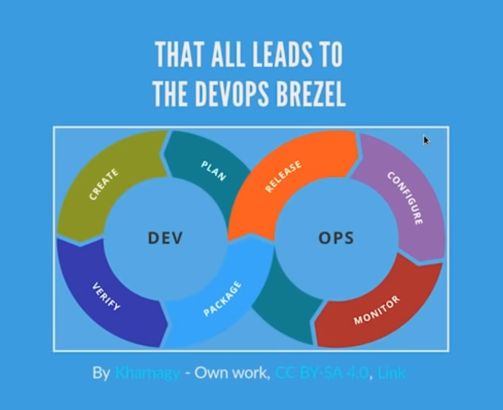
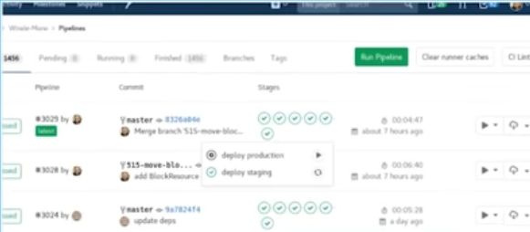

# DevOps Introduction
**FreeCodeCamp**  
**https://youtu.be/UqMUoINlKnY**

# Goals of DevOPS

- Keep a constant flow through technology value stream
- A culture of learning and experimentation to improve the value stream
- Not only "Day 0", but during "Dev", "Day 1", "Day 2", Day N"
- All the people involved in developing the product (Sysadmin, Security, Networking, Development, Sales) work together in all stages of a project

# DevOPS is about

- Culture
- Automation
- Lean
- Measurement
- Sharing

## Culture

- Blame-free learning and experimentation
- Yes, this means more volatile environments...
- ...while reducing risk
- No more Silos
- Shared Responsibility
- Autonomous Teams

## Automation

- "If a human operator needs to touch your system during normal operations, you have a bug The definition of normal changes as your systems grow" (Carla Geisser, Google SRE)
- Eliminate Toll
- Manual
- Repetitive
- Automatable
- Tactical
- No Enduring Value
- O(n) with growth
- Huge Resource Saver, Google's goal is < 50% toil for any SRE team

## Lean (Wiki)

- Eliminate Waste
- Amplify Learning
- Decide as late as possible
- Deliver as fast as possible
- Empower the team
- Build integrity in
- See the whole

## Instrumentation

- Measure Everything
- If you cannot answer a question via the dashboard, add a new instrumentation
- Any member of the organization should be able to create new graphs relevant for her work

# DevOPS Brezel

# Effects on Software Development

## Living it

### Infrastructure

- Use git
- Use an integration service
- Use build tools
- Cloud (own or hosted doesn't matter)
- Provisioning Tools (ansible, salt, etc)
- See Virtualization Hardware as software

### Continuous Integration

**Always Have a working "Master Branch" (mainline) and never move away from it**

- Check out mainline
- Develop a feature
- Build + Test and merge (fully automated on commit <2m for backend services)
- Failing or broken builds don't make it to mainline

### Continuous Delivery 1/2

**Deliver all the time, until it becomes a "non-event"**

- Every Successful merge into master branch gets deployed to staging.
- There are Buttons for "Review" and "Promote to Production", "Rollback"
  
- "PO" can decide when to promote a feature
- Small and frequent changes with focused value to the end customer
- Reducing risk while faster time to market
- We deploy ~10 times a day with 0 downtime

## Our Infrastructure is Cattle
- My wife's laptop is my only "pet"
- build container images during CI
- CI/CD pipeline makes rolling upgrades
- If something is broken, we shoot it
- Deployment stops on error

## And we are Safe!
- Too many features to manually test
- Long workflows (registration, un-subscription, data-promotion to client systems, ...)
- alerts for every core business-case (See, Act, Know, ...)
- We know when which version of code was online
- Have much better things to do than testing out code manually 
- detect errors as fast as possible and stop them from passing along the value stream

# Discipline
- There is no manual "quick-fix"
- Fix broken commits immediately (Kent Back: "Nobody has a higher priority task than fixing the build")
- If you can do it, you can script it
- Learn all the time!
- Communicate

# Failures - Did not work
- Being Half-committed doesn't work
- Ansible/Script deployments on 'PET'-servers (servers you like)
- Wiki playbooks for deployments, upgrades
- Strongly wired services ('A' knows 'B' has specific IP/Port)
- KVM/XEN/VMWare for 'Application Virtualization' - They do work well for infrastructure deployment
- Delegating Core Services (DNS, Hosting)
- Outsourcing Software Development
- Outsourcing Sysadmins
- Taking responsibility away from people
- Multiple Git Repositories

# Everything you do is code, Commit it 
- Why write it down?
- All truth lies in repo. 
- Anything not committed has no value
- In case you run into a bus
- Or get hacked
- Or you want to change infrastructures
